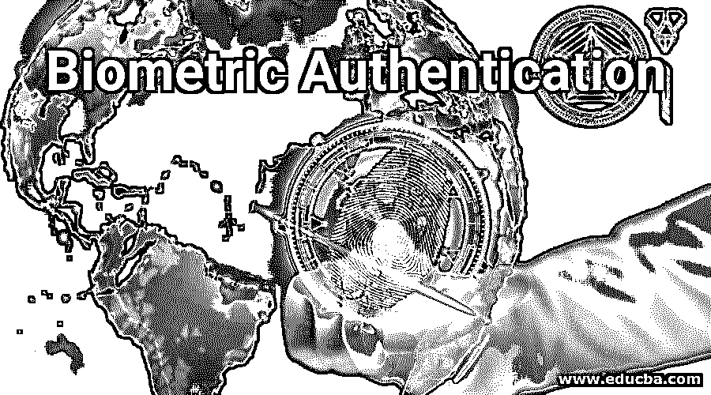

# 生物认证

> 原文：<https://www.educba.com/biometric-authentication/>

## 生物认证简介

在当今时代，生物认证是一种流行的认证机制，越来越受到公众的关注。你可以看到，从用指纹或面部锁解锁手机到办公室考勤，我们在任何地方都在使用生物认证。生物认证的应用不仅限于电话和办公室，它们被用于各种领域来实现安全性。在本文中，我们将了解生物认证的工作原理。

### 什么是生物识别设备？

生物识别设备的工作原理是基于一些人类特征，如指纹、声音、眼睛虹膜的纹路。所有的用户数据库都包含一些用户生物特征的样本。在认证期间，用户需要提供用户生物特征的另一个样本。这与数据库中的一个匹配，如果两个样本匹配，即存储在数据库中的特征和用户提供的特征匹配，那么用户将被认为是有效的。

<small>网页开发、编程语言、软件测试&其他</small>

生物识别的主要特点是，用户在每次认证过程中产生的样本可能略有不同。实现该特征的原因是用户的身体特征可能由于多种原因而改变。例如，假设用户的指纹每次都被捕获并用于认证。从认证中提取的样本可能每次都不相同，因为手指可能有割伤或其他痕迹，可能是脏的或油的，可能有 mehndi，等等。这就是不需要样品精确匹配的原因。

### 生物认证是如何工作的？

在任何认证过程中，第一个用户的样本(指纹、人脸、视网膜、声音等。)并存储在用户数据库中。然后，在认证时，用户需要提供他或她在创建时提供的样本。这通常通过加密会话发送到服务器。在服务器端，用户的当前样本被解密，并与数据库中存储的样本进行比较。如果这两个样本在生物特征的特定值的基础上匹配到预期的程度，用户将被认为是有效的，否则，它将被认为是无效的。

### 生物认证技术

基于行为，生物特征认证技术分为两个部分——生理技术和行为技术

#### 1.生理技术

这些技术基于人类的身体特征。因为目的是唯一地识别人，所以这些特征可能非常突出并且可以从一个人区别到另一个人。其中一些技术如下

**a .面部**:在这项技术中，测量眼睛、鼻子、嘴巴等各种面部特征之间的距离。这些距离测量可以使用几何技术来完成。

**b .指纹**:根据医学科学，世界上每个人类都有一个独一无二的指纹。基于指纹的认证技术使用两种方法——基于图像和基于细节。在基于图像的技术中，获取指纹图像并存储在数据库中，而在基于细节的技术中，绘制单个纹线位置的图形。虽然指纹会因老化或疾病而改变，但它们已被广泛用于身份验证。

**c .声音**:在这种技术中，人类的声音被记录并存储在数据库中。基于声音的特征，如声音的波形、音调、声调，可以唯一地识别人类的声音。

**d. Retina** :这种技术很少使用，因为成本高。在这种技术中，可以观察到人眼后部输送血液的血管。它们提供了一种独特的模式，用于验证每个人的身份。

每个人的虹膜内都有一些独特的图案。在这种技术中，完成了对这种独特模式的识别。为了检查这种独特的模式，使用激光束。

#### 2.行为技术

在这种技术中，观察这个人的行为，以确保他或她没有试图自称是别人。换句话说，我们可以说这种技术检查人的行为，以确保他或她没有异常或不寻常的行为。其中一些技术如下:

**a .击键:**在这种技术中，观察诸如打字速度、两次敲击之间的时间、击键的强度、错误百分比和频率等几个特征来唯一地识别人类。

**b .签名**:这是我们多次使用的签署支票或其他文件的老技巧。这是我们用来识别用户的物理技术。但是现在随着时间的推移，技术也在改变。现在我们用扫描仪复制了一份 h 签名并保存在数据库中。这稍后用于比较基于纸张的签名和基于计算机的扫描签名。

### 使用生物认证的优势

生物认证提供了更高的检测和安全操作，这提供了许多优于传统方法的优点。生物识别技术的主要优点是适当的认证、数据准确性、隐私或数据保密性、不可否认性以及授权或访问控制。

这是非常有效的识别刑事取证，如刑事鉴定和监狱安全，非法进入计算机网络，自动取款机，电话，银行凭证通过卡，电子邮件。生物特征认证提供商业安全，防止网络攻击、诈骗等。

### 推荐文章

这是一个生物认证指南。在这里，我们将讨论生物认证如何与生物识别设备、技术和优势一起工作。您也可以阅读以下文章，了解更多信息——

1.  [物联网安全问题](https://www.educba.com/iot-security-issues/)
2.  [人工智能技术](https://www.educba.com/artificial-intelligence-technology/)
3.  [人工智能应用](https://www.educba.com/artificial-intelligence-applications/)
4.  [安全策略](https://www.educba.com/security-policies/)

