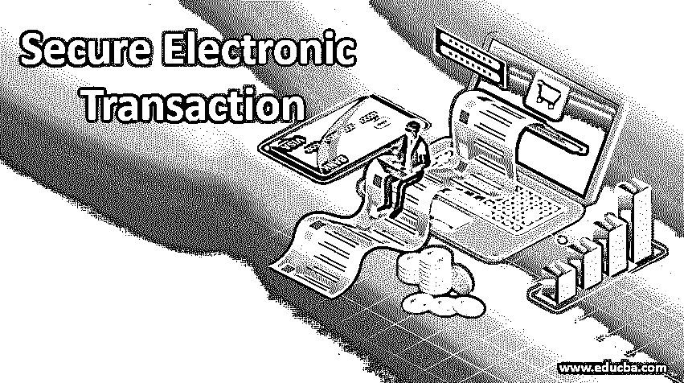
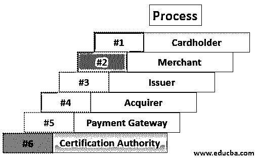

# 安全电子交易

> 原文：<https://www.educba.com/secure-electronic-transaction/>

## 什么是安全的电子交易

安全电子交易是一种[开源加密](https://www.educba.com/what-is-encryption/)和安全规范，旨在保护互联网上的信用卡交易。请记住，安全的电子交易不是支付系统；它是一套安全协议和格式，确保在互联网上使用在线支付交易是安全的。安全电子交易也称为 SET。SET 为参与电子商务交易的各方提供了一个安全的环境。这也保证了保密性。它通过数字证书提供认证。在本文中，我们将讨论安全电子交易的基本概念及其工作原理。

### 安全电子交易参与者

以下是参与 SET 流程的参与者列表:

<small>网页开发、编程语言、软件测试&其他</small>

*   **持卡人:**持卡人是支付卡的授权持有人。该卡可以是万事达卡或发卡机构发行的 Visa 卡。
*   **商户:**商户是指任何希望向持卡人出售其商品和服务的个人或组织。请注意，商家必须与收单机构建立关系，才能通过互联网接受付款。
*   **发卡行:**发卡行是向用户或持卡人发行支付卡——万事达卡或维萨卡的银行等金融机构。发卡行负责持卡人的债务支付。
*   **收单机构:**这是一个与商户有关系的金融机构，用于处理卡支付授权和所有支付。收单机构是这个过程的一部分，因为商家可以接受不止一个品牌的信用卡。它还提供向商家账户的电子资金转账。
*   **支付网关:**对于支付授权，支付网关充当安全电子交易和现有卡支付网络之间的接口。商家通过互联网与支付网关交换安全电子交易消息。作为响应，支付网关通过使用专用网络线路连接到收单机构的系统。
*   **认证机构:**它是一个可信的机构，向持卡人、支付网关和商户提供公钥证书。

### 安全的电子交易是如何工作的？

安全电子交易的工作原理如下:

#### 第一步:客户开户

客户在银行(即支持电子支付交易和安全电子交易协议的发行商)开立类似 master card 或 visa 的信用卡账户。

#### 步骤 2:客户收到证书

一旦客户身份得到验证(可以通过使用护照、商业文件或其他文件进行验证)，它将收到由 CA(认证机构)颁发的数字证书。该证书包含客户详细信息，如姓名、公钥、到期日期、证书号等。

#### 步骤 3:商家收到证书

想要接受某些信用卡品牌的商家必须[处理数字证书](https://www.educba.com/digital-certificate/)以获得可信度。

#### 第 4 步:客户下订单

这是一个购物车过程，客户从可用列表中借用一个商品，根据需求搜索特定商品，然后下订单。一旦顾客下了订单，作为回报，商家发送订单的细节，例如所选商品的列表、它们的数量和价格、总账单等。，在客户处维护订单记录。

#### 步骤 5:验证商家

商家还向客户发送数字证书，以确保客户正在与授权或合法的商家交易。

#### 步骤 6:发送订单和付款细节

除了客户的数字证书，客户还向商家发送订单和支付细节。订单部分用于参照订单中提到的项目来确认交易。支付部分包含信用卡(master card 或 visa)的详细信息。该支付信息是加密形式的；即使是商人也看不懂。客户证书向商家保证了客户的身份。

#### 步骤 7:商家请求支付授权

一旦商家获得顾客的支付细节，它就通过收单机构将它们传送到支付网关，并请求支付网关授权支付细节。此流程确保客户信用卡有效，且信用限额未被突破。

#### 步骤 8:支付网关授权支付

使用从商家接收的信用卡信息，支付网关在发行者的帮助下交叉验证顾客的信用卡。基于验证结果，它或者授权支付或者拒绝支付。

#### 第九步:商家确认订单

假设支付网关授权支付，商家向顾客发送订单确认。

#### 步骤 10:商家提供商品和服务

现在商家根据客户的订单提供商品和服务。

#### 步骤 11:商家请求付款

商家向支付网关发送进行支付的请求。此后，支付网关与各种金融组织(例如发行方、收单方和票据交换所)进行交互，以实现从客户账户到商家账户的支付。

### 推荐文章

这是一份安全电子交易指南。在这里，我们将讨论安全电子交易是如何通过 SET 过程中的各个步骤和所涉及的参与者列表来工作的。您也可以浏览我们推荐的其他文章，了解更多信息——

1.  [数字签名加密](https://www.educba.com/digital-signature-cryptography/)
2.  [SSL 的工作](https://www.educba.com/what-is-ssl/)
3.  [网络类型](https://www.educba.com/types-of-network/)
4.  [数字电子面试试题](https://www.educba.com/digital-electronics-interview-questions/)

