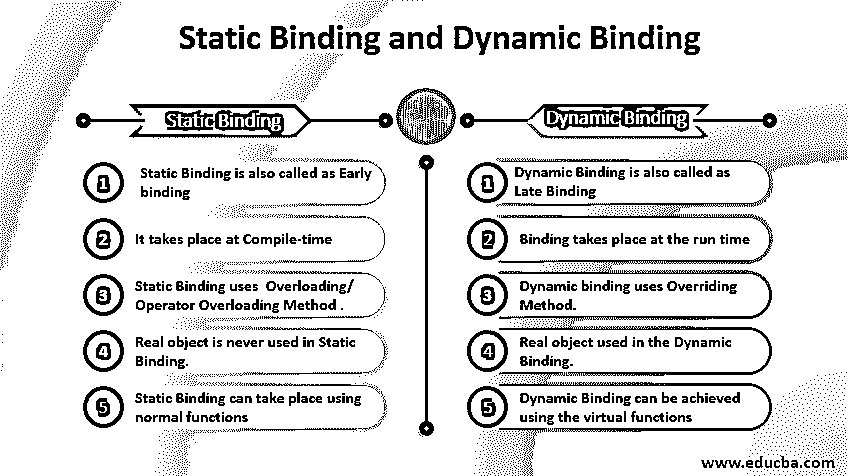

# 静态绑定和动态绑定

> 原文：<https://www.educba.com/static-binding-and-dynamic-binding/>




## 静态绑定和动态绑定简介

静态绑定和动态绑定是两种类型的绑定。绑定是指方法调用与方法体的关联。在静态绑定中，所有的赋值和声明都发生在编译时。他们有很多优点和缺点。在性能上，静态绑定优于方法和变量的动态绑定。静态绑定也称为早期绑定。众所周知，像 static、private & final 这样的方法绑定发生在编译时，而在动态绑定中，编译器并不决定调用哪个方法。

### 例子

下面给出的例子是更好理解的例子:

<small>网页开发、编程语言、软件测试&其他</small>

**例#1**

```
public class StaticBindingExample {
public static void main(String args[]) {
Vehicle veh = new MotorBike();
veh.start();
}
}
class Vehicle {
static void start() {
System.out.println("vehicle will start now..");
}
}
class MotorBike extends Vehicle {
static void start() {
System.out.println("Bike will start now..");
}
}
```

在上面给出的例子中，我们可以看到静态绑定是如何防止类重载的。


下面的例子将展示动态绑定是如何工作的；这里，子类方法覆盖了父类。

**例** **#2**

```
public class StaticBindingExample {
public static void main(String args[]) {
Vehicle veh = new MotorBike();
veh.start();
}
}
class Vehicle {
void start() {
System.out.println("vehicle will start now..");
}
}
class MotorBike extends Vehicle {
void start() {
System.out.println("Bike will start now..");
}
}
```

在这个例子中，在 parent & child 类方法下的 start 方法中不存在 static 因此，同名的方法将覆盖父类方法。它的发生是由于这个。


上面给出的截图中，给出了程序的输出。

### 为什么要用？

1.  编程需要使用静态和动态绑定来处理不同的情况。
2.  编译时绑定被称为早期绑定，即当需要在程序执行的编译时(在最开始)声明时。在动态绑定中，绑定发生在运行时，也称为后期绑定。
3.  定义为 static、final 和 private 的 Method & variables 是指静态绑定，而在运行时发生绑定的虚拟方法称为动态绑定。
4.  [方法重载](https://www.educba.com/method-overloading-in-python/) /运算符重载使用静态绑定所以是最好的例子之一，而 Overriding 使用动态，所以被称为动态绑定的最好例子。
5.  在这种情况下，在动态绑定中使用真实对象时，不会使用真实对象。

### 其他示例

在下面给出的例子中，我们可以看到静态绑定是如何发生的。

#### 示例#1

//父类实现

**代码:**

```
class Colony{
//Static method to start the electricity of the Colony
public static void start electricity(){
//printing the message here
System.out.println("Colony Electricity is On.");
}
}
//Child class implementation
class Building extends Colony{
//Static method to start the electricity of Building
public static void startElectricity(){
//printing the message here
System.out.println("Building Electricity is On.");
}
}
public class StaticBindingExample {
public static void main(String args[]) {
//Creating object of the parent class type
Colony col = new Colony();
col.startElectricity();
//Creating object of the child class type
Colony col2 = new Building();
col2.startElectricity();
}
}
```

在上面给出的程序中，col 是 class Colony 类型的引用变量，指向 class Colony 的对象。col2 也是 class Colony 类型的引用变量，但指向类构建的对象。当编译发生时，虽然绑定编译器从不检查对象的类型，但它只检查引用变量的类型。

在上面的程序中，比如 col .startElectricity()，编译器检查 startElectricity()方法定义是否存在于类 Colony 中，因为 col 是类 Colony 类型，对于 col2.startElectricity()方法调用也是如此。它检查 start electricity()方法是否存在于类 Colony 中，因为 col2 也是类 Colony 类型。它不检查 col 1，col2 指向哪个对象。这种类型的绑定称为静态绑定。

**输出:**


上面给出的程序输出显示了如何使用静态成员来防止重写。

#### 实施例 2

在下面给出的例子中，我们可以看到动态绑定是如何在运行时发生的。

//父类实现

**代码:**

```
class Colony{
//method to start the electricity of the Colony
void startElectricity(){
//printing the message here
System.out.println("Colony Electricity is On.");
}
}
//Child class implementation
class Building extends Colony{
//method to start the electricity of Building
void startElectricity(){
//printing the message here
System.out.println("Building Electricity is On.");
}
}
public class StaticBindingExample {
public static void main(String args[]) {
//Creating object of the parent class type
Colony col = new Colony();
col.startElectricity();
//Creating object of the child class type
Colony col2 = new Building();
col2.startElectricity();
}
}
```

在上面给出的程序中，一切都与静态示例程序相同，但是在这个示例中，方法“static”的成员被删除了。在此期间，将调用 col.startElectricity()所指向的主对象的方法。而对于 col2.startElectricity()调用，将调用 col2 所指向的 main 对象的方法。这种类型的绑定称为动态绑定。

**输出:**


### 优势

以下是给出的一些优点。

1.  静态绑定执行比动态绑定更高效、更快。这个绑定编译器知道这些类型的方法不能被覆盖。
2.  在静态绑定中，使用类型，而动态绑定使用对象进行绑定。
3.  动态绑定的主要优势之一是灵活性；由于灵活性，单个函数可以在运行时处理不同类型的对象。
4.  在静态绑定中，编译时之前需要所有信息，而在动态绑定中，运行时之前没有任何信息。
5.  静态绑定可以使用普通函数进行，而[动态绑定](https://www.educba.com/dynamic-binding-in-java/)可以使用虚函数实现[。](https://www.educba.com/virtual-functions-in-c-plus-plus/)

### 结论–静态绑定和动态绑定

这些是面向对象编程的一些重要概念。绑定指的是代码的执行。它发生在编译时，而动态绑定发生在运行时。定义、声明和声明的范围，这是静态绑定的三个重要支柱，而在动态绑定中，绑定的名称和绑定的生存期很重要。

### 推荐文章

这是静态绑定和动态绑定的指南。这里我们分别讨论介绍、用途、例子和优点。您也可以浏览我们推荐的其他文章，了解更多信息——

1.  [虚拟主机的类型](https://www.educba.com/types-of-web-hosting/)
2.  [Java 中的重载和覆盖](https://www.educba.com/overloading-and-overriding-in-java/)
3.  [JavaScript 静态方法](https://www.educba.com/javascript-static-method/)
4.  [c++中的方法重载](https://www.educba.com/method-overloading-in-c-plus-plus/)


