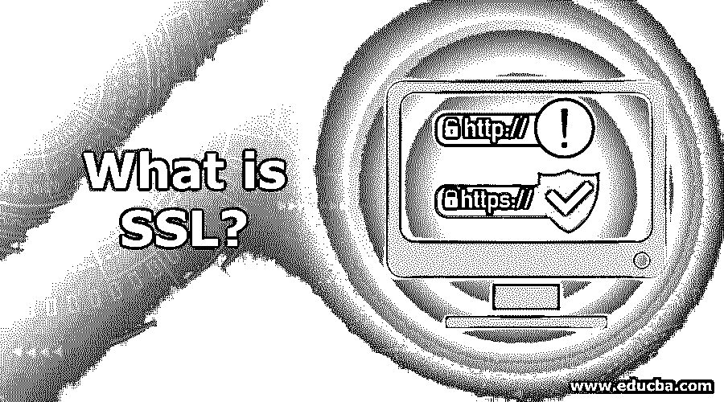
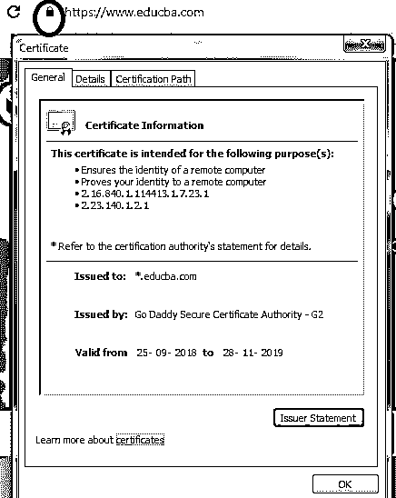
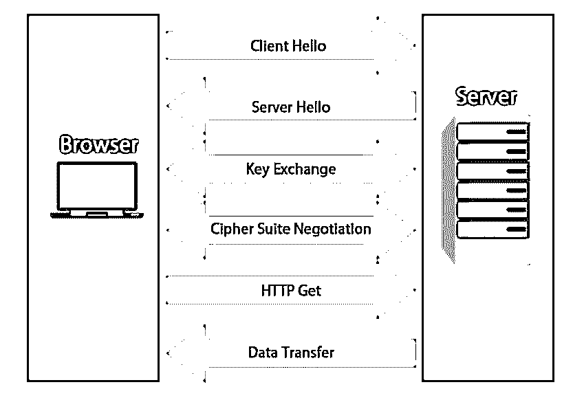
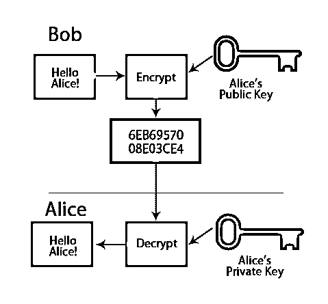
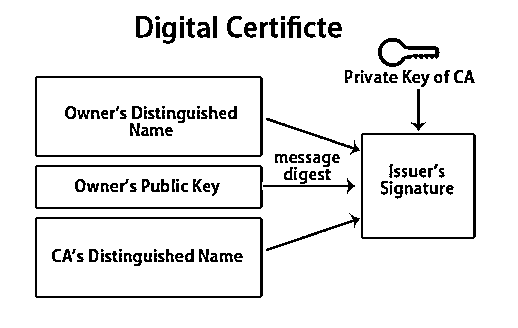

# 什么是 SSL？

> 原文：<https://www.educba.com/what-is-ssl/>

## SSL 简介

安全套接字层(SSL)是一种基于加密的互联网安全协议，用于在联网的计算机之间建立经过身份验证的加密链接，从而为互联网通信提供隐私和完整性。它到处被用来获得当事人的信任；例如，当你在谷歌上搜索时，各种网站都被打开了，每个内容的左上角都有一个锁状标志，这个锁状标志表明特定的网站可以安全使用。许多在线企业使用 SSL 概念来获得用户的信任。

### 什么是 SSL？

SSL 代表安全套接字层，它是一种用于向计算机网络提供安全通信的协议。该协议的正式名称现已更改和替换；它被称为 TLS，代表传输层安全性。虽然 SSL 是 TLS 的基础，但它是对 SSL 中发现的漏洞的替代。

<small>网页开发、编程语言、软件测试&其他</small>

在当今世界，个人信息和安全信息需要受到保护，以防范黑客和犯罪分子。信息交换可以发生在服务器和客户端(例如，浏览器和网站)之间，也可以发生在服务器网络上。

每当 SSL 保护网络或网站时，HTTPS 就会出现在 URL 中。HTTPS 代表超文本传输协议安全。此外，通过单击浏览器栏左上角出现的锁状符号，可以看到有关 SSL 证书颁发机构和网站所有者公司名称的更多详细信息。

### SSL 的工作原理(如何建立安全连接？)

SSL 背后使用的基本方法是，当您在服务器上启用并安装 SSL 证书时，当客户端(比如 web 浏览器)试图与之连接时，SSL 证书会触发 SSL 协议，该协议会对客户端和服务器之间的所有数据进行加密。SSL 握手发生在客户端和浏览器之间，这对用户是不可见的。为了建立 SSL 连接，需要三个密钥:私钥、公钥和会话密钥。

**规则是:**

私钥只能解密在公钥帮助下加密的任何东西，反之亦然。一旦连接建立，会话密钥将用于加密所有数据。

SSL 中的数据加密使用不同的算法，SSL 中支持的[对称算法有 Camellia、DES、3DES、RC2、ARCFOUR、AES、IDEA、SEED、NULL(即不加密)。](https://www.educba.com/symmetric-algorithms/)

### 通过 SSL 建立安全连接涉及哪些步骤？

以下是通过 SSL 建立安全连接的步骤:

*   web 浏览器(即客户端)连接到受 SSL 保护的服务器。浏览器/客户端请求服务器标识。
*   接下来，[服务器将 CA 颁发的 SSL 证书](https://www.educba.com/what-is-ssl-certificate/)发送给客户端。除了证书，服务器还发送它的公钥。
*   客户端(即浏览器)接收证书的副本，然后验证不同的属性，即检查到期、撤销和有效性。如果检查结果可信，对称会话密钥将被发送回客户端，并使用服务器的公钥进行加密。
*   然后，服务器使用其私钥解密对称会话密钥。还会发回一个确认，并用会话密钥加密。
*   一旦建立了安全连接，所有传输的数据都会在会话密钥的帮助下进行加密。

### SSL 的特性和提供的安全性

SSL/TLS 提供了数据加密、身份验证和数据完整性的功能。

当数据用 SSL 加密时，基本上意味着:

*   没有人阅读发送的数据/消息。
*   没有人修改消息/数据。
*   消息/数据被发送给预期的接收者。

为了确保消息已经到达接收方并且没有人修改它，SSL 对它进行加密和签名。

这两个过程都需要使用密钥。

### 公钥、私钥和对称密钥

*   **公钥:**公钥使用算法将消息转换成不可读的格式，只有拥有公钥的人才能加密消息。另一方面，接收者有一个私钥，在这个私钥的帮助下，他可以解密消息。
*   **私钥:**私钥用于解密使用公钥加密的消息。

**举例:**

顾名思义，公共密钥对任何能够访问存储库的人都是可用的。

一个或多或少的公钥，可能如下所示:

1048 0141 03c 9 18 fa CA8D EB2D ek D5 FD 37 89 B9 M069 EA97 FC20 5e 35 F577 EE31 C4FB c6b 4 4811 7a 86 BC8F BAFA 362F 922 b F01B 2k 40 C744 2654 C0DD 2881 D673 CA2B 4013 C266 E2ED CB02 0201 0011。

举一个最著名的例子，如果 Bob 想发送敏感信息给 Alice，他会用 Alice 的公钥加密数据。通过这样做，他将确保只有爱丽丝能够阅读它。而在另一边，只有爱丽丝可以访问相应的私钥。因此，只有拥有私钥的人才有能力解密加密的数据。

### 密钥和证书

在公钥/私钥加密中，我们如何知道公钥属于声明它的实体？

数字证书就是这个问题的答案。

数字密钥就像一个电子密码，它提供了公钥和实体(如公司、企业)之间的链接，这是经过验证的。数字证书是分发可信公共加密密钥的首选方式。

### 数字证书是如何获得的？

可以从任何认可的证书颁发机构或 CA 获得数字证书。

一些受欢迎的证书颁发机构公司有:

*   SSL 模式。
*   DigiCert。
*   委托数据卡。
*   地球信托。
*   GlobalSign.
*   上帝啊。
*   网络解决方案。
*   RapidSSL(快速 SSL)

要获得证书，实体的业务需要填写表单，添加公钥，并被发送到证书颁发机构。反过来，证书颁发机构将运行一些检查，他们将发回密钥，该密钥将包含在证书中。

收到的证书由 CA(证书颁发机构)签名。

### 数字证书的类型

数字证书主要有两种类型:

*   **延长的有效证书** **(EV)**

EV 或扩展验证证书用于 HTTPS 网站和软件。EV 提供了控制软件包和网站的法律实体。

*   **域验证证书(DV)**

在 DV 或域验证证书的情况下，通过对 DNS 域进行一些控制来验证企业的身份或实体。DV 是典型的 X.509 数字证书。

### 确定有效 SSL 证书的步骤

为了确定网站是否拥有 SSL 证书或有效的 SSL 证书(这意味着可信且未过期)，可以进行以下一些检查:

*   主要区别是“HTTP”(即超文本传输协议)和“HTTPS”(即安全超文本传输协议)，后者说明哪种连接受 SSL 保护。如果有 SSL 保护，HTTP 将始终显示在任何网站地址之前。而如果网站没有任何安全性，其地址将显示为 HTTP。
*   如果网站受 SSL 保护，则可以看到一个挂锁符号。
*   此外，通过点击浏览器栏左上角出现的锁(即挂锁)符号，可以看到有关 SSL 证书颁发机构和网站所有者公司名称的更多详细信息。

### 应该在哪里使用 SSL？

SSL 应该在任何地方用于通过网络传输数据或信息，尤其是在信息比较敏感的情况下。

**例子:**

*   内部网通信–保护在组织内部网上交换的信息。
*   互联网–保护通过互联网交换的信息。例如用于网络浏览器和服务器之间的通信。
*   用于保护服务器之间或服务器网络上的信息交换。
*   [云计算](https://www.educba.com/introduction-to-cloud-computing/)。
*   保护通过手机、平板电脑等发送的信息。
*   电子邮件通信等等。

### SSL 证书的优势和好处

正如我们所见，SSL 是一种用于为计算机网络提供安全通信的协议。

以下是使用 SSL 的优势:

#### 1.消灭坏人，即“黑客”的所有企图

现在有许多网络钓鱼网站，并且正在被创建，所以我们需要非常小心[网络钓鱼网站](https://www.educba.com/what-is-phishing/)。在许多情况下，你可能会看到一模一样的原始网站的复制品，它是为了欺骗你而提供给你的。但就 SSL 证书而言，他们将确保不会发生假冒网站无法获得 CA 批准和签名的 SSL 证书的情况。除此之外，SSL 还将保护您免受其他威胁，如“[中间人攻击](https://www.educba.com/what-is-man-in-the-middle-attack/)”和窃听。

#### 2.搜索引擎排名和用户存在的增加

许多搜索引擎，如谷歌，已经更新了他们的算法，根据某些参数对网站进行排名，以出现在搜索结果中，其中一个是 SSL 安全网站。任何具有 SSL 安全性的网站将排在没有任何安全性的网站之前，这意味着当用户搜索信息时，SSL 安全网站将首先显示在搜索结果中，而非 SSL 网站将显示在最后。另一大优势是获得用户和客户的信任。使用 SSL 保护的网站获得了用户的信任，他们不太担心网站的安全问题，在浏览网站时也不害怕。

#### 3.安全支付网关和安全购物

任何商业网站都必须获得 SSL 证书。当涉及到资金和现金转移时，无论交易中涉及到谁，在购买实体和销售实体之间提供一个安全的通道就变得至关重要。没有 SSL 证书的企业几乎是黑客攻击的目标。如果没有安全的连接，任何用户都不会有信心为了交易而提交他们的信用卡号码。

#### 4.更高的安全性和扩展的身份验证

随着全球范围内越来越多的网络攻击，客户和道德黑客也变得越来越安全，以防止任何意外。有许多敏感信息通过网络交换，如密码、个人信息、商业交易等。因此，必须提供一个安全的身份验证来确保通信得到很好的保护。这种额外的安全性是通过发布服务器证书和 SSL 证书来实现的。

#### 5.更强大的加密功能，确保信息安全

通过 SSL 连接传输的所有信息都用强大而复杂的算法加密。破译它们几乎是不可能的。认证机构最常用的加密算法是 RSA、DSA 和 ECC。任何敏感信息，如密码或信用卡号码，通过网络发送时，都将受到强大的加密保护，黑客无法破解。

### 结论

在本文中，我们对 SSL 及其工作原理有了很好的理解。我们还了解了 SSL 加密算法中使用的公钥和私钥，然后我们了解了可以在哪里使用 SSL。最后，我们通过看到 SSL 的好处来结束本文。

### 推荐文章

这是什么是 SSL 的指南？在这里，我们讨论了确定有效 SSL 证书的关键概念、特性、工作原理、好处和步骤。您也可以浏览我们推荐的其他文章，了解更多信息——

1.  [Hadoop 中的 MapReduce 是什么？](https://www.educba.com/what-is-mapreduce-in-hadoop/)
2.  什么是 Django？
3.  [什么是网络安全？](https://www.educba.com/what-is-cyber-security/)
4.  [数字证书](https://www.educba.com/digital-certificate/)

