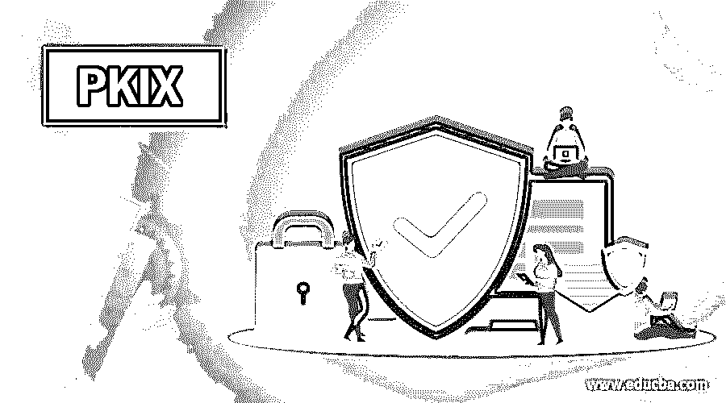

# PKIX

> 原文：<https://www.educba.com/pkix/>

## PKIX 简介

PKIX 代表公钥基础设施 x . 509。x . 509 标准定义了数字证书的结构、格式和字段，它还指定了分发公钥的过程。为了扩展这些标准并使它们通用，IETF(互联网工程任务组)成立了 PKIX 工作组。PKIX 扩展了 X.509 标准的基本原理，并指定了数字证书在互联网世界中的实现。此外，已经为各种领域中的应用定义了其他 PKI 模型。例如，金融组织使用 ANSI、ASC X9F 标准。

### PKIX 服务

提供的服务如下:

<small>网页开发、编程语言、软件测试&其他</small>

*   **注册:**终端实体向 CA 注册的过程。通常，注册是通过 RA 完成的。
*   **初始化:**这处理基本问题，例如验证终端实体正在与正确的 CA 对话的方法。
*   **认证:**是 CA 为终端实体创建数字证书并返回给终端实体的过程。CA 还保留一份证书副本以供记录。如果需要，CA 还会将其复制到公共目录中。
*   **密钥对恢复:**用于加密文件的密钥可能需要在以后用于解密相同的旧文件时恢复。密钥存档和恢复服务可以由 CA 或独立的密钥恢复系统提供。
*   **密钥生成:** PKIX 模型规定终端实体应该能够生成公钥和私钥对，或者 CA 应该能够为终端实体生成公钥和私钥对。
*   **密钥更新:**是数字证书过期的密钥自动更新并替换为新密钥对的过程。但是，对于手动数字证书续订请求和响应有一个规定。
*   **交叉认证:**由不同 CA 重新认证的终端实体可以相互交叉验证的过程。它有助于建立信任模型。
*   **撤销:** PKIX 模型提供了对两种模式下检查证书状态的支持，在线使用 OCSP 和离线使用 CRL。

### PKIX 架构模型

PKIX 开发了一个文档，描述了其架构模型的五个方面。这些领域如下:

#### 1.509 V3 证书和 V2 证书吊销列表配置文件

X.509 标准在描述数字证书的扩展时允许使用各种选项。PKIX 将所有被认为适合互联网用户的选项进行了分组。它将这组选项称为互联网用户的个人资料。RFC2459 中描述了这个概要文件，它指定了必须/可以/不可以支持哪些属性。还提供了每个扩展类别中使用的值的适当值范围。例如，当证书被暂停时，X.509 标准不指定指令代码。PKIX 定义了它们。

#### 2.操作规程

这些定义了为传递证书提供传输机制的底层协议。CRL 和其他管理和状态信息。由于这些需求要求不同的服务方式，如何使用 HTTP、LDAP、FTP、X.500 等。就是为此目的而定义的。

#### 3.管理协议

这些协议能够在各种 PKI 实体之间交换信息。比如如何携带注册请求撤销状态或者交叉认证请求和响应。管理协议规定了在实体之间浮动的消息的结构。它们还指定了处理这些消息所需的详细信息。管理协议的例子包括用于请求证书的 CMP(证书管理协议)。

#### 4.政策大纲

PKIX 在 RFC2527 中定义了 CP(证书策略)和 CPS(证书实践声明)的大纲。这些定义了创建文档的策略，例如证书策略，它决定了在为特定应用程序域选择证书类型时哪些考虑因素是重要的。

#### 5.时间戳和数据认证服务

时间戳服务由被称为时间戳机构的可信第三方提供。此服务的主要目的是对消息进行签名，以保证它在特定的日期和时间之前存在。这有助于处理不可否认声明。DCS(数据认证服务)是一种可信的第三方服务，用于验证其接收的数据的正确性。这类似于现实生活中的公证服务，例如，它可以使用它来获得一个人的财产证明。

### 结论

PKIX 代表公钥基础设施 X.509 标准是处理与 PKI 技术(即公钥基础设施)相关的问题的模型。在本文中，我们讨论了 PKI 的概念及其工作、服务和体系结构。

### 推荐文章

这是一个 PKI(公钥基础设施 X.509)的指南。这里我们讨论 PKIX 服务及其架构模型的五个方面。您也可以看看以下文章，了解更多信息–

1.  [数字证书](https://www.educba.com/digital-certificate/)
2.  [公钥加密](https://www.educba.com/public-key-encryption/)
3.  [PKCS](https://www.educba.com/pkcs/)
4.  [什么是 SSL？](https://www.educba.com/what-is-ssl/)

