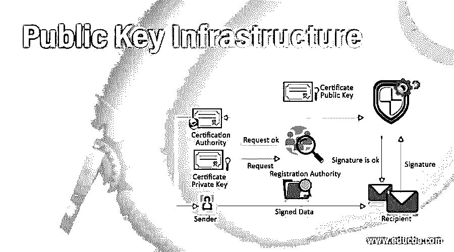

# 公钥基础设施

> 原文：<https://www.educba.com/public-key-infrastructure/>

## 公钥基础设施简介

公钥基础设施是互联网上最受欢迎的技术，是现代安全机制的焦点。它与非对称密钥加密技术密切相关，非对称密钥加密技术包括消息摘要、数字签名和加密服务。建立、维护和发展公钥基础设施、承诺、大量投资和努力。启用所有服务都需要数字证书。它相当于网络上的通行证。在本文中，我们将讨论带有数字证书的公钥基础设施及其标准，如 PKIX、PKCS 和 XML。

### 顶级公钥基础设施

这里我们讨论公钥基础设施:

<small>网页开发、编程语言、软件测试&其他</small>

#### 1.数字签名

数字证书是一个小的计算机文件，它指定了用户和它的公钥之间的关系。X.509 标准用于定义数字证书的结构。数字签名字段如下

*   **版本:**标识用于数字证书的 X.509 协议的特定版本
*   **证书序列号:**定义了一个唯一的整数，通常由 CA(Certificate authority)生成。
*   **签名算法标识:**定义了 CA 对数字证书进行签名的算法。
*   **颁发者名称:**它标识创建和签署证书的 CA 的可分辨名称。
*   **Validity:** 它包含两个值 Not Before 和 Not after，这两个值指定在证书的时间范围内应该被认为是有效的。
*   **主题名称:**它标识被颁发证书的用户的可分辨名称。
*   **主体公钥信息:**包含主体的公钥以及与该密钥相关的算法。

#### 2.PKIX

PKIX 代表公钥基础设施 x . 509。x . 509 是定义数字证书的结构、格式和字段的标准。它还定义了用于分发公钥的过程。为了扩展标准并使其通用，IETF(互联网工程任务组)成立了工作组 PKIX(公钥基础设施 X.509)。它扩展了 X.508 标准的基本概念，并规定了如何在互联网上实现数字证书。公钥基础设施 X.509 提供以下服务

*   **注册:**这是一个主体向 CA 展示自己的过程。通常，RA 会执行此任务。
*   初始化:它处理一些基本问题，如验证终端实体是否与正确的 CA 对话的方法。
*   **认证:**是 CA 为终端实体创建数字证书并返回给终端实体的过程。它还保留了一份数字证书的副本以供自己记录。
*   **密钥对恢复:**用于加密的密钥被恢复用于解密旧文档。
*   密钥生成:公钥基础设施 X.509 规定终端实体应该能够生成公钥和私钥对。
*   **密钥更新:**用新的有效密钥对更新旧的过期密钥对的过程。
*   **交叉认证:**提供可信度，使得终端实体可以相互交叉验证。
*   **撤销:**公钥基础设施 X.509 提供撤销来检查数字证书的状态。

#### 3.PKCS

PKCS 代表公钥加密标准，它是由 RSA 实验室开发的一种模型。PKCS 开发的目标是标准化公钥基础设施。标准化在许多方面都像格式、算法和 API。它帮助许多组织开发和实现可互操作的公钥基础设施解决方案。公钥密码标准提供了 15 种标准，如下所示:

*   **PKCS#1:** 它定义了 RSA 公钥函数的基本格式规则。
*   **PKCS#2:** 定义报文摘要计算。
*   PKCS#3: 它为 Diffie Hellman 密钥协商算法定义了一种机制。
*   **PKCS#4:** 与 PKCS#1 合并。
*   PKCS#5: 它定义了一种对称密钥加密的方法。
*   PKCS#6: 它定义了扩展数字证书的语法。
*   PKCS#7: 它定义了加密消息标准的语法。
*   PKCS#8: 它定义了私钥信息的语法。
*   PKCS#9: 它定义了扩展数字证书的属性类型的选择。
*   PKCS#10: 它定义了证书请求的语法。
*   PKCS#11: 它定义了加密令牌。这个标准也因 Cryptoki 而闻名。
*   PKCS#12: 它定义了交换个人信息的语法，比如私钥、数字证书等。
*   PKCS#13: 它处理一种新的加密标准机制。
*   **PKCS#14:** 它定义了伪随机数发生器的标准。
*   PKCS#15: 它定义了加密令牌信息的标准。

#### 4.XML 安全性

XML 代表可扩展标记语言，是现代技术的中心，是未来技术的支柱。XML 密钥管理规范(XKMS)分为两部分——XML 加密和 XML 数字签名

##### XML 加密

XML 加密涉及的 XML 加密步骤

*   选择需要加密的 XML。
*   以规范形式转换数据。
*   用公钥加密结果。
*   将加密的 XML 文档发送给目标接收者。

##### XML 数字签名

XML 数字签名涉及的元素如下

*   **Signedinfo:** 它本身包含签名。
*   **规范化方法:**指定用于规范化 Signedinfo 的算法。
*   **签名方法:**指定转换规范化 Signedinfo 所使用的算法。
*   **参考:** Ut 定义了一种计算消息摘要的机制。
*   **KeyInfo:** 定义了用于验证数字签名的密钥。
*   **转换:**它定义了在计算消息摘要之前需要执行的操作。
*   **摘要方法:**定义了用于消息摘要计算的算法。
*   **摘要值:**包含原报文的报文摘要。

### 推荐文章

这是公钥基础设施指南。在这里，我们也讨论了介绍和顶级公钥基础设施，其中包括，数字证书，PKIX 和 XML 标准等。您也可以看看以下文章，了解更多信息–

1.  [私有云 vs 公有云](https://www.educba.com/private-cloud-vs-public-cloud/)
2.  [云计算公共 vs 私有](https://www.educba.com/cloud-computing-public-vs-private/)
3.  [PKCS](https://www.educba.com/pkcs/)
4.  [区块链安全吗？](https://www.educba.com/is-blockchain-safe/)

