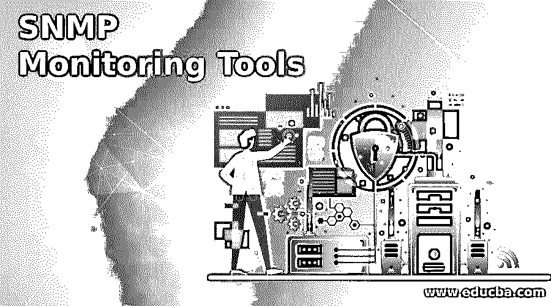

# SNMP 监控工具

> 原文：<https://www.educba.com/snmp-monitoring-tools/>

## SNMP 监控工具简介

SNMP 监控工具是一种用于监控被管理设备、组织、收集的工具，也用于信息修改以设计行为。SNMP 工具用于测量网络的效率、准确性和粒度，以及网络的性能和健康状况。使用这个工具，网络用户可以监控设备性能，可以得到与配置相关的告警。市场上有不同类型的监控工具可供服务器使用。

### SNMP 监控工具是如何工作的

下面提到了监控工具:

<small>网页开发、编程语言、软件测试&其他</small>

#### 1.网络安全管理软件产品

网络安全管理软件产品 NPM(网络性能监视器)是一种流行的 SNMP 监控工具，因为它提供了自动发现设备的功能，并向用户提供交互式动态仪表板。在该功能中，当安装该工具时，该工具能够自己定位和配置网络节点。该工具提供的另一个功能是单页类型的路径分析。由此，所有重要的数据可以仅在一个帧中被分析，使得分析过程变得容易，从而可以对网络路径进行严格的分析。网络安全管理软件产品工具还发送与网络配置相关的警报。该工具提供可靠的类型警报功能，还提供定制警报和嵌套触发场景。该工具的仪表板包括网络的详细信息和深入报告，以便更好地分析网络统计数据。

#### 2.管理人管理人

这种类型的 SNMP 监控工具具有出色的接收器功能，用于处理高达每秒 300 条消息的元素。当出现任何问题和设备缺陷时，用户可以获得与所有这些问题相关的反馈。该工具还为所有陷阱进程提供了日志记录功能，以便更好地了解问题。OpManager 工具与不同类型的操作系统兼容，如 Linux、Windows，还有助于监控关键指标，包括速度、延迟、数据包丢失和错误。该工具还可以发现瓶颈并监控磁盘利用率、内存和 CPU。在性能监控期间，可以使用 OpManager 工具设置多个阈值。该工具提供的其他可靠功能包括网络映射、网络状态监控和网络流量管理。仪表板上大约有 200 个性能小部件，用户可以根据需要进行选择。

#### 3.Kaseya 网络监视器

该工具在用于监视 WMI 查询和注册表计数器的 Windows 操作系统中受支持。这个 SNMP 监控工具与 Kaseya VSA 集成，用于监控管理程序、服务器、防火墙、路由器和其他网络元素。用于监控目录、文件、数据库、SNMP 陷阱、日志和邮件相关服务的工具。该文件的位置，文件存在可以在这个工具中检查。这个工具使用名为 Lua 的脚本语言，这是一种易于使用的语言。Lua 脚本语言用于定制自动化程序。该工具支持 24 种类型的操作系统，这增加了该工具的受欢迎程度。该工具有某些缺点，因为该工具提供的仪表板不全面或不清晰，并且不提供详细的分析。

#### 4.SysAid 监控

SysAid 工具可以轻松监控 SNMP 资产。事件类型会被自动识别，并通知用户任何问题或威胁。该工具用于监控流程、服务、网页可用性、URL、软件或硬件变更、端口或任何硬件组件。SysAid 工具还用于覆盖 CPU、内存、硬盘驱动器的使用，并通知任何陷阱。该工具通过短信或电子邮件发送警报。该工具无法向用户发送推送通知。用户不能将 SysAid 监控工具作为独立工具使用，因为该工具需要 SysAid 帮助台。因此，公司不喜欢使用这种类型的工具进行 SNMP 监控。该工具不太用户友好，并且有几个局限性。

#### 5.Paessler PRTG

派斯勒 PRTG 是一种网络监控工具，用于 SNMP 监控。这种类型的 SNMP 监控工具不同于其他监控工具，因为它有助于监控任何服务器的 CPU 负载，也有助于监控磁盘驱动器的空间。PRTG 工具中有多个 SNMP 传感器。该工具支持内置警报功能，还可以根据用户要求进行定制。该工具的仪表板以刻度盘和图表的形式提供数据的动态视图。该工具的缺点之一是价格计划。由于该工具使用各种传感器，随着运营成本的增加，它增加了不适合该组织的计划的成本。

#### 6.脉动道

Pulseway 是另一种类型的 SNMP 监控工具，用于监控不同的网络元素，如网络性能、系统资源、SNMP 启用设备和 windows 更新。该工具还提供其他功能，如与移动设备兼容。可以定制脚本，因为它有助于自动化 it 活动，包括安全检查、备份和其他活动。可以为警报分配类别并应用阈值。

#### 7.Spiceworks

Spiceworks 是一个用于监控 SNMP 的开源工具，因为仪表板简单且用户友好，软件可以立即安装在系统上。SNMP 小部件可以在仪表板中设置，设备数据可以轻松监控。仪表板中的属性也可以像数据包、数据包丢失和 I/O 一样进行配置。该工具使用警报系统来帮助在设备级别发送警报，这使得该工具很受欢迎。该工具实时显示性能图，有助于更好地分析数据，但它使仪表板有点杂乱。

### 结论

有多种类型的 SNMP 监控工具，在所有工具选项中，网络安全管理软件产品 NPM 被认为是最好的 SNMP 工具。在选择 SNMP 工具时，要考虑工具的可用性和特性，并据此选择工具。

### 推荐文章

这是 SNMP 监控工具的指南。这里我们讨论 SNMP 监控工具的介绍，并详细解释 7 种不同的工具。您也可以浏览我们的其他相关文章，了解更多信息——

1.  [网络安全工具](https://www.educba.com/cyber-security-tools/)
2.  [Web 测试工具](https://www.educba.com/web-testing-tools/)
3.  [什么是 Linux？](https://www.educba.com/what-is-linux/)
4.  [移动测试工具](https://www.educba.com/mobile-testing-tools/)

