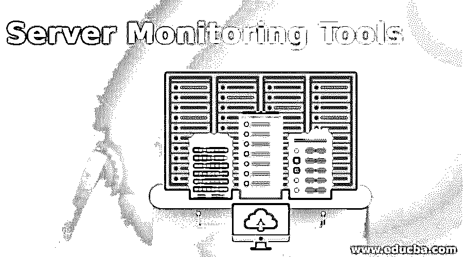
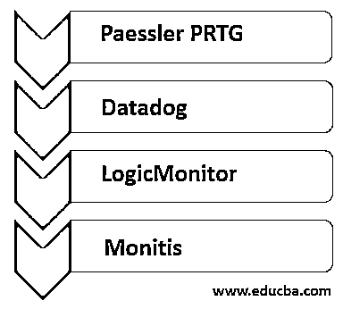

# 服务器监控工具

> 原文：<https://www.educba.com/server-monitoring-tools/>

## 服务器监控工具简介

对于任何 IT 组织来说，维护其生产环境都是非常关键的，因为任何缺陷都会在很大程度上妨碍其运营。服务器是任何组织的主要支柱，定期对其进行监控至关重要，该组织确实在这项任务上花费了大量资金，因为他们不希望出现不可预测的长时间停机。为了最大限度地减少停机时间并获得网站和其他服务的最佳性能，我们需要定期持续监控数据中心和其他服务器基础设施。因此，为了处理这种监视，服务器监视工具就派上了用场，它们主要监视 CPU 健康状况、正常运行时间、磁盘空间、性能阈值等。

### 顶级监控工具服务器

在任何组织中，服务器监控工具对于监控其基础设施的健康状况以及通过提供快速可靠的服务来确保为客户提供优质服务都非常重要。为了维护客户之间的信任，组织确实需要采用更好的服务器监控工具，以便能够提供不间断的服务。如果有任何维护活动，那么可以提前通知客户，并且该活动需要在定义的 SLA 内完成。为数不多的流行工具包括 Datadog、派斯勒 PRTG、Nagios X1、太阳风服务器和应用监控服务、Zabbix 等。

<small>网页开发、编程语言、软件测试&其他</small>

下面让我们简单看看一些流行的服务器监控工具。在这里，我们将了解数据狗、PRTG、逻辑监视器和莫尼蒂斯。

#### 1.Paessler PRTG

PRTG 是一个较好的和流行的服务器监控工具，可以帮助监测以往分布式网络。PRTG 将配备预定义的传感器，可以立即开始监控。PRTG 服务器监控工具可以用来监控各种服务，下面是其中的一些

*   **邮件服务器监控:**邮件服务器是需要持续监控的主要关键服务器之一，PRTG 是这方面高效的服务提供商之一。邮件服务器中的任何小故障都是有问题的，这些工具可能是邮件服务器监控的流行传感器，包括 IMAP、POP3、SMTP 等。
*   **Web 服务器监控:**这台特殊的服务器可能是许多组织的决定因素，PRTG 有不同的服务器可用于 Web 服务器监控。
*   **数据库服务器监控:**数据库非常关键，因为它存储着高度关键的数据。此外，数据库的性能也很重要。PRTG 也有有效的监测传感器。
*   **文件服务器监控:**文件服务器监控也是一项关键任务，PRTG 为这项任务配备了高效的传感器。

#### 2.数据狗

Datadog 是最受欢迎的监控服务，尤其用于云规模的应用程序。再如 PRTG，这可以有效地用于监控邮件服务器、web 服务器、数据库服务器、文件服务器等。Datadog 通过一个基于 SaaS 的数据分析框架提供这些功能。Datadog 以前是用 python 编写的，但最新版本采用了一些开源和闭源技术，如 Kafka、Cassandra、D3、PostgreSQL 等。Datadog 可以支持多个基于云的巨头，它们包括亚马逊网络服务 AWS、微软 Azure、红帽 OpenShift 和谷歌平台云。Datadog 现在与 350 多个集成相关联。它支持 Windows、Linux 以及基于 mac 的系统。

下面列出了 datalog 的一些功能:

*   Datadog 为 IT 或 DevOps 团队提供基础架构的单一视图，以便团队了解服务器基础架构及其运行状况。
*   Datadog 提供了可定制的仪表板，因此指标很容易理解。
*   警报通知是 datadog 的最佳功能之一，有助于跟踪和解决关键问题。
*   支持许多集成。
*   分析日志可以有效地了解延迟和错误率。
*   它支持许多用不同语言编写的应用程序，可以是 python、java、PHP、.NET、Go、Node 等。

#### 3.逻辑监视器

LogicMonitor 也是一种流行的网络监控工具，它在一个统一的平台上提供了网络基础设施以及其他 IT 相关基础设施的高度可见性。LogicMonitor 的一些最佳特性如下所示:

*   易于部署，在实际部署之前可以免费测试。LogicMonitor 的轻量级特性使这成为可能。
*   覆盖大多数复杂的网络，这些网络可能会扩展到多个数据中心。
*   LogicMonitor 与合作伙伴 Cisco 一起为软件定义的网络提供支持。
*   为跟踪网络和服务器性能提供有效的仪表板、拓扑映射、更高的可见性。这有助于识别基础设施性能趋势中的任何异常。
*   LogicMonitor 的故障排除速度更快，并且 LogicMonitor 还降低了警报噪音。

#### 4.莫尼蒂斯

monitis 官方网站的标语说，“将你的服务器提升到一个新的水平”，它在组织中的流行证明了这个标签的合理性。monitis 服务器监控非常划算，它可以在更短的时间内监控关键性能。monitis 服务器监控工具的一些更好的特性如下:

*   提供对 IT 基础架构的广泛了解。
*   由于 montis 基于云，我们可以从任何地方监控性能。
*   在一个平台下为所有监控要求提供简化的解决方案。
*   来自 monitis 的警报功能和富有洞察力的报告确保我们始终处于问题的顶端。这有助于提前感觉到有问题，需要解决。
*   它可用于 Windows 和 Linux 部署。
*   它将磁盘、存储、CPU、网站、服务器健康检查纳入其监控范围。

### 结论

如今，组织的业务依赖于他们如何提供稳定一致的服务。因此，业务需求不仅需要更好的基础设施来提供一致的服务，还需要更好的监控工具，以便持续监控网络和数据中心等基础设施的健康状况，并快速捕捉任何异常情况。因此对其客户的服务影响最小或没有影响。本文介绍了几个这样的流行工具，它们可以用来监控您的服务器，只需最少的人工干预。

### 推荐文章

这是服务器监控工具指南。在这里，我们还将讨论服务器的简介和 4 大监控工具，并给出解释。您也可以看看以下文章，了解更多信息–

1.  [带宽监控工具](https://www.educba.com/bandwidth-monitoring-tools/)
2.  [Java 监控工具](https://www.educba.com/java-monitoring-tool/)
3.  [MongoDB 监控](https://www.educba.com/mongodb-monitoring/)
4.  [Kubernetes 工具](https://www.educba.com/kubernetes-tools/)

