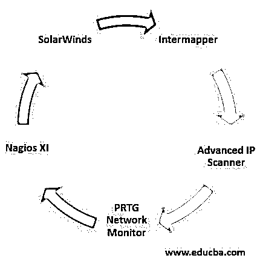

# 网络发现工具

> 原文：<https://www.educba.com/network-discovery-tools/>

## 网络发现工具简介

网络发现工具有助于了解您所关注区域的网络覆盖情况。借助这些工具，可以显示 IP 节点和 SNMP 节点的可用性和详细信息。它还有助于网络的维护、创建和安全。计算机和网络可以相互查找，以便设备可以与同一网络中的其他设备连接和通信。网络发现工具可以将设备的网络可用性设置为开或关。对网络进行扫描，以便在覆盖区域内轻松找到所有可用的网络。

### 网络发现工具的重要性

*   网络发现工具有助于发现与同一网络相关的各种设备。它可以在一次扫描中找到设备，或者我们可以安排该工具在特定时间扫描以找到网络中的设备。必须向工具提供 IP 地址或 IP 范围来查找设备。
*   借助工具中的网络拓扑，网络可视化变得非常容易。这有助于用户了解网络的工作方式，并在需要时做出必要的更改和安排。借助于网络中的可视化，还可以看到设备性能。设备的可用性和适当的监控也可以在网络发现工具的帮助下完成。
*   仪表板显示设备在同一网络和互联网中用于各种应用的性能。可以根据用户的目的定制图表和仪表板，以便轻松了解网络使用情况和可用性。每当用户需要访问任何应用程序时，他们可以检查应用程序的仪表板和网络范围。
*   通过使可用性为人所知并向系统提供业务服务交付，可以防止应用程序停机。这有助于以前所未有的速度更快地解决与网络相关的问题。检测工具通过了解停机时间，帮助用户相应地计划服务，并为经常遇到的问题提供解决方案。
*   网络发现工具进行必要的预测，并确保在需要时为设备提供网络。网络的内部活动被评估，这使得系统与可用网络一起工作。此外，如果设备试图在没有任何许可的情况下访问网络，它们将被拒绝服务，因为网络发现工具不允许这样的设备。
*   网络发现工具的活动遵循一定的规范和规则，并且在指导方针内完成。没有任何设备可以侵入该工具并使网络可供他们使用。这使得网络发现工具成为控制网络中设备的最佳工具。

### 顶级网络发现工具

以下是不同的网络发现工具:

<small>网页开发、编程语言、软件测试&其他</small>

#### 1.内部地图

它有助于映射网络，并提供范围内的网络性能。网络被发现并映射到可用的设备。使用所有物理和虚拟 IP 地址创建自定义映射，这些地址会根据网络性能数据自动更新。这有助于用户了解设备及其 IP 地址。不同的版本适用于不同的操作设备，收费取决于所使用的设备，或者可以为任意数量的设备支付固定费用。

#### 2.高级 IP 扫描仪

该工具是免费提供的，它在网络范围内的 IP 地址的帮助下进行网络映射。网络中的所有设备都被扫描和识别，并关闭或唤醒远程位置的计算机。该功能仅限于扫描网络设备和使用远程位置的计算机。

#### 3.PRTG 网络监视器

该工具跟踪网络中可用的设备，还监控云中可用的服务。此外，性能、数据库容量和网络正常运行时间也在网络监视器的帮助下得到监控。此外，它还可以用于网络发现，并且可以在该工具的帮助下完成映射。该工具涉及手动过程，即创建地图，之后该工具为网络中连接的每个设备更新网络信息。每个设备的连接数据和性能也与每个设备的状态一起显示。该工具的价格高于其他任何具有相同功能的工具。

#### 4.纳吉奥斯·Xi

网络数据受到监控，以便用户需要时一切都能顺利运行。界面是用户友好的，仪表板显示所有的网络行为和所有事件和一般网络的图形。应该给这些图分配适当的资源，以避免网络过载。如果网络中存在任何潜在的问题，可以重新路由网络流量。该工具易于定制，易于使用。在定制的帮助下，可以很容易地改变布局或任何主题。可以免费试用，这样用户在购买之前就可以很好地了解这个工具。

#### 5.网络安全管理软件产品网络性能监视器

这是用于网络监控的最佳工具之一，它扫描网络，并借助可视化映射工具显示网络拓扑。工具中的路径显示了从网络到目的地服务的目的地，因此可以很容易地看到任何问题，这有助于很容易地解决问题。可以很容易地发现 IP 地址和端口，并且该信息可以用于网络内设备的安全和警报。该工具中使用了集中式网络管理工具。

### 结论

了解哪种工具适合业务需求是很重要的，为此，可以免费试用，以便选择合适的工具。此外，还有许多免费的网络监控工具来满足短期需求。

### 推荐文章

这是网络发现工具指南。在这里，我们讨论了简介和顶级网络发现工具，如 Intermapper，高级 IP 扫描器等。简而言之及其重要性。您也可以浏览我们推荐的其他文章，了解更多信息——

1.  [SOA 备选方案列表](https://www.educba.com/soa-alternatives/)
2.  [谷歌云平台](https://www.educba.com/what-is-google-cloud-platform/)
3.  [行业中的替代品](https://www.educba.com/jmeter-alternatives/)
4.  [体式的替代品清单](https://www.educba.com/asana-alternatives/)

