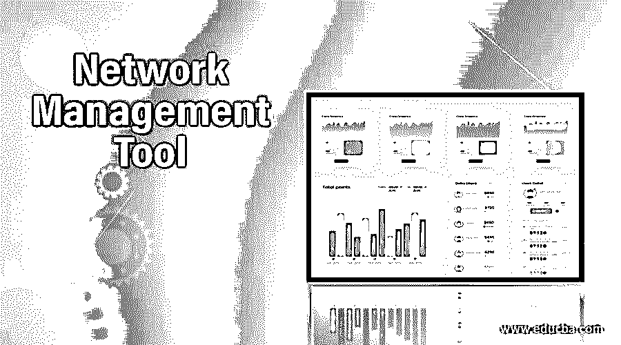

# 网络管理工具

> 原文：<https://www.educba.com/network-management-tool/>

## 网络管理工具简介

广阔的世界被细小的电线连接起来，有时变成无线的。但所有设备都保持连接，并有效地提高个人或企业的生产力。网络监控工具每年都在开发，并且定期推出实用程序，使其在不断变化的 it 监控中处于领先地位。但是网络工具中有一些独特的功能，如停机时间和正常运行时间指示器、电子邮件和短信警报系统、定制模板、SNMP 集成、NetFlow、映射和发现功能、自动化网络拓扑，这些都是选择适合您业务的工具的重要标准。本文简要讨论了几种常用的网络监控工具。

### 7 大网络管理工具

网络管理中的重要工具具有各种功能，由用户选择正确的工具。

<small>网页开发、编程语言、软件测试&其他</small>

#### 1.什么是黄金

它是从 Ipswitch 实现的网络管理工具，也是市场上配置最高的工具。仪表板很吸引人，这使得它们用户友好，易于定制。WhatsUp Gold 的价格和功能对于日常 IT 管理来说是平衡的。可以将重复警报配置到控制面板中，以监控 IT 基础架构。WhatsUp Gold 的最新版本于 2017 年发布，该版本结合了实时性能监控、手动和自动故障转移的混合云警报监控，并提供了分布式网络的扩展可见性。但仅限于 Windows OS 支持。根据用户要求，它有不同的价格方案。

#### 2.纳吉奥斯·Xi

它是专为自由职业者，广大观众，中小型企业。Nagios XI 的价格模型是灵活的，可以作为开源的免费版本使用，也有一次性订阅和许可。由于它具有极大的灵活性，所以它支持插件工具的适应性。触发警报的成本甚至更低。重要的组成部分是 Nagios XI 监视器数据库，基础设施和网络。安装很容易，有时只需几个步骤就能适应用户需求。用户可以使用配置文件配置该工具来监控每个组件。它只能在 Unix 变体和 Linux 上受支持。100 个节点的收费约为 1999 美元。

#### 3.网络安全管理软件产品

这个工具可以立即安装，配置非常简单。该工具会自动检测网络组件，并在一小时内将它们部署到现场。它遵循一个简单和标准的方法来监控网络的整个结构及其本能的用户界面，因为它可以很容易地快速编辑和管理。它可以在基于 web 的仪表板、视图和性能图表上进行高度定制。它可以为整个网络基础架构实施定制的体系结构，并开发定制的依赖性智能警报。

#### 4.PRTG

它可以用在高级基础设施中来管理高性能。在网络中，所有组件、流量、服务器和应用程序都可以在分层视图中查看，以总结进程和警报的性能。它还监视使用 WMI、SSH、数据包嗅探、SNMP、Rest API、SQL、Ping、HTTP 请求等的网络基础设施。它是新组织监控其网络性能的最佳选择，因为它用户友好、功能强大，并且监控端到端过程。独特的功能是监控移动应用程序和数据中心中的组件。QR 码与打印出来的传感器相匹配，并固定在物理硬件上。移动应用可以被实现为扫描代码以总结在移动屏幕上看到的设备的功能。它有一个灵活的价格计划，可以根据用户的选择实施。

#### 5.扎比克斯

它有一个吸引人的网络图形用户界面，这使得它更受欢迎和用户友好。它是开源的，可以完全配置。它专注于趋势功能和系统监控。该工具用于监控服务器和链接的网络硬件。该工具的主要优点是，它可以通过分析历史数据来预测流量和预测即将到来的。由于它是开源的，它在全世界拥有广泛的社区支持和活跃的用户，并有简短的文档支持。它允许用户利用所有组件的开源解决方案，而没有任何强制性的供应商限制。对于低于 1000 个节点的 SMB 网络来说，它太强大了。但除此之外，该工具的速度会变慢，性能也会下降。一个重要的缺点是它没有任何报告和实时测试。

#### 6.伊辛加

这个工具是 Nagios 的开发团队在 2009 年实现的。它可用于开放式基础设施中的网络和服务监控工具。它用户友好且灵活，尤其适用于企业和 SMB 网络。该工具专注于监控具有报告和警报功能的服务和基础设施，并且非常注重阈值分析。众所周知，为高优先级警报生成警报，并且为用户 It 基础架构的每次运行状况检查提取报告。可以在通过 SMS、电子邮件或某些消息应用程序触发的仪表板中查看警报的相关性。它是免费和开源的，由公司和支持社区提供

#### 7.管理人管理人

该工具通过使用 APM 插件软件，用于应用性能管理、网络监控和基础设施管理。在特性分析和重负载监控时，它是平衡的。它提供了管理服务器、网络、故障配置和性能管理的即时解决方案。它分析网络流量并执行管理引擎 OpManager，该引擎可以即时部署在本地。该产品的亮点在于它为网络监控组件提供了预配置的模板。它由监控服务器的预定义参数组成，并为组件提供特定的时间间隔。重要版售价 595 美元，可以连接 25 个组件。

### 结论

因此，这些是在所有类型的商业环境中使用的一些最常用的网络管理工具。

### 推荐文章

这是一个网络管理工具指南。在这里，我们讨论了 7 大网络管理工具，并给出了详细解释。您也可以浏览我们的其他相关文章，了解更多信息——

1.  [网络映射器](https://www.educba.com/network-mapper/?source=leftnav)
2.  [网络扫描工具](https://www.educba.com/network-scanning-tools/?source=leftnav)
3.  [网络嗅探器](https://www.educba.com/network-sniffer/?source=leftnav)
4.  [联网命令](https://www.educba.com/networking-commands/?source=leftnav)

