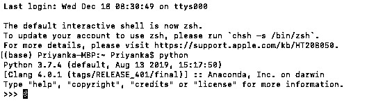
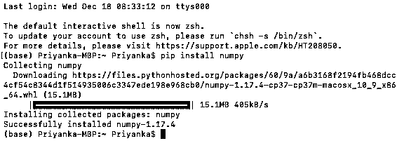
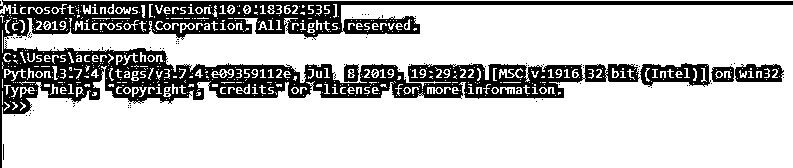
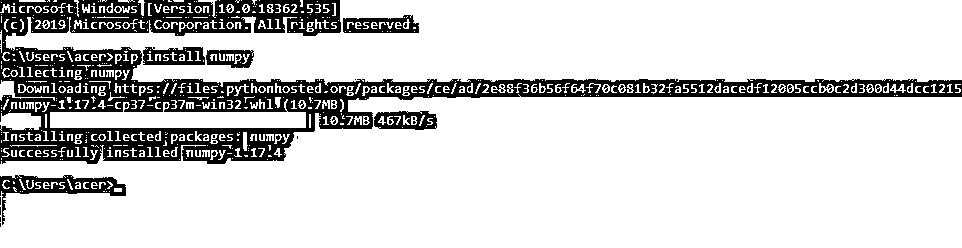
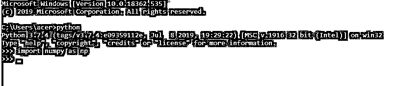

# 安装 NumPy

> 原文：<https://www.educba.com/install-numpy/>


## 如何安装 Numpy？

Numpy 是数据分析师和科学家中最著名的 python 库之一。它主要用于科学和数学计算。在 python 中，像 numpy、matplotlib、scipy 等包/库。不过是一个扩展模块。因此，安装一个包或多或少类似于下载它的脚本并把它作为一个头文件/扩展文件。

python 包安装程序(pip)用于安装所有 Python 包。我们可以通过在命令提示符下键入[pip–version]来检查我们的系统上是否已经安装了 pip。大多数时候，pip 是在 python 安装的时候安装的。如果还没有安装，应该从 PyPI (Python 包索引)下载，因为我们将使用它来下载各种 Python 库。在本帖中，我们将学习在 MAC、Windows 10 和 Ubuntu 操作系统上安装 NumPy 包。

<small>网页开发、编程语言、软件测试&其他</small>

### 在不同的操作系统上安装 NumPy

在这里，我们将看到 NumPy 在不同操作系统上的安装:

#### 形容词（adjective 的缩写）在 Mac 操作系统上安装 NumPy

**第一步:**打开终端。我们可以在 MAC 中打开终端，如下所示:

*   转到菜单栏
*   在菜单上选择开始
*   从下拉菜单中选择实用程序
*   从搜索结果中选择终端

转到→实用程序→终端

**第二步:**检查你的系统上是否安装了 python。您可以通过在终端上键入“Python”来检查这一点。它将为您提供系统上安装的 python 版本。MAC 操作系统通常已经安装了一个 python 包。




**第三步:**如第一步所述打开一个新的终端。现在，我们将使用以下命令安装 Numpy 库:

```
pip install numpy
```

这个命令将自动开始下载和安装 numpy 包。




**第四步:**现在，让我们尝试导入 numpy 库，检查它是否已经成功安装。我们可以使用下面的命令导入 numpy 并在我们的程序中使用它。在您的终端上编写 python 来创建一个 python 环境。

```
Python
```

现在，使用以下代码导入 numpy:

```
import numpy as np
```


这说明我们已经在 MAC 操作系统中成功安装了 numpy。现在，我们可以通过创建一个类似 np.array()、np.sum()或任何东西的 numpy 对象来使用它的任何类和函数。

#### B.在 Windows 操作系统上安装 Numpy

**Step1:** 打开命令提示符。您可以通过在桌面底部的任务栏中搜索来打开 Windows 中的命令提示符。

**第二步:**检查你的系统上是否安装了 python。您可以通过在终端上键入“Python”来检查这一点。它将为您提供系统上安装的 python 版本。




**第三步:**打开一个新的命令提示符，如第一步所述。现在，我们将使用以下命令安装 Numpy 库:

```
pip install numpy
```

这个命令将自动开始下载和安装 numpy 包。




**第四步:**现在，让我们尝试导入 numpy 库，检查它是否已经成功安装。我们可以使用下面的命令导入 numpy 并在我们的程序中使用它。在您的终端上编写 python 来创建一个 python 环境。

```
Python
```

现在，使用以下代码导入 numpy:

```
import numpy as np
```




我们已经成功地在 Windows 操作系统中安装了 numpy。现在，我们可以通过创建一个类似 np.array()、np.sum()或任何东西的 numpy 对象来使用它的任何类和函数。

#### 碳（carbon 的缩写）在 Ubuntu 操作系统上安装 Numpy

默认情况下，Python 存在于 Ubuntu 操作系统中。所以，我们这里不需要安装 python。但是，这个已经安装的 python 包没有附带 pip，而 pip 对于安装任何 python 包都是必不可少的。因此，我们必须从下载 pip 开始。

**第一步:**打开命令提示符。我们可以如下打开 ubuntu 中的命令提示符:

*   点击左上角的 Ubuntu 图标打开仪表板
*   在搜索栏上键入“终端”
*   从搜索结果中选择终端

**步骤 2:** 使用以下命令安装 pip，

```
sudo apt-get install python-pip
```

一旦我们成功安装了 pip，我们就可以继续安装 numpy。这个命令将自动开始下载和安装 pip 包，而不会在 Ubuntu 操作系统中给出任何依赖错误。

**第三步:**打开一个新的命令提示符，如第一步所述。现在，我们将使用以下命令安装 Numpy 库:

```
sudo pip install numpy
```

这个命令将自动开始下载和安装 numpy 包，而不会在 Ubuntu 操作系统中给出任何依赖错误。

**第四步:**现在，让我们尝试导入 numpy 库，检查它是否已经成功安装。我们可以使用下面的命令来导入 numpy 并在我们的程序中使用它。在您的终端上编写 python 来创建一个 python 环境。

```
Python
```

现在，使用以下代码导入 numpy:

```
import numpy as np
```

这个命令将成功地在 Ubuntu(或任何类似的 Linux)操作系统中安装 numpy。现在，我们可以通过创建一个类似 np.array()、np.sum()或任何东西的 numpy 对象来使用它的任何类和函数。

### 结论–安装 NumPy

我们已经成功地在 Mac、Windows 和 Ubuntu 操作系统上安装了 numpy。Numpy 是一个 python 扩展模块，用于科学和数学计算。作为一名[数据科学家或数据分析师](https://www.educba.com/data-analyst-vs-data-scientist/)，你在职业生涯中很可能会遇到这个模块。另外，这篇文章是专门为 numpy 安装而写的，但是我们可以用同样的方法下载其他 python 包，比如 scipy、matplotlib、pandas 等等。

### 推荐文章

这是安装 NumPy 的指南。这里我们讨论如何在不同的操作系统上安装 numpy，比如 mac、windows 和 ubuntu。您也可以阅读以下文章，了解更多信息——

1.  [NumPy 数据类型](https://www.educba.com/numpy-data-types/)
2.  [Python Web 开发](https://www.educba.com/python-web-development/)
3.  [numpy.linspace()](https://www.educba.com/numpy-linspace/)
4.  [numPy.where()](https://www.educba.com/numpy-where/)


