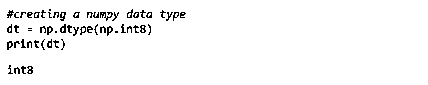
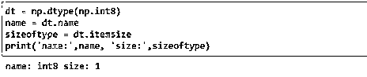
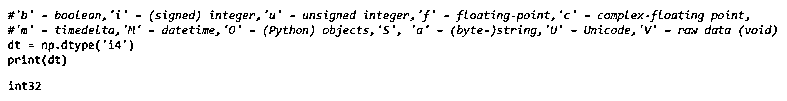
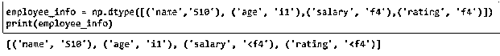

# NumPy 数据类型

> 原文：<https://www.educba.com/numpy-data-types/>


## NumPy 数据类型简介

数据类型用于定义具有特定类型的变量，该特定类型用于识别变量并允许给定类型的数据。Numpy 是 python 编程中使用的一种数据类型，随 Python 包一起提供，可用于多种科学计算操作。常用的几种 NumPy 数据类型有 np.byte，np.short，np.int_，np.uintc，np.ubyte，np.bool_，np.longlong，np.single，np.half，np.single，np.double，np.csingle，np.int8，np.int64，np.int32，np.intp，np.unitp，np.float64 等。

### Numpy 数据类型

numpy 支持的各种数据类型有:

<small>Hadoop、数据科学、统计学&其他</small>

| **Numpy 数据类型** | **紧密关联的 C 数据类型** | **存储大小** | **描述** |
| np.bool_ | 弯曲件 | 1 字节 | 可以保存布尔值，如(真或假)或(0 或 1) |
| np.byte | 有符号字符 | 1 字节 | 可以保存从 0 到 255 的值 |
| 比如说损失 | 无符号字符 | 1 字节 | 可以保存从-128 到 127 的值 |
| np.short | 带符号的短 | 2 字节 | 可以保存从-32，768 到 32，767 的值 |
| np.ushort | 无符号短整型 | 2 字节 | 可以保存从 0 到 65，535 的值 |
| np.uintc | 无符号整数 | 2 或 4 字节 | 可以保存 0 到 65，535 或 0 到 4，294，967，295 的值 |
| np.int_ | 长的 | 8 字节 | 可以保存从-9223372036854775808 到 9223372036854775807 的值 |
| np.uint | 无符号长整型 | 8 字节 | 0 到 18446744073709551615 |
| np .龙龙 | 龙龙 | 8 字节 | 可以保存从-9223372036854775808 到 9223372036854775807 的值 |
| 乌龙龙 | 无符号长整型 | 8 字节 | 0 到 18446744073709551615 |
| 半浮动 | — |  | 允许使用
格式的半浮点精度:符号位、5 位指数、10 位尾数 |
| np .单身 | 漂浮物 | 4 字节 | 允许单浮点精度
格式:符号位，8 位指数，23 位尾数 |
| np.double | 两倍 | 8 字节 | 允许双浮点精度
格式:符号位，11 位指数，52 位尾数。 |
| np.longdouble | 长双份 | 8 字节 | 浮子的延伸 |
| 比如说小叮当 | 浮动复合体 | 8 字节 | 可容纳具有实部和虚部的复数，最高可达
单精度浮点 |
| NP . cddouble | 双重情结 | 16 字节 | 可容纳高达
双精度浮点的实部和虚部复数 |
| 克隆双重 | 长双复数 | 16 字节 | 复数浮点数的扩展 |
| np.int8 | int8_t | 1 字节 | 可以保存从-128 到 127 的值 |
| np.int16 | int16_t | 2 字节 | 可以保存从-32，768 到 32，767 的值 |
| np.int32 | int32_t | 4 字节 | 可以保存从-2，147，483，648 到 2，147，483，647 的值 |
| np.int64 | int64_t | 8 字节 | 可以保存从-9223372036854775808 到 9223372036854775807 的值 |
| np.uint8 | uint8_t | 1 字节 | 可以保存从 0 到 255 的值 |
| np.uint16 | uint16_t | 2 字节 | 可以保存从 0 到 65，535 的值 |
| np.uint32 | uint32_t | 4 字节 | 可以保存从 0 到 4，294，967，295 的值 |
| np.uint64 | uint64_t | 8 字节 | 可以保存从 0 到 18446744073709551615 的值 |
| np.intp | intptr_t | 4 字节 | 用于索引的有符号整数 |
| np.uintp | uintptr_t | 4 字节 | 用于保存指针的无符号整数 |
| np.float32 | 漂浮物 | 4 字节 | 单浮点精度 |
| np.float64 | 两倍 | 8 字节 | 双浮点精度 |
| np .复杂 64 | 浮动复合体 | 8 字节 | 复数中的单浮点精度 |
| np.complex128 | 双重情结 | 16 字节 | 复数中的双浮点精度 |

### NumPy 数据类型的示例

现在，让我们了解一个特定的 numpy 数据类型是如何使用的。

#### 示例#1

创建数据类型对象

```
dt = np.dtype(np.int8)
```

**输出:**




#### 实施例 2

查找数据类型的大小

```
dt = np.dtype(np.int8)
name = dt.name
sizeoftype = dt.itemsize
print('name:',name, 'size:',sizeoftype)
```

**输出:**




#### 实施例 3

使用每个数据类型的唯一符号创建数据类型对象

numpy 中的每种数据类型都有一个唯一标识它的相关字符代码。

```
dt = np.dtype('i4')
```

**输出:**




#### 实施例 4

使用数据类型创建结构化数组

```
employee_info = np.dtype([('name','S10'), ('age', 'i1'),('salary', 'f4'),('rating', 'f4')])
print(employee_info)
```

**输出:**




```
a = np.array([('Karthik',31,20000,3.84),('Rita',25,25123.34,4.41)], dtype = employee_info)
print (a)
```

**输出:**


### 结论

Numpy 数据类型或多或少类似于 C 数据类型。它们可以大致分为布尔型、字节型、整型、浮点型、双精度型和复杂型。对于优秀的程序员来说，理解数据是如何存储和操作的是必须的。这可以通过有效地理解数据类型来实现。

### 推荐文章

这是 NumPy 数据类型的指南。在这里，我们将讨论如何使用特定的 numpy 数据类型以及示例。您也可以看看以下文章，了解更多信息–

1.  [NumPy 是什么？](https://www.educba.com/what-is-numpy/)
2.  [学习 NumPy 直方图的例子](https://www.educba.com/numpy-histogram/)
3.  [NumPy floor()函数示例](https://www.educba.com/numpy-floor/)
4.  [NumPy Ndarray 指南](https://www.educba.com/numpy-ndarray/)
5.  [NumPy 中的矩阵|示例|如何创建？](https://www.educba.com/matrix-in-numpy/)


