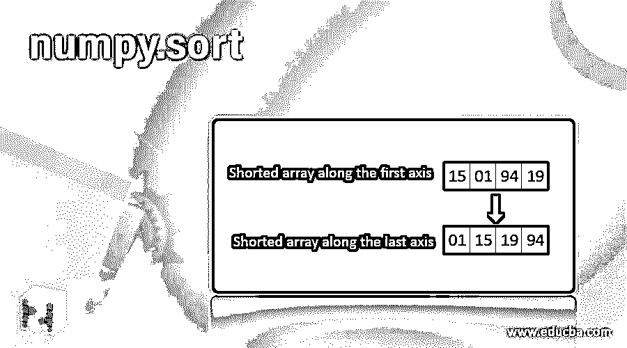
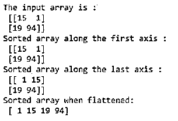
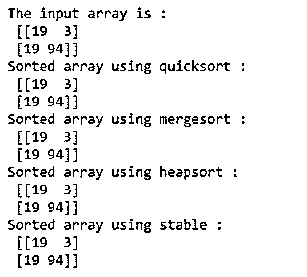
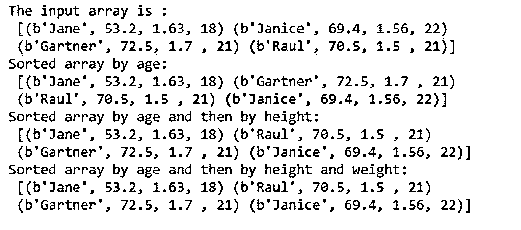

# numpy.sort

> 原文：<https://www.educba.com/numpy-sort/>




## numpy.sort 简介

Numpy.sort()是一个排序函数，它有助于按照一定的顺序排列数组的元素。假设我们想沿着第一个轴对数组进行升序排序，那么 numpy.sort()就来帮我们了。Numpy 提供了四种不同的排序算法:quicksort、heapsort、mergesort 和 timsort。我们将在解决一些例子时详细讨论这些算法。基于所需的时间和空间复杂度，我们可以选择任何提到的算法。

### 语法和参数

接下来，让我们更详细地讨论 numpy.sort()函数。编写该函数的标准语法如下:

<small>网页开发、编程语言、软件测试&其他</small>

```
numpy.sort(a, axis=-1, kind=None, order=None)
```

numpy.sort()的参数是:

*   **a:类数组对象—**要排序的输入数组。
*   **轴:0、-1 或无-**数组必须沿其排序的轴。如果什么都没有提到，那么数组在排序前被展平。默认情况下，数组沿最后一个轴排序。它用轴= -1 来表示。
*   **种类:{'quicksort '，' mergesort '，' heapsort '，' stable'}–**在 numpy 中，我们可以从这些排序算法中任意选择{'quicksort '，' mergesort '，' heapsort '，' stable ' }。默认情况下，将使用快速排序对输入数组进行排序。
*   **order:排序的顺序{字符串或列表}–**该参数指定排序所依据的字段。它通常在我们有一个字段定义的数组时使用。

在上述参数中，第一个参数是必需的。其他参数是可选的，可以根据具体要求使用。numpy.sort()函数返回输入数组的排序副本。

### 举例说明 numpy.sort

下面是不同的例子来说明 numpy.sort

#### 示例#1

使用 numpy.sort()演示沿不同轴排序的程序

**代码:**

```
import numpy as np
#creating an array
A = np.array([[15, 1], [19, 94]])
print ("The input array is : \n", A)
# sorting along the first axis
A_sorted = np.sort(A, axis = 0)
print ("Sorted array along the first axis : \n", A_sorted)
#sorting along the last axis
A_sorted = np.sort(A, axis = -1)
print ("Sorted array along the last axis : \n", A_sorted)
#sorting the flattened axis
A_sorted = np.sort(A, axis = None)
print ("Sorted array when flattened: \n", A_sorted)
```

**输出:**




#### 实施例 2

使用 numpy.sort()演示使用不同排序算法进行排序的程序

**代码:**

```
import numpy as np
#creating an array
A = np.array([[19, 3], [19, 94]])
print ("The input array is : \n", A)
# sorting along the first axis using quicksort
A_sorted = np.sort(A, axis = 0, kind = 'quicksort')
print ("Sorted array using quicksort : \n", A_sorted)
# sorting along the first axis using mergesort
A_sorted = np.sort(A, axis = 0, kind = 'mergesort')
print ("Sorted array using mergesort : \n", A_sorted)
# sorting along the first axis using heapsort
A_sorted = np.sort(A, axis = 0, kind = 'heapsort')
print ("Sorted array using heapsort : \n", A_sorted)
# sorting along the first axis using stable
A_sorted = np.sort(A, axis = 0, kind = 'stable')
print ("Sorted array using stable : \n", A_sorted)
```

**输出:**




快速比较不同算法的空间和时间复杂度。

| **分析类型** | **快速排序** | **堆排序** | **合并排序** | **timsort** |
| 最好的情况 | O(n*log(n)) | O(n*log(n)) | O(n*log(n)) | O(nk) |
| 最坏情况 | O(n^2) | O(n*log(n)) | O(n*log(n)) | O(nk) |
| 一般情况 | O(n*log(n)) | O(n*log(n)) | O(n*log(n)) | O(nk) |
| 空间 | 常数 | 常数 | 依赖 | 依赖 |
| 稳定性 | 不 | 不 | 是 | 是 |

稳定本身并不是一个排序算法。它是一个关键字，用于指导函数为正在排序的数据类型自动选择最佳的稳定排序算法。在 numpy 的当前版本中，它被映射到合并排序和基数排序。它们根据数据类型交替使用。

快速排序和堆排序是就地排序算法。它们不需要额外的空间来进行比较。而合并排序是一种不合适的算法。它在数组中需要 O(n)的空间。因此，您可以根据空间限制选择这些算法中的任何一种。Timsort 最适合于几乎已经排序的数组。如果在函数中没有提到 kind 参数，那么 numpy.sort()将默认使用 quicksort。

#### 实施例 3

演示使用 numpy.sort()在字段定义或结构化数组中排序的程序

**代码:**

```
import numpy as np
#defining values and data type for creating a field defined array
dtype = [('student', 'S10'), ('weight', float),('height', float),('age', int)]
values = [('Jane',53.2,1.63,18), ('Janice',69.4,1.56,22),('Gartner',72.5,1.7,21),('Raul',70.5,1.5,21)]
# creating a field defined array
A = np.array(values, dtype=dtype)
print ("The input array is : \n", A)
# sorting the array by age
A_sorted = np.sort(A, order = 'age')
print ("Sorted array by age: \n", A_sorted)
# sorting the array by age then by height if age is equal
A_sorted = np.sort(A, order = ['age','height'])
print ("Sorted array by age and then by height: \n", A_sorted)
# sorting the array by age then by height and finally by weight if age and height are equal
A_sorted = np.sort(A, order = ['age','height'])
print ("Sorted array by age and then by height and weight: \n", A_sorted)
```

**输出:**




### 结论

Numpy.sort()是一个排序函数，用于排列类似数组的对象的元素。该函数将类似数组的对象作为输入，并输出输入数组的排序副本。在 numpy 中，我们可以使用四种算法对数组进行排序。这些算法是快速排序、堆排序、合并排序和时间排序。

numpy 模块中还有一些其他排序函数，如 ndarray.sort()(就地排序数组)、np.argsort()(间接排序)、np.lexsort()(对多个键进行间接稳定排序)和 np.partition()(部分排序)。我们将在接下来的文章中更详细地讨论它们。

### 推荐文章

这是一个 numpy.sort 的指南。这里我们讨论 numpy.sort 的介绍和参数，以及示例和代码实现。您也可以阅读以下文章，了解更多信息——

1.  [数字直方图](https://www.educba.com/numpy-histogram/)
2.  [NumPy 数据类型](https://www.educba.com/numpy-data-types/)
3.  [NumPy Ndarray](https://www.educba.com/numpy-ndarray/)
4.  [numpy.linspace()](https://www.educba.com/numpy-linspace/)


