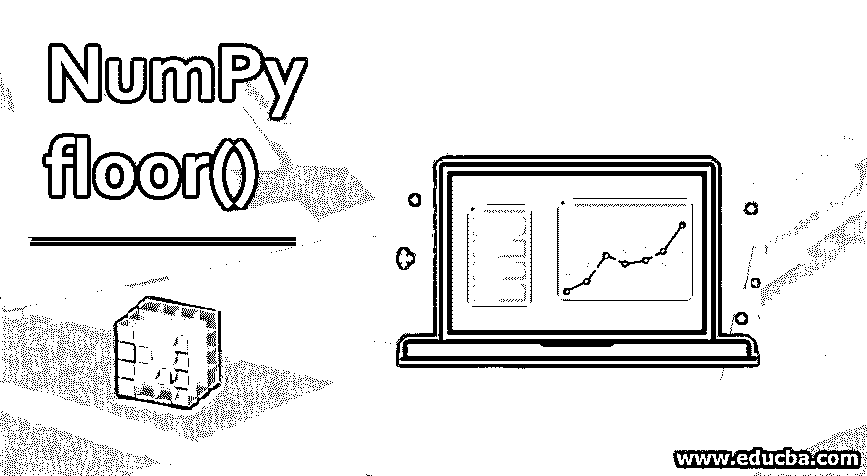
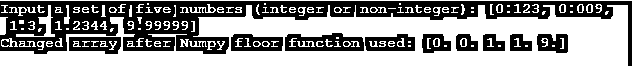

# NumPy 地板()

> 原文：<https://www.educba.com/numpy-floor/>




## NumPy 地板简介()

Python 提供了一个为科学计算工具提供的核心库，这些工具被称为 Numpy。它是一个数组对象，以多维高性能数组著称。NumPy floor()是一个数学函数，存在于 Python 语言编码时使用的工具中。它返回数组中元素的底值。因此，对于包含标量值的数组，将返回一个值“I ”,它将是最大的整数(这样 I 的值< =x)

### NumPy 的优势

为了简化 Numpy 数组的优势，我们可以根据三个参数来查看它的输出传递。它们如下:

<small>网页开发、编程语言、软件测试&其他</small>

*   **大小:** Numpy 数据结构在内存中占用相对较少的空间。
*   **性能:**比较数组中提供的两个列表，Numpy 数据结构要快得多。
*   **功能:**众所周知，内置函数的优化水平很高(例如:内置[线性代数运算](https://www.educba.com/numpy-linear-algebra/)。

### 语法和参数

```
numpy.floor(x, /, out=None, *, where=True, casting='same_kind', order='K', dtype=None, subok=True[, signature, extobj]) = <ufunc 'floor'>
```

标量 x 的底是最大的整数 I，因此 i <= x。它通常表示为。

**参数**

以下是 floor()语法的元素细分列表，其中的详细信息已在下面列出，解释了所有的功能和含义:

| **参数:** | **x: **stands for the set of arrays that would be processed by the floor()  function.它可以是程序员定义的一组值，也可以是用户被提示输入的值，这些值将被用作变量数组。**out** :可以在 None、ndarray 或 ndarray 的元组以及 None 之间分配多个特性给 out。这是一个可选步骤。

*   如果没有提到，则返回新分配的数组。
*   如果编写了 tuple(仅在某些情况下可能作为关键字编写),那么返回值的长度应该等于输出的数量。

**其中** : array_like(可选是否包含在代码中)使用 False 时反映的值表示输出中的值必须保持不变，而 True 反映的值表示必须在保存该值的存储器位置对 ufuncn 执行计算。 |
| **退货:** | **y**: ndarray or scalar values that are returned after processing of the entered code on the values entered by the user, which has been made by the programmer返回 x()中每个元素的下限(从技术角度来说，该值返回向下舍入的值，即对于数字 9.9999，返回值是 9 而不是 10)。如果 x 是一个标量实体，这就是一个标量值。 |

### NumPy floor()函数如何工作？

Numpy floor()检查输入变量的值(必须是实数；假设 x)并将变量向下舍入到最接近的整数，最后返回处理后的输出。必须注意，它不是四舍五入，而是小于或等于输入的值(即 x 本身)。它不同于另一个函数[ceil()]，后者用于返回向上舍入的变量。

让我们通过下表简化地板和天花板之间的差异:

| **x** | ********{ \ display style \ LCL part x \ rcpart】******** | **楼板**********【显示样式\ lfloor x \ rfloor】******** | **分数{ x } {\displaystyle \{x\}}** |
| **3** | Three | Three | Zero |
| **3.4** | Four | Three | Zero point four |
| **3.9** | Four | Three | Zero point nine |
| **—3.7** | −3 | −4 | Zero point three |
| **—3** | −3 | −3 | Zero |

### 在 Numpy 中实现 floor()函数的例子

让我们借助一个例子来解释 floor 函数的工作原理

**代码:**

```
import numpy as np
arr= [0.123, 0.009, 1.3, 1.2344, 9.99999]
print ("Input a set of five numbers (integer or non-integer):", arr)
r_arr = np.floor(arr)
print("Changed array after Numpy floor function used:",r_arr)
```

**输出:**




因此，我们看到输出反映了输入的每个数字的舍入值。如果使用了 numPy ceil()函数，这个值就会被取整。

**说明:**

函数 numpy 必须从 python 工具集中导入

*   提示用户输入数组的值(用户必须输入的值的数量在输出屏幕的注释中提示)
*   调用函数 flooroff_values，它逼近用户输入的具有平均值的数字，并返回最接近的整数
*   舍入后的值在输出窗口中返回(即 0.1，1。, 0.).
*   我们可以看到所有返回的值都是最接近的整数。

因此，我们看到，我们没有得到四舍五入，但更接近其基本整数的值。对于小数和整数值为零的数字，它们将只返回零。因此，对于 0.99999 到 0.000001 之间的值，返回的所有 floor()值都将是 0。

### 结论

该函数虽然使用起来相当简单，但它与 python 中的 Nympy 包提供的多种科学计算工具中的其他可利用函数捆绑在一起。它大大减少了程序员编写小代码的时间，同时也减少了使用这些代码的复杂函数的时间。

因此，这减少了代码的冗长，增加了可信度和正面词汇，让更多用户将 Python 作为首选编码语言。当人们处理使用大量数学应用程序的核心定量数据时，这些代码集特别有用。

因此，由于 R 语言的精确性和基于科学计算的工具的内置特性，使用 R 语言实现这种数学功能的编码人员，在更好的用户界面和减少冗长的好处上又增加了一项，使其成为所有功能操作的编程语言。

### 推荐文章

这是 NumPy 地板的指南()。这里我们讨论 NumPy floor()函数是如何工作的？以及参数、优点和示例。您也可以浏览我们的其他相关文章，了解更多信息——

1.  [NumPy 数据类型](https://www.educba.com/numpy-data-types/)
2.  [NumPy Ndarray](https://www.educba.com/numpy-ndarray/)
3.  [NumPy 数组函数](https://www.educba.com/numpy-array-functions/)
4.  [NumPy 线性代数](https://www.educba.com/numpy-linear-algebra/)


