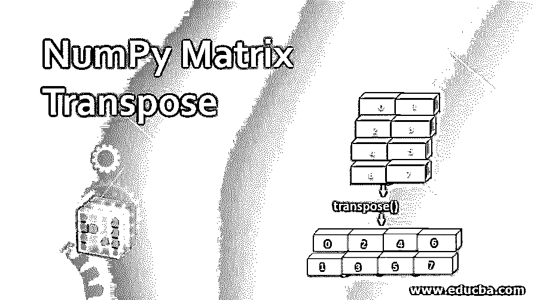
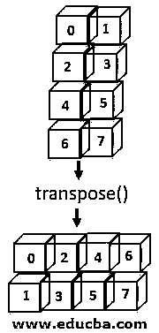
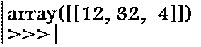
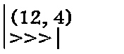
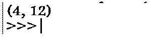
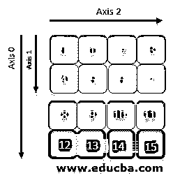
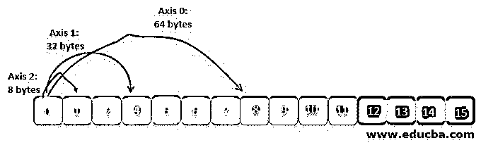
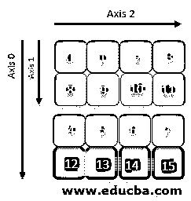
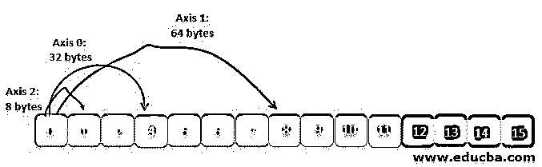
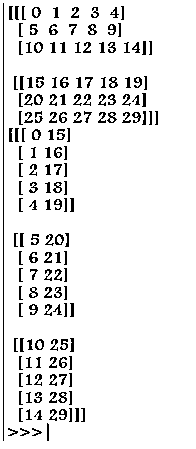

# NumPy 矩阵转置

> 原文：<https://www.educba.com/numpy-matrix-transpose/>




## NumPy 矩阵转置简介

转置矩阵函数是编码语言中非常普遍需要的组件，通常使用嵌套循环来执行。但是使用编程语言中的 Numpy transpose matrix()函数，python 只需要一行代码就可以将转置后的值返回给用户输入的矩阵，从而在逻辑和冗长方面简化了一个重要的函数。简单地说，转置函数颠倒了排列成行和列的元素的顺序，即，具有(X，Y)方向的数组将变成(Y，X)。




<small>网页开发、编程语言、软件测试&其他</small>

Numpy 包是一个多用途的预构建包，主要用于处理和辅助数组的数据操作(主要针对多维数组)。

**语法:**

```
numpy.transpose(a,axes=None)
```

**参数:**

| **参数名称** | **描述** | **状态** |
| 英语字母表中第一个字母 | 输入数组——它代表编码器使用的内置数组。(它可以是预先输入的变量，也可以提示用户输入值，还可以通过定义其维度大小和元素来定制数组) | 需要 |
| 轴 | 默认情况下，数组在维度上是相反的。也可以通过公式语法根据由用户定义的值置换轴来完成) | 可选择的 |

**Axes:**numpy transpose()函数中使用的第二个参数是轴，通过它来排列值。

为了简化，让我们举一个例子:

让我们假设初始元素的索引是(x，y，z)

(这里 x 代表第 0 个轴

y 代表第一轴

z 代表第二轴)

得到的转置数组的方向为(z，y，x)；其中第 0 轴和第 2 轴已经互换。

(这里 z 代表第 0 轴

y 代表第一轴

x 代表第二轴)

**返回值:[ndarray]**

它作为轴被置换的输出值返回。如果可能，将返回数组的视图。

### NumPy 矩阵转置示例

下面给出了一个应用 Numpy 矩阵的例子:

| **代码使用 Numpy transpose** 转置数组 | **评论** |
| 

```
import numpy as np
xyz = np.matrix('[1, 2 ; 3, 4]')
ans= np.transpose(xyz)
print(ans)
```

**输出:**T2T4】


 | Function used to import the important module needed to implement the solution in python用于创建矩阵的 numpy 函数用于创建矩阵的 numpy 函数应用 matrix.transpose()函数给出所需的结果 |

**matrix . transpose()–**该函数返回轴反转的数组视图。

这对一维数组没有影响，因为生成的数组完全相同。在多维数组上可以看到这种效果。当分别转置一维和二维列向量的数组时，必须增加一个额外的维度。这是由 ndarray 实现的。t 和 np.newaxis。

对于维数未定义的数组 a，假设它是 n 维的

```
a.shape=(i[0],i[1],i[2]...i[n-2],i[n-1])
a.transpose().shape=(i[n-1],i[n-2],...i[2],i[1],i[0])
```

### 转置和图像表现过程的解释

为了理解转置的机制，我们必须理解 Numpy 函数只是使用形状和步幅的信息，并交换它们以返回转置的数组。以下示例显示了函数发生的方式:

**代码:**

```
arr = np.array([[12, 32, 4]])
arr
```

**输出:**




**代码:**

```
arr.strides
```

**输出:**




**代码:**

```
arr.transpose(1, 0).strides
```

**输出:**




您可以看到转置操作，不需要复制任何数据，NumPy 使用底层内存来重新排列新转置数组的构造。

### 想象步伐

跨距值是一个字节的表示，该字节在内存中行进以到达数组轴的下一个值。

让我们考虑一个如下所示的三维数组 arr。这个数组存储在计算机中的连续内存块中，对它来说就像 1D，为了对它的 3D 可视化进行解释，Numpy 函数跳过某些字节，沿着其中一个轴移动。







因此，沿轴-1 移动时，跳过 4 个值(8 字节 x 4 = 32 字节)，而沿轴-0 移动时，跳过 8 个值(8 字节 x 8 = 64 字节)。

在执行 transpose -> arr.transpose(1，0，2)函数时




因此，这里的 NumPy 交换两个轴(即轴 1 和轴 0)的信息跨度，轴 2 保持不变。此外，系统必须跳得更远，以便沿轴 1 移动，而不是先前移动的轴 0。




**代码:**

```
import numpy as np
A =np.arange(30). reshape((2,3,5))
print(A)
print(np.transpose(A,(1,2,0)))
```

**输出:**




### 结论

转置是许多数学和统计编码中需要的一个非常重要的功能。为程序中重复需要的单个函数编写多行代码。transpose()的 numpy 函数给出了一个解决方案，直接给出所需的函数，同时减少了程序的冗长性，这直接影响了输出的运行时间和执行。

像 NumPy 这样的带有各种内置工具(如 transpose)的库提供了可以存储数据的数据帧，并且可以在该数据帧上执行各种操作。它还提供了并行计算的额外优势。当我们处理的数据量有限时，数据处理的核心不会受到太大影响。当数据变得巨大时，单个核心不足以进行处理，其中 NumPy 数据集将处理过程分成不同的矿石，使得整个过程相对快得多。

### 推荐文章

这是一个 NumPy 矩阵转置指南。这里我们讨论 NumPy 矩阵转置的例子以及转置的过程。您也可以看看以下文章，了解更多信息–

1.  [NumPy 数组](https://www.educba.com/numpy-arrays/)
2.  [NumPy 数组函数](https://www.educba.com/numpy-array-functions/)
3.  [安装 NumPy](https://www.educba.com/install-numpy/)
4.  [NumPy Ndarray](https://www.educba.com/numpy-ndarray/)


