# NumPy 数组函数

> 原文：<https://www.educba.com/numpy-array-functions/>

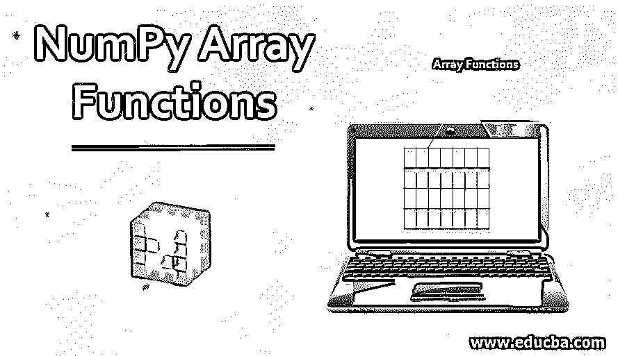


## NumPy 数组函数概述

在 python 中，我们没有对数组数据类型的内置支持。但是不要担心；我们仍然可以在 python 中创建数组，方法是将列表和元组等 python 结构转换成数组，或者使用固有的 numpy 数组创建对象，如 arrange、one、zeros 等。这篇文章将讨论创建和使用数组的内在 numpy 数组函数。

**数组创建:** Numpy 为我们提供了几个内置函数来从头开始创建和使用数组。用于创建数组的典型 numpy 数组函数如下所示:

<small>网页开发、编程语言、软件测试&其他</small>

```
numpy.array(object, dtype=None, copy=True, order='K', subok=False, ndmin=0)
```

这里，除了对象之外的所有属性都是可选的。因此，即使您不太了解其他参数，也不要担心。

*   **Object:** 指定需要数组的对象
*   **Dtype:** 指定数组所需的数据类型
*   **Copy:** 指定是否要复制数组
*   **顺序:**指定存储器创建的顺序
*   **Subok:** 指定您想要子类还是基类类型数组
*   **Ndmin:** 指定数组的维数

### NumPy 数组创建示例

下面是 NumPy 数组函数的不同示例:

#### 示例 1–使用 np.array()函数创建数组

**代码:**

```
#importing numpy
import numpy as np
#creating an array a
a = np.array( [[ 1, 2, 3, 4],
[ 5, 6, 7,8],
[9,10,11,12]]
)
#printing array a
print ("Array is:",a)
#we can also print the other attributes like dimensions,shape and size of an array
print ("Dimensions of a are:", a.ndim)
print ("Shape of a is", a.shape)
print ("Size of a is", a.size)
```

**输出:**

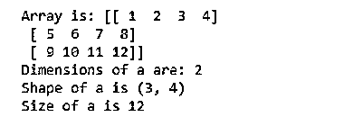


#### 示例 2–使用 empty_like 函数创建一个空数组

Empty_like 函数返回一个形状为类型为输入的空数组。

```
np.empty(shape, dtype)
```

**代码:**

```
import numpy as np
#creating an array an empty square array of dimensions 2X2
empty_array = np.empty([2,2], dtype = int)
#np.empty() creates an array with random values
print ("Array is:", empty_array)
```

**输出:**

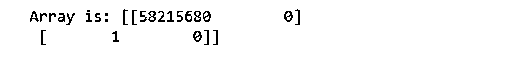


#### 示例 3–使用 zero_like 函数创建一个包含零的数组

Zero_like 函数以形状和类型作为输入返回一个零数组。

```
np.zeros(shape,dtype)
```

**代码:**

```
import numpy as np
#creating an array a zeros square array of dimensions 2X2
zeros_array = np.zeros([2,2], dtype = int)
print ("Array is:", zeros_array)
```

**输出:**

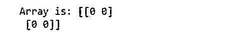


其他类似的创建数组的函数很少，像 ones_like，full_like，eye()，arange() np.asarray()等。

### 数组操作的例子

以下是 NumPy 数组函数中数组操作的不同示例:

#### 示例# 1—从一个阵列复制到另一个阵列

我们可以使用 copyto 函数将内容从一个数组复制到另一个数组。

```
np.copyto(destination, source)
```

**代码:**

```
import numpy as np
#creating an array a zeros square array of dimensions 2X2
zeros_array = np.zeros([2,2], dtype = int)
print ("Array zeros is:", zeros_array)
ones_array = np.ones([2,2], dtype = int)
print ("Array ones is :", ones_array)
#copying content from ones_array to zeros
np.copyto(zeros_array,ones_array)
print ("New zeros array :", zeros_array)
```

**输出:**

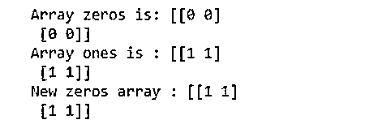


#### 示例 2–更改阵列的形状

Reshape 改变数组的形状而不改变其中的数据。

```
np.reshape(object, shape)
```

**代码:**

```
import numpy as np
#creating an array a 1D array
a = np.array([[1,2],[3,4]])
print ("array a is :", a)
#changing the shape of array from 2D to 1D
print ("reshape array a is:",np.reshape(a,4))
```

**输出:**

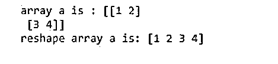


#### 示例 3–转置一个数组

Transpose_like 数组函数帮助转置数组。

```
ndarray.T
```

**代码:**

```
import numpy as np
#creating an array a 1D array
a = np.array([[1,2],[3,4]])
print ("array a is :", a)
#transposing array a using array.T
print ("transposed array a is:", a.T)
```

**输出:**

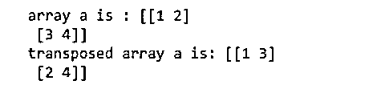


我们也可以使用，

np.moveaxis(a，source，destination)，np.rollaxis(a，axis)和 np.swapaxes(a，axis1，axis2)来转置一个数组。

#### 示例 4–连接两个或多个阵列

Concatenate 函数有助于沿着给定的轴连接两个或多个数组。

```
np.concatenate((a1, a2, ...), axis=0, out=None)
```

**代码:**

```
import numpy as np
#creating two arrays a and b
a = np.array([[1, 2], [3, 4]])
b = np.array([[5, 6]])
#joining a and b vertically
print ("concatenated array vertically:", np.concatenate((a, b), axis=0))
#joining a and b horizontally
print ("concatenated array horizontally:", np.concatenate((a, b), axis=None))
```

**输出:**

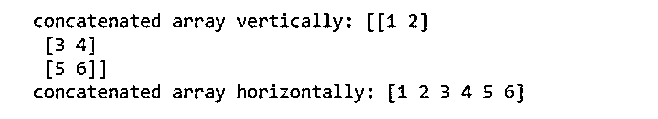


其他 numpy 数组函数，如 np.stack(array，axis)和 np.block(array1，array2 等)也可用于沿所需轴将两个或多个数组连接在一起。

#### 示例 5–将一个阵列拆分成多个子阵列

[split 函数帮助](https://www.educba.com/split-function-in-python/)将一个数组分割成多个大小相等或接近相等的子数组。

```
np.split(**array, indices)**
```

**代码:**

```
import numpy as np
#creating an array using arange function.
a = np.arange(8)
print (a)
#splitting array a into 4 equal parts
print ("sub-parts of array a:", np.split(a, 4))
```

**输出:**

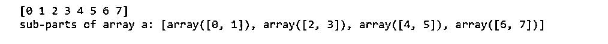


很少有其他函数可以用来执行类似的任务，如 hsplit(数组，索引)、vsplit(数组，索引)、array_split(数组，索引，轴)。

#### 示例 6–向现有阵列添加元素

我们可以使用 np.insert(array，index，value)沿着给定的轴在给定的索引之前插入值。但是，如果我们想在数组末尾添加值，我们可以使用，

```
np.append(array, value, axis = 0)
```

**代码:**

```
import numpy as np
#creating an array using arange function.
a = np.array([[1,2,3],[1,2,3]])
print ("array a is :", a)
#inserting elements along the y axis at index 1
print ("array a after insertion :", np.insert(a,1,5, axis = 1))
```

**输出:**

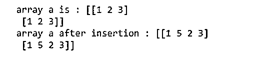


#### 示例 7–从数组中删除元素

Delete 函数可以用来删除给定数组的一个轴，并返回一个新的数组，沿着被删除的轴有子数组。

```
np.delete(array, object, axis)
```

**代码:**

```
import numpy as np
#creating an array using arange function.
a = np.array([[1,2,3],[1,2,3]])
print ("array a is :", a)
#deleting elements
print ("array a after deletion :", np.delete(a,[1,2,3], axis = 0))
```

**输出:**

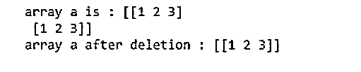


#### 示例 8–将数组元素旋转 90 度

我们可以使用 np.rot90()在轴指定的平面内将数组旋转 90 度。

```
np.rot90(array, no_of_times_to_rotate, axes)
```

**代码:**

```
import numpy as np
#creating an array using arange function.
a = np.array([[1,2],[3,4]])
print ("array a is :", a)
#rotating elements by 90 degrees once along (1,0)
print ("rotated array is :",np.rot90(a,1,(1,0)))
```

**输出:**

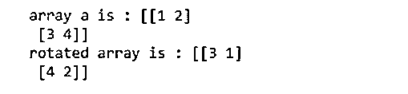


### 结论

在这篇文章中，我们讨论了一些基本的和常用的数组函数。这些函数还有许多其他版本。如果您想了解更多，请继续用不同的数组、轴、形状和索引来试验所讨论的函数。

### 推荐文章

这是 NumPy 数组函数的指南。这里我们讨论 NumPy 数组函数中数组创建和数组操作的概述和各种例子。您也可以阅读以下文章，了解更多信息——

1.  [NumPy Ndarray](https://www.educba.com/numpy-ndarray/)
2.  [numpy.linspace()](https://www.educba.com/numpy-linspace/)
3.  [numPy.where()](https://www.educba.com/numpy-where/)
4.  [NumPy.argmax()](https://www.educba.com/numpy-argmax/)


