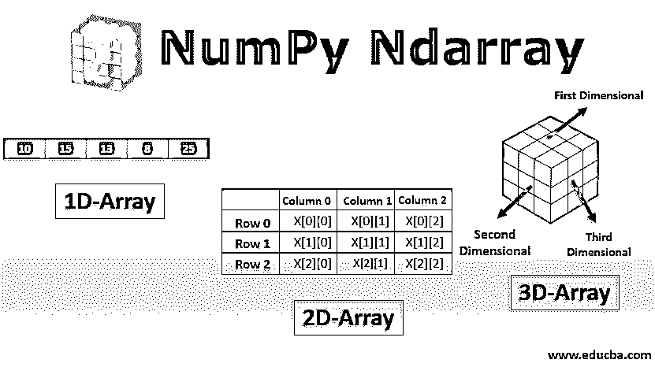
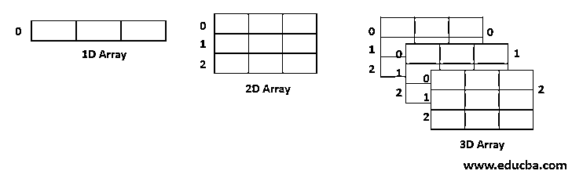
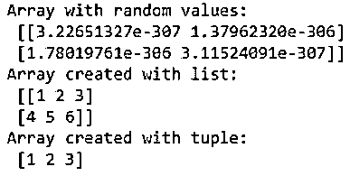
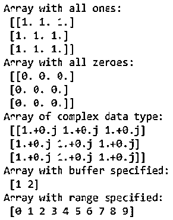
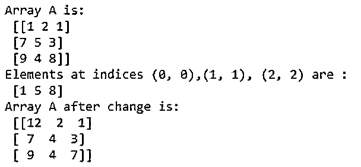
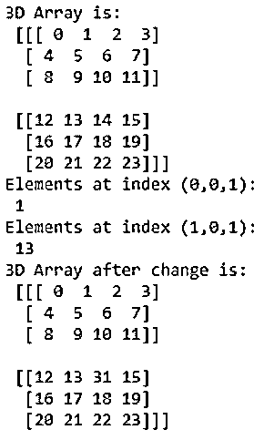
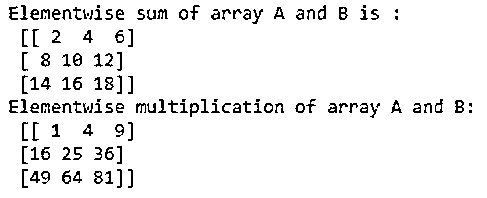

# NumPy Ndarray

> 原文：<https://www.educba.com/numpy-ndarray/>




## NumPy Ndarray 简介

Ndarray 是 NumPy python 库中最重要的类之一。它基本上是一个具有相同元素的固定大小的多维或 n 维数组(即数组中所有元素的数据类型都是相同的)。多维数组看起来像这样:




<small>网页开发、编程语言、软件测试&其他</small>

在 Numpy 中，数组的维数由秩给出。因此，在上面的例子中，1D、2D 和 3D 阵列的排列分别是 1、2 和 3。

**语法:**

```
np.ndarray(shape, dtype= int, buffer=None, offset=0, strides=None, order=None)
```

这里，数组中元素的大小和数量由 shape 属性给出。数组的数据类型(特别是元素)由 dtype 属性给出。Buffer 属性是公开缓冲区接口的对象。偏移量是缓冲区中数组数据的偏移量。Stride 属性指定内存中连续数组元素开始之间的位置数。

它应该总是大于或等于元素的数据类型的大小。最后，order 属性用于指定我们想要行主顺序还是列主顺序。在上述所有属性中，shape 和 dtype 是必选属性。所有其他属性都是可选的，可以根据需求指定。

### 使用 Ndarray

可以使用以下函数创建数组:

*   **np.ndarray(shape，type):** 用随机数创建给定形状的数组。
*   **np.array(array_object):** 从列表或元组中创建给定形状的数组。
*   **np.zeros(shape):** 创建一个给定形状的全零数组。
*   **np.ones(shape):** 创建给定形状的全 1 数组。
*   **np.full(shape，array_object，dtype):** 用复数创建给定形状的数组。
*   **np.arange(range):** 创建指定范围的数组。

### Ndarray 的示例

以下是 Ndarray 的示例:

#### 示例#1:多维数组的属性(ndarray)

**代码:**

```
import numpy as np
#creating an array to understand its attributes
A = np.array([[1,2,3],[1,2,3],[1,2,3]])
print("Array A is:\n",A)
#type of array
print("Type:", type(A))
#Shape of array
print("Shape:", A.shape)
#no. of dimensions
print("Rank:", A.ndim)
#size of array
print("Size:", A.size)
#type of each element in the array
print("Element type:", A.dtype)
```

**输出:**
T3】


#### 示例 2:创建多维数组(ndarray)

**代码:**

```
import numpy as np
#creating array using ndarray
A = np.ndarray(shape=(2,2), dtype=float)
print("Array with random values:\n", A)
# Creating array from list
B = np.array([[1, 2, 3], [4, 5, 6]])
print ("Array created with list:\n", B)
# Creating array from tuple
C = np.array((1 , 2, 3))
print ("Array created with tuple:\n", C)
# Creating array with all ones
D = np.ones((3, 3))
print ("Array with all ones:\n", D)
# Creating array with all zeros
E = np.zeros((3, 3))
print ("Array with all zeroes:\n",E)
# Creating an array with complex data type
F = np.full((3, 3), 1, dtype = 'complex')
print ("Array of complex data type:\n", F)
#creating an array with buffer
G = np.ndarray((2,), buffer=np.array([1,2,3]),dtype=int)
print ("Array with buffer specified:\n", G)
#creating an array with range
H = np.arange(10)
print ("Array with range specified:\n", H)
```

**输出:**







#### 示例#3: **程序，用于说明 2D 数组中的**索引

**代码:**

```
#creating an array to understand indexing
A = np.array([[1,2,1],[7,5,3],[9,4,8]])
print("Array A is:\n",A)
B = A[[0, 1, 2], [0, 1, 2]]
print ("Elements at indices (0, 0),(1, 1), (2, 2) are : \n",B)
#changing the value of elements at a given index
A[0,0] = 12
A[1,1] = 4
A[2,2] = 7
print("Array A after change is:\n", A)
```

**输出:**




#### 例#4: **程序，说明 3D 数组中的**索引

**代码:**

```
#creating a 3d array to see indexing in a 3D array.
import numpy as np
I = np.array([[[ 0,  1,  2,  3],
[ 4,  5,  6,  7],
[ 8,  9, 10, 11]],
[[12, 13, 14, 15],
[16, 17, 18, 19],
[20, 21, 22, 23]]])
print("3D Array is:\n", I)
print("Elements at index (0,0,1):\n", I[0,0,1])
print("Elements at index (1,0,1):\n", I[1,0,1])
#changing the value of elements at a given index
I[1,0,2] = 31
print("3D Array after change is:\n", I)
```

**输出:**




#### 示例 Ndarray 上的操作

Ndarrays 中的元素操作。

**代码:**

```
import numpy as np
A = np.array([[1, 2, 3],
[4,5,6],[7,8,9]])
B = np.array([[1, 2, 3],
[4,5,6],[7,8,9]])
# adding arrays A and B
print ("Elementwise sum of array A and B is :\n", A + B)
# multiplying arrays A and B
print ("Elementwise multiplication of array A and B:\n", A*B)
```

**输出:**




### Ndarrays 的优势

*   使用 Numpy Ndarrays 的一个主要优点是，与 python 中的类似数据结构(列表和元组)相比，它们占用的内存空间更少，运行速度更快。
*   Numpy Ndarrays 支持一些特定的科学函数，比如[线性代数](https://www.educba.com/numpy-linear-algebra/)。它们帮助我们解线性方程。
*   Ndarrays 支持矢量化运算，如元素加法和乘法，计算 Kronecker 积等。Python 列表不支持这些特性。

### 结论–NumPy Ndarray

NumPy Ndarray 是所有相同类型的对象的多维数组。它对科学和数学计算非常有帮助。因此，它们在数据科学、机器学习和人工智能中有应用。因此，为了成为一名高效的数据科学家或机器学习工程师，必须对 Numpy Ndarrays 非常熟悉。

### 推荐文章

这是 NumPy Ndarray 的指南。这里我们讨论 NumPy Ndarray 的介绍、语法、工作原理和各种例子。您也可以看看以下文章，了解更多信息–

1.  [NumPy 是什么？](https://www.educba.com/what-is-numpy/)
2.  [numpy.linspace()](https://www.educba.com/numpy-linspace/)
3.  [numPy.where()](https://www.educba.com/numpy-where/)
4.  [NumPy 中的矩阵](https://www.educba.com/matrix-in-numpy/)


