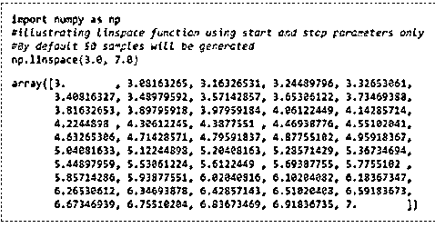
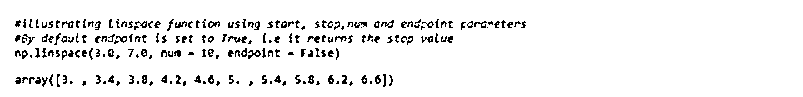
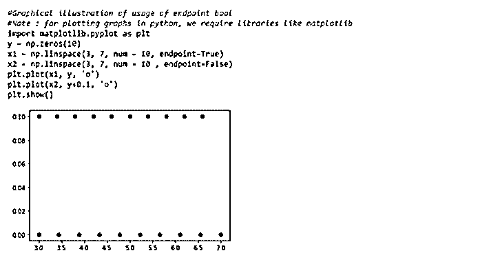
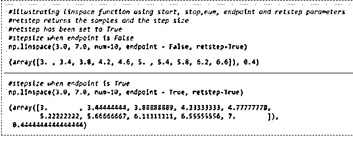
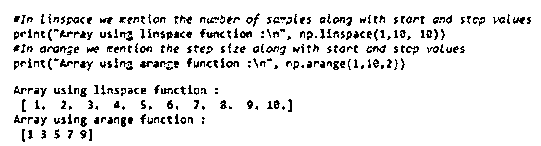
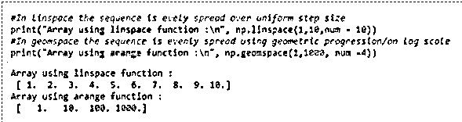

# numpy.linspace()

> 原文：<https://www.educba.com/numpy-linspace/>


## numpy.linspace()简介

numpy.linspace()是一个函数，用于在指定的时间间隔内创建数字序列。该函数的输出是一个包含数字序列的 ndarray。这个函数类似于 numpy 库中的 np.arange()和 np.geomspace()。

**语法和参数:**

<small>网页开发、编程语言、软件测试&其他</small>

编写该函数的标准语法如下:

```
numpy.linspace(start, stop, num=50, endpoint=True, retstep=False, dtype=None, axis=0)
```

该函数中使用的不同参数是:

**1。start: array_like 对象**

数字序列必须开始的起始值。

**2。停止:数组状物体**

数字序列的最后一个值。

**3。num:非负整数**

要生成的数字或样本数。如果您没有为该参数指定任何内容，那么该函数将使用默认值 50。此参数的值必须是非负数。

**4。端点:布尔{真或假}**

如果您为该参数指定 True，那么“停止”将被视为最后一个样本。否则，“停止”不包括在序列中。如果您没有为该参数指定任何内容，那么该函数将使用 True 作为默认值。另外，请注意，当端点为假时，步长会发生变化。

**5。retstep:boolean {真或假}**

如果 retstep 已设置为 True，则该函数返回样本，并以提到的步长作为样本之间的间距。

**6\. dtype，可选的**

输出数组的数据类型。如果您没有为此参数指定任何内容，那么函数将从其他输入参数中推断出数据类型。

**7。轴:整数{0，-1，无}**

创建的样本必须沿其存储的轴。如果你没有为这个参数提及任何东西，那么默认情况下 0 将被用作轴，样本将沿着一个新的轴在开始处插入。如果你想要最后的样本，那么使用 axis = -1。

前两个参数是必需的，其他参数是可选的，可以根据需要使用。

np.linspace()返回一个 ndarray。

### numpy.linspace()的示例

下面是提到的例子:

#### 示例#1

这个程序演示了带有开始和停止参数的 np.linspace()函数。

**代码:**

```
import numpy as np
#illustrating linspace function using start and stop parameters only
#By default 50 samples will be generated
np.linspace(3.0, 7.0)
```

**输出:**




#### 实施例 2

用 start，stop 和 num 参数演示 np.linspace()函数的程序。

**代码:**

```
import numpy as np
#illustrating linspace function using start, stop and num parameters
#We can notice that the step size changes with the sample size.
np.linspace(3.0, 7.0, num = 10)
```

**输出:**


#### 实施例 3

这个程序演示了 np.linspace()函数的开始、停止、数量和端点参数。

**代码:**

```
import numpy as np
#illustrating linspace function using start, stop,num and endpoint parameters
#By default endpoint is set to True, i.e it returns the stop value
np.linspace(3.0, 7.0, num = 10, endpoint = False)
```

**输出:**




#### 实施例 4

这个程序以图形化的方式展示了 np.linspace()函数的 start、stop、num、endpoint 和 retstep 参数。

**代码:**

```
import numpy as np
#Graphical illustration different parameters of the linspace function
#Note : for plotting graphs in python, we require libraries like matplotlib
import matplotlib.pyplot as plt
y = np.zeros(10)
x1 = np.linspace(3, 7, num = 10, endpoint=True)
x2 = np.linspace(3, 7, num = 10 , endpoint=False)
plt.plot(x1, y, 'o')
plt.plot(x2, y+0.1, 'o')
plt.show()
```

**输出:**




在上面的输出中，我们可以看到 np.linspace()生成了从 3 到 7 的 10 个样本。当终点设置为假时，除停止值外，已生成 10 个样本，即 7 个。我们还可以注意到，即使开始和停止值相同，两种情况下的步长也不同。

#### 实施例 5

用 start，stop，num，endpoint 和 retstep 参数演示 np.linspace()函数的程序。

**代码:**

```
import numpy as np
#illustrating linspace function using start, stop, num, endpoint and retstep parameters
#retstep returns the samples and the step size
#retstep has been set to True
#stepsize when endpoint is False
np.linspace(3.0, 7.0, num=10, endpoint = False, retstep=True)
```

**输出:**




**NP . Lin space()与其他类似函数的比较**

np.linspace()类似于 np.arange()和 np.geomspace()函数

| **np.arange()** | **np.linspace()** |
| 函数的作用是:创建一个均匀分布的数字序列，构造成一个 ndarray 数组。 | 函数的作用是:创建一个均匀分布的数字序列，构造成一个 ndarray 数组。 |
| np.arange()使用步长作为参数 | np.linspace()使用样本数作为参数 |

#### 实施例 6

说明 np.arange()和 np.linspace()之间区别的程序

**代码:**

```
import numpy as np
#In linspace we mention the number of samples along with start and stop values
print("Array using linspace function :\n", np.linspace(1,10, 10))
#In arange we mention the step size along with start and stop values
print("Array using arange function :\n", np.arange(1,10,2))
```

**输出:**




| **np.geomspace()** | **np.linspace()** |
| 函数的作用是:创建一个均匀分布的数字序列，构造成一个 ndarray 数组。 | 函数的作用是:创建一个均匀分布的数字序列，构造成一个 ndarray 数组。 |
| 在 np.geomspace()中，数字在对数尺度上均匀分布。 | 在 np.geomspace()中，数字以统一的步长均匀分布。 |

#### 实施例 7

说明 np.geomspace()和 np.linspace()之间区别的程序

**代码:**

```
import numpy as np
#In linspace the sequence is evely spread over uniform step size
print("Array using linspace function :\n", np.linspace(1,10,num = 10))
#In geomspace the sequence is evenly spread using geometric progression/on log scale
print("Array using arange function :\n", np.geomspace(1,1000, num =4))
```

**输出:**




### 结论

np.arange()、np.linspace()和 np.geomspace()可以互换使用。所有这三个 numpy 函数都是为了创建一个数字序列。您可以根据自己的需求和舒适度使用任何功能。

### 推荐文章

这是 numpy.linspace()的指南。这里我们讨论 numpy.linspace()的介绍，用适当的语法和相应的例子来更好地理解。你也可以看看下面的文章来了解更多-

1.  [NumPy 函数](https://www.educba.com/numpy-functions/)
2.  [NumPy 数组函数](https://www.educba.com/numpy-array-functions/)
3.  [numpy.sort](https://www.educba.com/numpy-sort/)
4.  [NumPy.argmax()](https://www.educba.com/numpy-argmax/)


