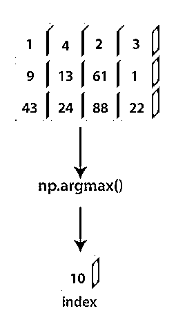
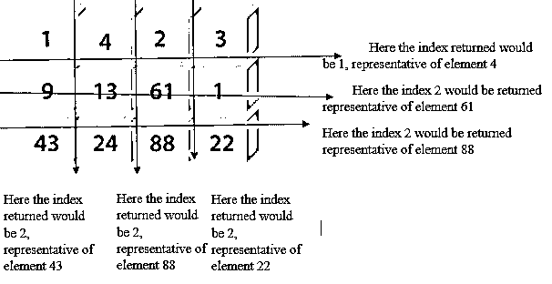
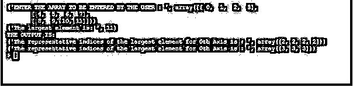

# NumPy.argmax()

> 原文：<https://www.educba.com/numpy-argmax/>


## NumPy.argmax()简介

在 Python 编码语言中使用 Numpy.argmax()函数，以便系统返回逐渐变为最大值的元素的索引。这是相对于由球场用户定义的指定轴来完成的。如果未在多维数组中定义轴，则系统将采用默认访问。该函数通常将数组展平为包含元素的线性价值链，在没有提到轴的情况下，从数组的所有内容中排序单个最大的元素。

### 语法和参数

以下是用 Python 编程语言编写 numpy.argmax()的语法:

<small>网页开发、编程语言、软件测试&其他</small>

```
numpy.argmax(a, axis=None, out=None)
```

**参数:**

以下是用 Python 编程语言编写的 numpy.argmax()函数所使用的参数:

*   **参数:** **a1 : array_like**
    用户进入的数组，寻找其中最大的元素
*   **轴:整数**
    被选择执行 argmax 功能的轴编号。如果用户没有指定特定的轴，则该函数的默认值是以线性形式对数组进行平坦化。
*   **输出:数组值返回**
    如果在指定的语法中提到了该参数，那么由系统执行后的函数将被插入到一个数组“输出”中。该数组必须与插入的原始数组具有相同的维数和数据类型
*   **返回:****index _ array:ndarray of ints**
    执行函数 argmax()后得到的输出。这个结果数组包含最大值元素的代表索引号的索引。这个结果数组具有与数组 a1 相同的尺寸和形状，但是沿着指定轴的尺寸作为例外被移除。

### NumPy.argmax()是如何工作的？




argmax 函数的工作方式是，当系统需要时，首先扫描提供给它的数组，并尝试识别用户是否指定了任何索引。如果没有指定轴，系统会计算出必须使用完整的数组来处理元素。

接下来，系统比较数组中出现的每个单独的元素，并识别其中最大的元素。这个元素不是直接提供给用户的。更确切地说，系统捕获代表计算机系统内的存储部分的索引号，在该存储部分中该元素已经被加密。

每当用户调用打印给定程序的输出时，索引号被调用并打印在屏幕上，代表元素在数组中的位置。

因此，对于每个轴，可能会选择不同的元素来显示最大的数字。例如:

这里最大的元素是 88，它将具有由系统显示的代表性索引号 10。对于第 0 <sup>个</sup>轴，数字 43 是最大的，因此将返回索引 3。




### 在 Python 中实现 NumPy.argmax()的示例

下面是提到的例子:

#### 示例#1

**代码:**

```
# A program written using the python language used to illustrate the function argmax()
import numpy as n1
# The program is shown to work on a two dimensional array
a1 = n1.arange(12).reshape(3, 4)
print("ENTER THE ARRAY TO BE ENTERED BY THE USER : ", a1)
# Performing the function by not specifying any axis, hence whole array to be used
print("The largest element is: ", n1.argmax(a1))
# Performing the function by specifying particular axis (here 0 and 1)
print ("THE OUTPUT IS:" )
print("The representative indices of the largest element for 0th Axis is : ", n1.argmax(a1, axis=0))
print("The representative indices of the largest element for 0th Axis is : ", n1.argmax(a1, axis=1))
```

**输出:**




#### 实施例 2

**代码:**

```
# A program written using the python language used to illustrate the function argmax()
import numpy as n1
# The program is shown to work on a two dimensional array
a1 = n1.random.randint(6, size=(4, 4))
print("ENTER THE ARRAY TO BE ENTERED BY THE USER : ", a1)
# Performing the function by not specifying any axis, hence whole array to be used
print("The largest element is: ", n1.argmax(a1))
# the program is used for returning Indices representing the largest element
# Performing the function by specifying particular axis (here 0 and 1)
print ("THE OUTPUT IS:" )
'''
[[ 0 30 80 130]
[120 110 20 110]
[ 50 130 80 30]
[120 150 30 40]]
^ ^ ^ ^
120 150 80 130 - element
1 3 0 0 - indices
'''
print("The representative indices of the largest element for 0th Axis is : ", n1.argmax(a1, axis=0))
''' ELEMENT INDEX
->[[ 0 30 80 130] 13 3
->[120 110 20 110] 12 0
->[ 50 130 80 30] 13 1
->[120 150 30 40]] 15 1
'''
print("The representative indices of the largest element for 1st Axis is : ", n1.argmax(a1, axis=1))
```

**输出:**


### 结论

argmax()函数是数值 python 包中一个非常重要的工具，它允许使用一个预构建的功能来寻找数组的以索引为中心的最大值。它不仅减少了正在编写的代码的冗长性，而且通过不将数据存储在多个结果阵列中并从以存储器为中心的单个存储器中投影，减少了对系统的整个存储器的压力，这增加了系统的处理能力。

### 推荐文章

这是 NumPy.argmax()的指南。这里我们讨论 NumPy.argmax()的介绍，语法，参数，它是如何工作的，以及相应的例子。您也可以浏览我们的其他相关文章，了解更多信息——

1.  num py . dot()
2.  [numpy.mean()](https://www.educba.com/numpy-mean/)
3.  num py . unique()
4.  [numpy.diff()](https://www.educba.com/numpy-dot-diff/)


