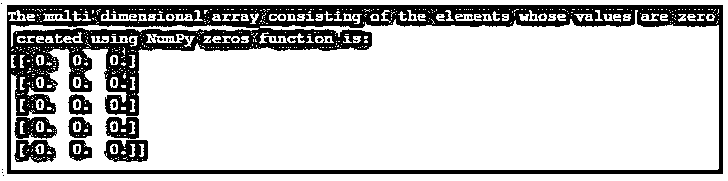

# NumPy 个零

> 原文：<https://www.educba.com/numpy-zeros/>


## NumPy 零简介

创建指定类型和指定形状的新数组，并且新创建的数组中的元素值为零。我们在 NumPy 中使用了一个名为 zeros 的函数，其中每个维度中的元素计数表示数组的形状，数组形状的数据类型是 int 或整数元组，zeros 函数采用一个可选的参数来指定数组的数据类型，数组数据类型的默认值是 float，还有另一个名为 order taken 的参数 由 zeros 函数执行，该函数的值决定多维数组必须以列优先顺序存储在内存中还是以行优先顺序存储在内存中。

**语法:**

<small>网页开发、编程语言、软件测试&其他</small>

```
zeros(shape, dtype=None, order='C')
```

*   其中阵列的大小由形状定义。
*   dtype 是一个可选的参数，它指定数组的数据类型，数组的默认数据类型是 float，order 是一个参数，它的值决定多维数组是必须以列优先顺序存储(在内存中不是 Fortran 风格)还是以行优先顺序存储(在内存中只是 C 风格顺序)。

### 数字零点的运算

*   每当需要创建指定类型和指定形状的新数组，并且新创建的数组中的元素值为零时，我们就使用 NumPy 中的一个函数，称为 zeros function。
*   每个维度中的元素计数表示数组的形状，数组形状的数据类型是 int 或整数元组。
*   zeros 函数接受一个可选参数，该参数指定数组的数据类型，数组的数据类型的默认值是 float。
*   还有另一个名为 order taken by the zeros 函数的参数，它的值决定了多维数组在内存中是按列优先顺序存储还是按行优先顺序存储。
*   内存中的列主顺序也称为内存中的 Fortran 风格顺序。
*   内存中的行优先顺序也称为内存中的 C 风格顺序。

### 例子

下面是提到的例子:

#### 示例#1

Python 程序演示了 NumPy zeros 函数来创建一个由值为零的元素组成的一维数组。

**代码:**

```
#importing the package numpy
import numpy as np
#creating a variable to store the one dimensional array created by using zeros function in NumPy
arrayname = np.zeros(5)
#the one dimensional array consisting of the elements whose values are zero created using NumPy zeros function is printed as output on the screen
print("The one dimensional array consisting of the elements whose values are zero created using NumPy zeros function is:")
print(arrayname)
```

**输出:**


在上面的程序中，导入了一个名为 NumPy 的包，使我们能够使用 zeros 函数。然后创建一个变量来存储在 NumPy 中使用 zeros 函数创建的一维数组。然后，由使用 NumPy zeros 函数创建的值为零的元素组成的一维数组作为输出打印在屏幕上。

#### 实施例 2

Python 程序演示了 NumPy zeros 函数来创建一个多维数组，该数组由值为零的元素组成。

**代码:**

```
#importing the package numpy
import numpy as np
#creating a variable to store the mutli dimensional array created by using zeros function in NumPy
arrayname = np.zeros((5,3))
#the multi dimensional array consisting of the elements whose values are zero created using NumPy zeros function is printed as output on the screen
print("The multi dimensional array consisting of the elements whose values are zero created using NumPy zeros function is:")
print(arrayname)
```

**输出:**




在上面的程序中，导入了一个名为 NumPy 的包，使我们能够使用 zeros 函数。然后创建一个变量来存储 NumPy 中使用 zeros 函数创建的多维数组。然后，由使用函数创建的值为零的元素组成的多维数组作为输出打印在屏幕上。

#### 实施例 3

Python 程序演示了创建多维数组的函数，该数组由值为零的元素组成，数组元素的数据类型为 int。

**代码:**

```
#importing the package numpy
import numpy as np
#creating a variable to store the mutli dimensional array, the data type of whose elements are specified to be of type int created by using zeros function in NumPy
arrayname = np.zeros((5,3), dtype=int )
#the multi dimensional array consisting of the elements whose values are zero and the data type of the elements is int created using NumPy zeros function is printed as output on the screen
print("The multi dimensional array consisting of the elements whose values are zero and the data type of the elements is int created using NumPy zeros function is:")
print(arrayname)
```

**输出:**


在上面的程序中，导入了一个名为 NumPy 的包，使我们能够使用 zeros 函数。然后创建一个变量来存储 NumPy 中使用 zeros 函数创建的多维数组。然后，由值为零的元素组成的多维数组和数组元素的数据类型是 int，使用函数创建的多维数组作为输出打印在屏幕上。

### 推荐文章

这是一个数字零的指南。这里我们分别用例子来讨论 NumPy 零点的介绍、工作原理。您也可以看看以下文章，了解更多信息–

1.  [numpy.linspace()](https://www.educba.com/numpy-linspace/)
2.  [numpy.ravel()](https://www.educba.com/numpy-dot-ravel/)
3.  [numpy.diff()](https://www.educba.com/numpy-dot-diff/)
4.  [numpy.pad()](https://www.educba.com/numpy-pad/)


