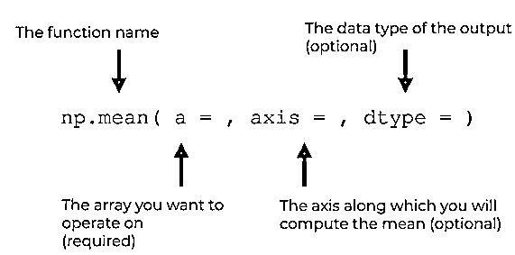
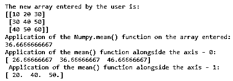
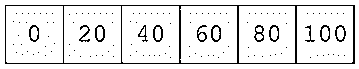
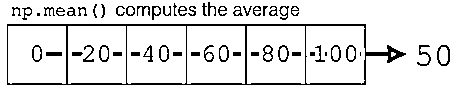

# numpy.mean()

> 原文：<https://www.educba.com/numpy-mean/>


## numpy.mean()简介

Numpy.mean()是 Python 语言中的函数，负责计算用户输入的数组中所有元素的算术平均值。简而言之，这些函数取沿给定轴出现的所有单个元素的总和，并将总和除以单个计算元素的数量。必须预先指定进行计算的轴，否则将采用轴的默认值。

### 语法和参数

以下是显示如何实现 numpy.mean()的语法。

<small>网页开发、编程语言、软件测试&其他</small>

```
numpy.mean (a, axis =None, dtype = None, out = None, keepdims =<no value>) 
```




用户输入的语法以**浮点** ***** **64** 中间形式发送，并由此返回对应于平均值的相关整数的值。

**numpy . mean()**语法中使用的参数

*   **a *: *array *_ *like ***

用户正在输入数组或提示输入数组。如果输入的数组不是整数数据类型，则将对输入的数据进行格式转换。

*   **轴:None *，* *int *，* *tuple *(可选参数)**

沿着用户输入的指定数组的元素的轴的计算已经完成。默认情况下，计算预展平数组的平均值。如果输入的数组是一个元组，在这种情况下，在数组的各个轴上计算平均值。

*   ****dtype****************:****************数据*********–*********类型** ***** **(参数可选)********

 ****对于平均值的计算，使用参数类型。默认情况下，float 数据类型用于具有整数数据集的数组。如果输入的数据是浮动的，它将保持与输入的数据类型相同。

*   **out : ndarray，(参数可选)**

这是一个用来记录合成平均值的替代阵列。默认情况下，参数保持不变。在提供的情况下，阵列需要具有与预期输出相同的确定形状。

*   **keepdims: bool，(参数可选)**

如果指定的参数为真，则推导出的轴将作为尺寸为 1 的尺寸保留在预期结果中。该选项使结果能够正确广播，以响应已输入的数组。在默认情况下，传递一个参数，那么 keepdims 参数将不会传递给方法特定的关于数组及其子类的 mean。但是，必须注意，对于传递的非默认值，keepdims 参数将适用于引发异常(如果有的话)。

*   **m:n 数组**

如果参数 out=None，那么在这种情况下，将返回一个包含平均值的新数组。否则，在这种情况下，如果返回，则返回关于元素的参考值。

### 实现 NumPy.mean()的示例

下面是提到的例子:

**代码:**

```
import numpy as n1
a1 = n1.array([[10,20,30],[30,40,50],[40,50,60]])
print 'The new array entered by the user is:'
print a1
print 'Application of the Numpy.mean() function on the array entered:'
print n1.mean(a1)
print 'Application of the mean() function alongside the axis - 0:'
print n1.mean(a1, axis = 0)
print ' Application of the mean() function alongside the axis - 1:'
print n1.mean(a1, axis = 1)
```

对于上面指定的代码，将产生以下输出:




### numpy.mean()是如何工作的？

该函数扫描用户提供的数组中指定的值。在计算算术平均值之前，它首先尝试展平结果数组。下面的系统示意图显示了实际执行计算的功能:




我们可以使用 NumPy mean 函数来计算平均值:




*   当 mean 函数遍历用户提供的各个轴时，它会扫描并尝试整合所有整数值的算术平均值功能，当元素不匹配为整数数据类型时，它会尝试转换这些数字。
*   这里您可以看到，对于一个具有六个指定元素的一维数组，这些函数扫描每个元素，然后将元素的总和除以数组中的元素总数(这里是 6)。
*   这样，对于具有多个维度的阵列，所有或指定的轴被提及，沿着该轴计算平均值，该平均值被显示在多于一个维度的阵列的阵列形式中。

### **结论**

NumPy 中的函数 mean()对于计算元素的算术平均值非常有用，特别是对于数组子集中给定的数据。通过手动代码计算会影响代码的冗长性，从而影响具有大数据集的长代码的计算时间。

### 推荐文章

这是 numpy.mean()的指南。这里我们讨论 numpy.mean()的介绍和工作，以及不同的例子和它的代码实现。您也可以阅读以下文章，了解更多信息——

1.  [NumPy 函数](https://www.educba.com/numpy-functions/)
2.  [numpy.sort](https://www.educba.com/numpy-sort/)
3.  [NumPy Ndarray](https://www.educba.com/numpy-ndarray/)
4.  [Numpy.argsort()](https://www.educba.com/numpy-argsort/)


****