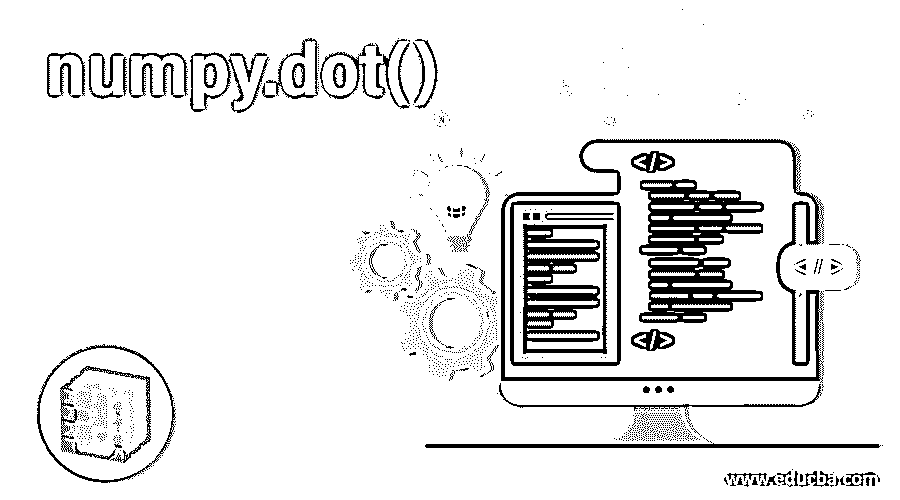
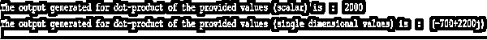
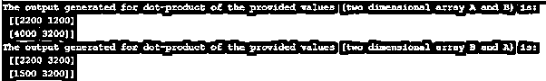

# numpy.dot()

> 原文：<https://www.educba.com/numpy-dot/>




## numpy.dot()是什么？

Numpy.dot()函数是一个负责返回用户输入的两个不同区域的点等价积的工具。在一维数组的情况下，该函数返回关于裁定向量的内积。相反，对于二维数组，函数返回的值等于两个数组相乘的结果输出。假设编码器不知道数组的维数(在用户输入地址的情况下)，输出等于数组‘B1’的倒数第二个轴和第一个数组‘a1’的最后一次访问的和积导数。

### 语法和参数

以下句子用于 python 编程语言中 Numpy.dot()的函数操作:

<small>网页开发、编程语言、软件测试&其他</small>

```
numpy.dot(a, b, out=None)
```

该函数负责返回数组的点积，同时保持下列投影的透视性:

*   对于一维数组，该函数返回关于裁定向量的内积
*   对于二维数组，该函数返回的值等于两个数组相乘的结果输出。
*   如果数组是无量纲的或 0-D 的(即标量实体),则结果输出是最后一个轴的和积
*   在 N-D 数组的情况下，用户不知道数组的维数，输出等于数组“b1”的倒数第二个轴和第一个数组“a1”的最后一次访问的和积导数。

这种情况下的语法格式是:

```
Numpy.dot(a1, b1)[i1, j1, k1, m1] = sum(a1[i1,j1,:] *** b1[k1,:,m1)
```

了解参数:

| **参数** | **a : array_like:** First array of argument which has been entered by the user**b : array_like:** 用户输入的第二个数组或参数。**out: ndarray，可选:**函数执行后得到的输出。该功能中用于实现的参数“种类”必须与用户输入的区域完全相同。特别是，参数“类型”必须正确，并且必须是 C-传染性类型。此外，必须注意，从输出返回的数据类型必须与为函数 numpy.dot(a1，b1)输入的 dtype 参数相同。这是一个与功能性能相关的指标特征。因此，必须理解的是，在不满足天气条件的情况下，有可能出现异常，而不是函数试图给出在输入的数据和参数方面灵活的输出。 |
| **返回** | **输出 *:* ndarray:** 该参数负责返回用户输入的数组(这里是 a1 和 b1)的点积。如果输入的区域是单个维度的标量值，则返回值是标量。相反，在空中是我们的 2D 或以上的结果输出是一个数组。 |
| **提高** | **ValueError:** 如果用户输入的第一个数组的指示性最后维度(此处为 a1)不等于用户输入的第二个数组的指示性最后维度(此处为 b1)，则系统会产生一个值错误。 |

### 使用 Numpy.dot()的示例

下面是一些例子:

#### 示例#1

**代码:**

```
# Program which illustrates using NuPy.dot() in python language
import numpy as n1
# Code written for Scalar Values entered by the user
output1 = n1.dot(50, 40)
print("The output generated for dot-product of the provided values (scalar) is  : ", output1)
# Code for 1D array
v_a1 = 20 + 30j
v_b1 = 40 + 50j
output2 = n1.dot(v_a1, v_b1)
print("The output generated for dot-product of the provided values (single dimensional values) is  : ", output2)
```

**输出:**




#### 实施例 2

**代码:**

```
# Program which illustrates using NuPy.dot() in python language
# Code for 2-D array
import numpy as n1
v_a1 = n1.array([[10, 40], [50, 60]])
v_b1 = n1.array([[20, 40], [50, 20]])
ans1 = n1.dot(v_a1, v_b1)
print("The output generated for dot-product of the provided values (two dimensional array A and B) is: \n", ans1 )
ans2 = n1.dot(v_b1, v_a1)
print("The output generated for dot-product of the provided values (two dimensional array B and A) is: \n", ans2 )
```

**输出:**




### 一维数组的函数是如何工作的？

对于一维数组提供的代码:

```
v_a1 = 20 + 30j
v_b1 = 40 + 50j
```

对阵列执行计算分析以给出点积

*   = 20(40+50 焦耳)+30 焦耳(40–50 焦耳)
*   = 80+100j+120j–150
*   答案是= -70 + 220j

该函数类似地对所提供的数组起作用，以给出结果输出，该结果输出是所提供的两个向量值的因子，因此，当与数组 B 和数组 A 相比时，数组 B 和数组 B 的和积将具有不同的输出，这是由于它们的索引中的变化以及各个元素的交叉位置乘法。

### 结论

NumPy.dot()函数是 NumPy 类中一个非常重要的工具，它允许小的单行驱动代码用于跨函数的多行程序，这增加了周转时间并减少了函数的冗长性，是大数据驱动编码的一个非常重要的工具。

### 推荐文章

这是 numpy.dot()的指南。这里我们讨论语法、参数、要实现的示例以及函数如何在一维数组中工作。您也可以浏览我们的其他相关文章，了解更多信息——

1.  [NumPy 地板()](https://www.educba.com/numpy-floor/)
2.  [Numpy.argsort()](https://www.educba.com/numpy-argsort/)
3.  [numpy.pad()](https://www.educba.com/numpy-pad/)
4.  [NumPy.argmax()](https://www.educba.com/numpy-argmax/)


