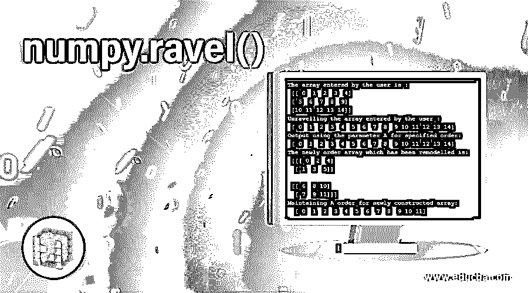

# numpy.ravel()

> 原文：<https://www.educba.com/numpy-dot-ravel/>




## numpy.ravel()简介

NumPy.ravel()是 NumPy 工具集中的一个函数，它使用户输入的数组能够连续地展平数组。numpy 工具中的 ravel 功能是最基本和最常用的功能之一，它有助于解开用户提供的数据。简而言之，ravel 函数用于展平或呈现以线性方式给出的数据，这在以前是以维度形式呈现的。因此，我们可以看到它可以简化数组的结构表示。

### numpy.ravel()的语法和参数

以下是用 Python 编程语言编写 numpy.ravel()的语法:

<small>网页开发、编程语言、软件测试&其他</small>

**语法:**

```
numpy.ravel(a, order='C'/ 'F' / 'A' / 'K')
```

根据当前版本(即 Python 1.10)，返回的输出与用户输入的数组类型相同。例如，对于用户输入的一个屏蔽数组，返回的数组也是屏蔽的。

**参数:**

以下是用 Python 编程语言编写的 numpy.ravel()函数所使用的参数:

*   a1:数组 _like
*   用户已经输入了数组。数组 a1(此处)，其中用户已经指定的元素由编程系统以与它已经被指定的顺序相同的顺序读取，并且以一维数组顺序的形式使用:{ * * * * C * ' *，* ' * F * ' *，* * '* A *' *，* ' * K * ' * }，参数是可选的。
*   当使用参数“C”时，系统需要读取数组 a1 中存在的所有元素。在这种情况下，元素的索引是基于主要行读取的。这意味着最后一个轴的步进变化速度最快，而第一个轴的变化速度最慢。
*   当使用参数 F 时，系统以 Fortran 格式标识数组中每个元素各自的索引号。这意味着系统识别出第一个指数变化最快，而最后一个指数变化最慢。
*   必须注意，参数 F 和 C 都不考虑用户输入的数组的存储器布局。它们仅指相应阵列的轴被索引的顺序。
*   当使用参数 A 时，只有当数组具有类似 Fortran 的传染性内存时，系统才按照 Fortran 的索引顺序读取数组 a1 的元素。否则，当使用参数 A 时，元素的读取方式类似于参数 c。
*   当使用参数 K 时，由用户 I 给出的数组中存在的元素根据它们在系统存储器中的出现来读取。例外是在数据中出现的步幅为负的情况下，颠倒顺序。
*   当没有指定参数时，默认参数是 c。

**退货:**

*   y1:类似数组
*   y1 是数组 a1 的一个相似子类型的数组，形状相同，我们必须注意到，在向后螺旋时，矩阵在兼容性方面有特殊情况。请注意，矩阵是向后兼容的特例，例如，如果 a1 表示矩阵，则 y1 是一维 ndarray。

### 在 Python 中使用 numpy.ravel()的示例

下面是下面给出的例子:

#### 示例#1

**代码:**

```
# Python Program illustrating the implementation of numpy.ravel() function
import numpy as n1
a1 = n1.arange(15).reshape(3, 5)
print("The array entered by the user is :", a1)
# Code flattens the array which was entered creating a one dimensional sequence
# Output for the array is displayed
print("Unravelling the array entered by the user : ", a1.ravel())
# The output array is rechecked for configuring if the order and shape is persistant
print("Reshaping the unravelled array == numpy.reshape(-1)")
print("The reshaped array is : ", a1.reshape(-1))
```

**输出:**

-1.1")


#### 实施例 2

**代码:**

```
# Python Program illustrating the implementation of numpy.ravel() function
import numpy as n1
a1 = n1.arange(15).reshape(3, 5)
print("The array entered by the user is :\n", a1)
# Code flattens the array which was entered creating a one dimensional sequence
# Output for the array is displayed
print("Unravelling the array entered by the user :\n", a1.ravel())
# Using the Parameters for maintaining both 'A' and 'F' order
print("Output using the parameter A for specified order:\n", a1.ravel(order = 'A'))
# Using the Parameters ‘K’ for maintaining both neither of 'A' order nor 'F' order
a2 = n1.arange(12).reshape(2,3,2).swapaxes(1,2)
print("The newly order array which has been remodelled is:\n", a2)
print("Maintaining A order for newly constructed array:\n ", a2.ravel(order = 'K'))
```

**输出:**

-1.2")


### 结论

对于处理大数据问题的程序员来说，函数 ravel()是一个非常重要的工具，他们必须处理具有多维度的数组和数据集，并且执行它们需要将它们线性化，以便分离元素。这通过提供一个内置的函数减少了代码的冗长和效率。

### 推荐文章

这是 numpy.ravel()的指南。在这里，我们还将讨论 numpy.ravel()的介绍和语法，以及不同的示例和代码实现。您也可以看看以下文章，了解更多信息–

1.  num py . unique()
2.  [numpy.diff()](https://www.educba.com/numpy-dot-diff/)
3.  [NumPy 中的矩阵](https://www.educba.com/matrix-in-numpy/)
4.  [numpy.linspace()](https://www.educba.com/numpy-linspace/)


