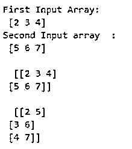
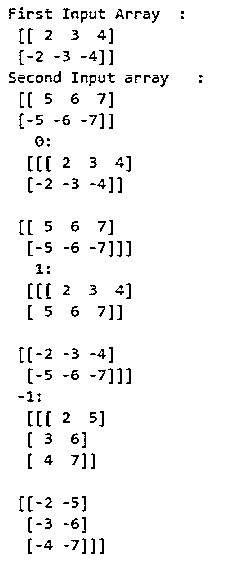
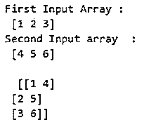
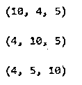

# 数字堆栈

> 原文：<https://www.educba.com/numpy-stack/>


## NumPy 堆栈简介

下面的文章提供了 NumPy 堆栈的概要。Python 为用户提供了不同的功能。为了处理数组，python 库提供了一个 NumPy 函数。stack()特征用来作为新轴旁边的等维数组序列的一部分。array 的 axis 参数指定新数组轴在输出维度中的顺序。例如，假设 axis=0，这意味着它确定第一个维度，如果 axis=-1，这意味着它确定最后一个维度。NumPy 是数字 python 的首字母缩写。基本上，NumPy 是一个开源项目。NumPy 执行数组的逻辑和数学运算。因此，可以有效地进行处理和操作。

**语法:**

<small>网页开发、编程语言、软件测试&其他</small>

```
numpy.stack(Arr, Axis)
```

**说明:**

*   **Arr:** 在上面的语法中，第一个参数是 Arr means array，用来定义一个数组形状相同的等维数组序列。
*   **轴:**是和输入数组一起的最终输出数组。

### NumPy 中的堆栈函数是如何工作的？

*   我们必须在我们的系统上安装 Python。
*   我们必须使用 pip 命令安装 numpy。
*   我们需要 Python 的基础知识。
*   我们需要关于带参数的栈函数的基本知识。
*   我们需要关于数组的基本知识。
*   我们可以使用 numpy 堆栈函数执行不同的操作。

### NumPy 堆栈示例

下面给出了 NumPy 堆栈的示例:

#### 示例#1

适用于轴=0 且轴=1 的情况。

**代码:**

```
import numpy as snp
A_x = snp.array([ 2, 3, 4] )
print ("First Input Array: \n", A_x)
A_y = snp.array([ 5, 6, 7] )
print ("Second Input array  :       \n", A_y)
A = snp.stack((A_x, A_y), axis = 0)
print ("\n ", A)
B = snp.stack((A_x, A_y), axis = 1)
print ("\n ", B)
```

**说明:**

*   我们导入 NumPy 函数并将它们用作 snp。
*   我们用数组值声明了变量两个输入数组，比如 A_x 和 A_y。
*   我们试图分别打印输入数组的值和它们的值。
*   然后，我们使用了一个堆栈函数，其中包含两个输入数组以及轴值 0 和 1。
*   最后，我们打印了两个带有轴值的结果输出数组。
*   在上面的例子中，我们实现了一个轴值为 0 和 1 的堆栈函数。

**输出:**




#### 实施例 2

对于如果轴= 0，轴=1 且轴=-1。

**代码:**

```
import numpy as snp
A_x = snp.array([[ 2, 3, 4], [ -2, -3, -4]] )   #input array
print ("First Input Array  : \n",A_x)
A_y = snp.array([[ 5, 6, 7], [ -5, -6, -7]] ) #input array
print ("Second Input array   : \n", A_y)
A  = snp.stack((A_x,A_y), axis = 0)       # Array with axis=0
print ("   0:  \n ", A)
B = snp.stack((A_x, A_y), axis = 1)  # Array with axis=1
print ("   1:   \n ", B)
C = snp.stack((A_x, A_y), axis = -1)  # Array with axis=-1
print (" -1: \n ", C)
```

**说明:**

*   我们导入 NumPy 函数并将它们用作 snp。
*   我们用数组值声明了变量两个输入数组，比如 A_x 和 A_y。
*   我们试图分别打印输入数组的值和它们的值。
*   然后，我们使用了一个堆栈函数，两个输入数组的轴值分别为 0、1 和-1。
*   最后，我们尝试用轴值打印两个结果输出数组。
*   在上面的例子中，我们实现了一个轴值为 0，1 和-1 的堆栈函数。

**输出:**




#### 实施例 3

适用于轴= 1 且轴= 2 的情况。

**代码:**

```
import numpy as snp
A_x = snp.array([ 1, 2, 3] )   #input array
print ("First Input Array : \n",A_x)
A_y = snp.array([ 4, 5, 6] )     #input array
print ("Second Input array  : \n",A_y)
A = snp.stack((A_x, A_y), axis = 1)   #  Array  with axis=1
print ("     \n ", A)
B = snp.stack((A_x, A_y), axis = 2) # Array  with axis=2
print ("     \n ", B)
```

**说明:**

*   我们导入 NumPy 函数并将它们用作 snp。
*   我们用数组值声明了变量两个输入数组，比如 A_x 和 A_y。
*   我们尝试分别打印输入数组的值和它们的值。
*   然后，我们使用了一个堆栈函数，其中包含两个输入数组以及轴值 1 和 2。
*   最后，我们尝试打印两个带有轴值的结果输出数组。
*   在上面的例子中，我们实现了一个轴值为 1 和 2 的堆栈函数。在这个例子中，它只执行一个轴为 1 的数组，当我们给轴 2 赋值时，它显示一个错误消息，因为轴 2 超出了数组维数 2 的范围。

**输出:**




#### 实施例 4

对于 if 轴= 1，Axis=2，Axis=-1 带形状函数。

**代码:**

```
import numpy as np
arrays = [np.random.randn(4, 5) for _ in range(10)]    #input array
A_x = snp.stack(arrays, axis=0).shape     #Array with axis=0
print("\n", A_x)
A_y = snp.stack(arrays, axis=1).shape  #Array with axis=1
print("\n", A_y)
z = np.stack(arrays, axis=2).shape #Array with axis=2
print("\n", z)
```

**说明:**

*   我们导入 numpy 函数并将它们用作 snp。
*   我们声明了一个随机数组。
*   我们尝试分别用它们的数组值打印输入的值。
*   然后，我们使用了一个堆栈函数，其中包含两个输入数组以及轴值 1 和 2。
*   最后，我们尝试打印两个带有轴值的结果输出数组。
*   在上面的例子中，我们用形状函数实现了 numpy 堆栈。

**输出:**




### 结论

从上面的文章中，我们看到了 NumPy 堆栈函数的基本语法。我们还通过不同的例子看到了如何用 python 实现它们。从本文中，我们还看到了如何在 python 中处理 NumPy 堆栈函数。

### 推荐文章

这是 NumPy 堆栈的指南。这里我们讨论 NumPy 栈的介绍和工作，以及不同的例子和代码实现。您也可以看看以下文章，了解更多信息–

1.  [NumPy 数组函数](https://www.educba.com/numpy-array-functions/)
2.  [numpy.ravel()](https://www.educba.com/numpy-dot-ravel/)
3.  num py . dot()
4.  [NumPy Ndarray](https://www.educba.com/numpy-ndarray/)


