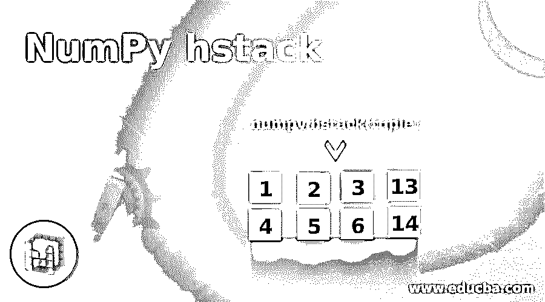
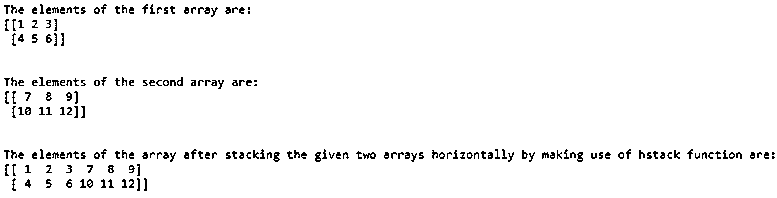
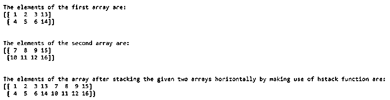

# 数字堆栈

> 原文：<https://www.educba.com/numpy-hstack/>




## NumPy hstack 简介

每当我们有一个以上的数组时，如果我们希望将这些数组中的值按顺序显示在一起，或者将它们一个接一个地水平堆叠在一个数组中，我们就使用 NumPy 中的一个名为 hstack function 的函数。NumPy 中的这个 hstack 函数从多个用作 hstack 函数的输入的数组中返回一个水平堆叠的数组，并且这个 hstack 函数将一个元组作为参数，该参数表示将要堆叠的输入数组，从而产生一个单独的数组，并且传递给 NumPy 中的这个 hstack 函数的输入数组必须具有相似的形状。

**语法:**

<small>网页开发、编程语言、软件测试&其他</small>

```
numpy.hstack(tuple)
```

其中 tuple 表示要堆叠在一起形成单个数组的输入数组。

### NumPy hstack 的工作

NumPy hstack 的工作方式如下:

*   每当我们有一个以上的数组时，如果我们希望将这些数组中的值按顺序显示在一起，或者将它们一个接一个地水平堆叠在一个数组中，我们就使用 NumPy 中的一个名为 hstack 的函数。
*   它从多个数组中返回一个水平堆叠的数组，这些数组用作 hstack 函数的输入。
*   它将一个元组作为参数，该参数表示将被堆叠的输入数组，从而产生单个数组。
*   在 NumPy 中传递给这个 hstack 函数的输入数组必须具有相似的形状。

### NumPy hstack 的示例

以下是如下所示的例子

#### 示例#1

Python 程序演示了 NumPyhstack 函数，该函数将给定的两个输入数组水平堆叠成一个数组，并将结果数组作为输出显示在屏幕上:

**代码:**

```
#importing the package numpy
import numpy as num
#Creating an array by making use of array function in NumPy and storing it in a variable called firstarray
firstarray = num.array([[1,2,3],[4,5,6]])
#Displaying the elements of firstarray followed by one line space by making use of \n
print 'The elements of the first array are:'
print firstarray
print '\n'
#Creating an array by making use of array function in NumPy and storing it in a variable called secondarray
secondarray = num.array([[7,8,9],[10,11,12]])
#displaying the elements of second array followed by one line space by making use of \n
print 'The elements of the second array are:'
print secondarray
print '\n'
print 'The elements of the array after stacking the given two arrays horizontally by making use of hstack function are:'
#creating an array by horizontally stacking the elements of firstarray and secondarray by making use of hstack function and storing it in a variable called resultingarray
resultingarray = num.hstack((firstarray,secondarray))
#displaying the elements of the resultingarray followed by one line space by making use of \n
print resultingarray
print '\n'
```

**输出:**




在上面的程序中，导入了一个名为 NumPy 的包，使我们能够使用 hstack 函数。然后利用 NumPy 中的 array 函数创建一个数组，并将其存储在一个名为 firstarray 的变量中。然后在屏幕上显示第一个数组的元素。然后利用 NumPy 中的数组函数创建另一个数组，并将其存储在一个名为 secondarray 的变量中。然后次级阵列的元素显示在屏幕上。然后通过使用 hstack 函数水平堆叠 firstarray 和 secondarray 的元素来创建数组，并将其存储在名为 resultingarray 的变量中。然后屏幕上显示结果数组的元素。

#### 实施例 2

Python 程序演示了 NumPyhstack 函数，该函数将给定的两个输入数组水平堆叠成一个数组，并将结果数组作为输出显示在屏幕上:

**代码:**

```
#importing the package numpy
import numpy as num
#Creating an array by making use of array function in NumPy and storing it in a variable called firstarray
firstarray = num.array([[1,2,3,13],[4,5,6,14]])
#Displaying the elements of firstarray followed by one line space by making use of \n
print 'The elements of the first array are:'
print firstarray
print '\n'
#Creating an array by making use of array function in NumPy and storing it in a variable called secondarray
secondarray = num.array([[7,8,9,15],[10,11,12,16]])
#displaying the elements of second array followed by one line space by making use of \n
print 'The elements of the second array are:'
print secondarray
print '\n'
print 'The elements of the array after stacking the given two arrays horizontally by making use of hstack function are:'
#creating an array by horizontally stacking the elements of firstarray and secondarray by making use of hstack function and storing it in a variable called resultingarray
resultingarray = num.hstack((firstarray,secondarray))
#displaying the elements of the resultingarray followed by one line space by making use of \n
print resultingarray
print '\n'
```

**输出:**




在上面的程序中，导入了一个名为 NumPy 的包，使我们能够使用 hstack 函数。然后利用 NumPy 中的 array 函数创建一个数组，并存储在一个名为 firstarray 的变量中。然后在屏幕上显示第一个数组的元素。然后利用 NumPy 中的数组函数创建另一个数组，并将其存储在一个名为 secondarray 的变量中。然后次级阵列的元素显示在屏幕上。然后通过使用 hstack 函数水平堆叠 firstarray 和 secondarray 的元素来创建数组，并将其存储在名为 resultingarray 的变量中。然后屏幕上显示结果数组的元素。

### 结论

在本教程中，我们通过定义了解 Python 中 NumPy hstack 函数的概念，通过编程实例及其输出了解 NumPyhstack 函数的语法，以及 Python 中 NumPyhstack 函数的工作原理。

### 推荐 ed 文章

这是 NumPy hstack 的指南。在这里，我们还讨论了 numpy hstack 的介绍和工作，以及不同的例子和它的代码实现。您也可以看看以下文章，了解更多信息–

1.  [NumPy 数组](https://www.educba.com/numpy-arrays/)
2.  [NumPy Ndarray](https://www.educba.com/numpy-ndarray/)
3.  [Python 中的字符串数组](https://www.educba.com/string-array-in-python/)
4.  [NumPy 中的矩阵](https://www.educba.com/matrix-in-numpy/)


