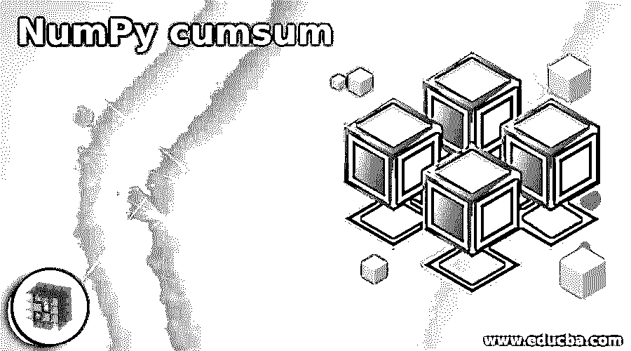
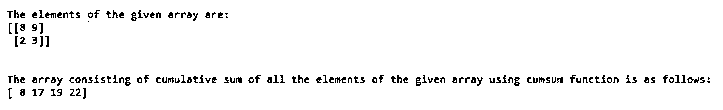
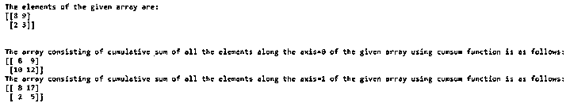

# NumPy 累计

> 原文：<https://www.educba.com/numpy-cumsum/>




## NumPy cumsum 简介

每当我们要计算给定数组中存在的元素的累积和时，如在数组中第二个元素是第一个元素和第二个元素的和，数组中第三个元素是第一个元素、第二个元素和第三个元素的和，依此类推。我们在 numpy 中使用了一个名为 cumsum 的函数，它带有四个参数，即 arrayname、axis、datatype 和 output，其中 arrayname 表示必须计算元素累积和的数组的名称，axis 表示必须计算元素累积和的轴，如果没有定义该参数，将给定的数组展平，然后计算元素累积和，datatype 是 output 表示的输出数组中元素的数据类型，这是可选的。

**语法:**

<small>网页开发、编程语言、软件测试&其他</small>

```
numpy.cumsum(arrayname, axis, datatype, output)
```

在哪里，

*   arrayname 是数组的名称，必须找到其元素的累积和。
*   axis 表示必须沿其计算元素的累积和的轴，如果未定义此参数，将给定的数组展平，然后将计算元素的累积和。
*   数据类型是产生输出数组的值的数据类型。
*   output 表示输出数组，该数组存储 arrayname 表示的给定输入数组中元素的累积和，该参数是可选的。

### NumPy 累计函数的运算

*   每当我们想计算一个给定数组中元素的累积和时，比如数组中的第二个元素是第一个元素和第二个元素的和，数组中的第三个元素是第一个元素、第二个元素和第三个元素的和，等等，我们就利用 numpy 中一个叫 cumsum 的函数。
*   Axis 表示必须沿其计算元素的累积和的轴，如果未定义此参数，将给定的数组展平，然后将计算元素的累积和。
*   arrayname 表示必须计算其元素累积和的数组的名称。
*   数据类型是产生输出数组的值的数据类型。
*   Output 表示输出数组，该数组存储 arrayname 表示的给定输入数组中元素的累积和，该参数是可选的。

### NumPy 累计的示例

下面是一些例子:

#### 示例#1

Python 程序演示了 NumPy cumsum 函数，使用 NumPy 中的 array 函数创建一个数组，然后使用 cumsum 函数查找给定数组元素的累积和，并在输出数组中表示它。

**代码:**

```
#importing the package numpy
import numpy as nump
#Creating an array by making use of array function in NumPy and storing it in a variable called initialarray
initialarray = nump.array([[8,9],[2,3]])
#Displaying the elements of intialarray followed by one line space by making use of \n
print 'The elements of the given array are:'
print initialarray
print '\n'
#using cumsum function of NumPy and passing the created array as the parameter to that function to find the cumulative sum of all the elements in the array and store it in a variable called cumsumarray
cumsumarray = nump.cumsum(initialarray)
#Displaying the array consisting of cumulative sum of all the elements in the array
print 'The array consisting of cumulative sum of all the elements of the given array using cumsum function is as follows:'
print cumsumarray
```

**输出:**




在上面的程序中，导入了一个名为 numpy 的包，它允许我们使用名为 array 和 cumsum 的函数。然后利用数组函数创建一个名为 initialarray 的数组。然后屏幕上显示 initialarray 的元素。然后用 cumsum 函数求出 initialarray 中所有元素的累积和，并存储在一个名为 cumsumarray 的变量中。然后，由所有元素的累积和组成的累计数组显示在屏幕上。

#### 实施例 2

Python 程序演示了 NumPy cumsum 函数，使用 NumPy 中的 array 函数创建一个数组，然后使用 cumsum 函数求出给定数组中沿轴=0 和沿轴=1 的元素的累积和，并在输出数组中表示它。

**代码:**

```
#importing the package numpy
import numpy as nump
#Creating an array by making use of array function in NumPy and storing it in a variable called initialarray
initialarray = nump.array([[8,9],[2,3]])
#Displaying the elements of intialarray followed by one line space by making use of \n
print 'The elements of the given array are:'
print initialarray
print '\n'
#using cumsum function of NumPy and passing the created array as the parameter to that function to find the cumulative sum of all the elements in the array and store it in a variable called cumsumarray
cumsumarrayalongaxis0 = nump.cumsum(initialarray, axis=0)
#Displaying the array consisting of cumulative sum of all the elements along the axis=0 in the array
print 'The array consisting of cumulative sum of all the elements along the axis=0 of the given array using cumsum function is as follows:'
print cumsumarrayalongaxis0
cumsumarrayalongaxis1 = nump.cumsum(initialarray, axis=1)
#Displaying the array consisting of cumulative sum of all the elements along the axis=1 in the array
print 'The array consisting of cumulative sum of all the elements along the axis=1 of the given array using cumsum function is as follows:'
print cumsumarrayalongaxis1
```

**输出:**




在上面的程序中，导入了一个名为 numpy 的包，它允许我们使用名为 array 和 cumsum 的函数。然后利用数组函数创建一个名为 initialarray 的数组。然后屏幕上显示 initialarray 的元素。然后，cumsum 函数和指定的轴一起用于查找 initialarray 中所有元素的累积和，并存储在一个名为 cumsumarray 的变量中。然后，在屏幕上显示由沿着轴=0 和沿着轴=1 的所有元素的累积和组成的累计数组。

### 推荐文章

这是一个指南 NumPy cumsum。这里我们分别用例子来讨论 NumPy cumsum 函数的介绍、工作原理。您也可以看看以下文章，了解更多信息–

1.  [NumPy 中的矩阵](https://www.educba.com/matrix-in-numpy/)
2.  [numpy.ravel()](https://www.educba.com/numpy-dot-ravel/)
3.  [Numpy.argsort()](https://www.educba.com/numpy-argsort/)
4.  [numpy.mean()](https://www.educba.com/numpy-mean/)


