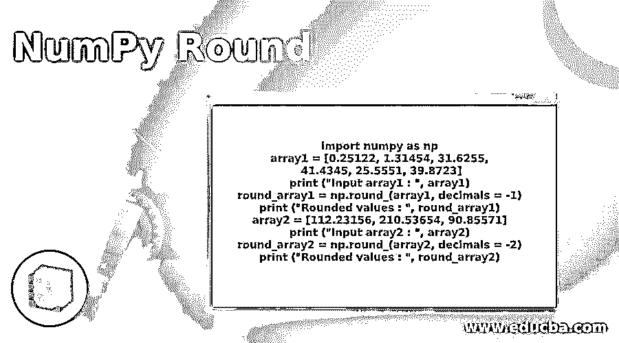
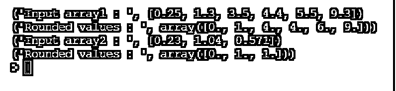
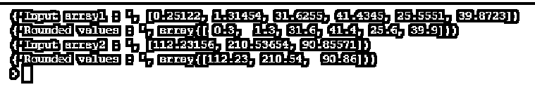
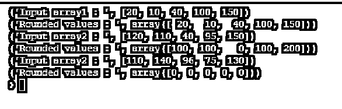
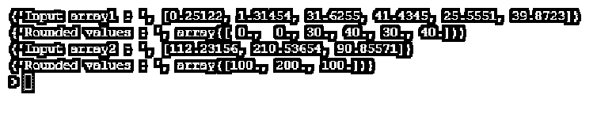

# NumPy 回合

> 原文：<https://www.educba.com/numpy-round/>




## 数字回合的定义

随机舍入是一个数学上的函数，当我们提供不同的浮点或小数元素的输入数组时，它执行舍入操作，我们希望将数字舍入到我们想要的位数，numpy round 函数默认情况下不需要小数位数参数默认情况下，它会舍入，如果我们希望声明要舍入的小数位数，我们可以选择。

**语法:**

<small>网页开发、编程语言、软件测试&其他</small>

numpy round 函数的基本语法是，

```
numpy.round(array, decimals = 0, out = None)
```

*   numpy.round 表示 numpy 中的数学舍入函数。
*   array 表示我们希望在其中执行舍入函数的输入数组。
*   如果想要声明我们想要舍入的位数，Decimals 是一个可选参数。
*   Out 是舍入后的输出数组。

### NumPy 回合的示例

下面是一些例子:

#### 示例#1

让我们讨论一个基本的例子来理解 numpy round 函数是如何工作的。

**代码:**

```
import numpy as np
array1 = [0.25, 1.3, 3.5, 4.4, 5.5, 9.3]
print ("Input array1 : ", array1)
round_array1 = np.round_(array1)
print ("Rounded values : ", round_array1)
array2 = [.23, 1.04, 0.571]
print ("Input array2 : ", array2)
round_array2 = np.round_(array2)
print ("Rounded values : ", round_array2)
```

**输出:**




在上面的例子中，我们声明了两个数组，array1 和 array2 作为 numpy round 函数的输入。我们打印了没有舍入的输入数组和舍入后的输出数组。我们可以看到，当我们在小数点后给出多个数字时，默认情况下 numpy round 函数会舍入到单个小数。当小数点后有 0.5 及以上时，numpy round 函数会将其舍入到序列中的下一个数字。

#### 实施例 2

在这个例子中，我们将讨论如何使用十进制参数，使我们能够四舍五入到我们想要的值。

**代码:**

```
import numpy as np
array1 = [0.252, 1.354, 3.155, 4.345, 5.551, 9.23]
print ("Input array1 : ", array1)
round_array1 = np.round_(array1, decimals = 2)
print ("Rounded values : ", round_array1)
array2 = [.2356, 1.554, 0.8571]
print ("Input array2 : ", array2)
round_array2 = np.round_(array2, decimals = 3)
print ("Rounded values : ", round_array2)
```

**输出:**


我们声明了两个输入数组，array1 和 array2，其位数超过 2 个小数点，对于第一个数组，我们声明了小数舍入点为 2，对于第二个数组，我们声明了小数舍入点为 3，这样在输出中就不会生成超出我们声明的小数限制的数字，并且相应的输出已经打印出来，我们可以清楚地看到在第一个和第二个输出中的第二个和第三个数字之前的值被舍入。

#### 实施例 3

让我们尝试不同的小数位置参数，并检查输出，以便更好地理解。

**代码:**

```
import numpy as np
array1 = [0.25122, 1.31454, 31.6255, 41.4345, 25.5551, 39.8723]
print ("Input array1 : ", array1)
round_array1 = np.round_(array1, decimals = 1)
print ("Rounded values : ", round_array1)
array2 = [112.23156, 210.53654, 90.85571]
print ("Input array2 : ", array2)
round_array2 = np.round_(array2, decimals = 2)
print ("Rounded values : ", round_array2)
```

**输出:**




#### 实施例 4

让我们在这个例子中看看 numpy round 函数如何处理不带小数点的整数值，以及小数点参数如何用于整数。

**代码:**

```
import numpy as np
array1 = [20, 10, 40, 100, 150]
print ("Input array1 : ", array1)
round_array1 = np.round_(array1, decimals = 1)
print ("Rounded values : ", round_array1)
array2 = [120, 110, 40, 95, 150]
print ("Input array2 : ", array2)
round_array2 = np.round_(array2, decimals = -2)
print ("Rounded values : ", round_array2)
array3 = [110, 140, 96, 75, 130]
print ("Input array2 : ", array3)
round_array3 = np.round_(array3, decimals = -3)
print ("Rounded values : ", round_array3)
```

**输出:**




在本例中，我们有三个带有整数值的输入数组，在第一个输出语句中，我们将十进制值声明为 1，因为输入数组包含没有任何十进制值的整数元素，numpy round 函数不起作用。因此输出数组与输入相同，因为没有对整数进行舍入的空间。在第二个输出中，我们声明了与第一个数组类似的输入数组，其中所有的整数值都没有任何小数，在 numpy round 函数中，我们声明了小数点值为负(-2)。

这个负二表示以相反的顺序舍入两位数，因此打印的结果输出是负两位数舍入后的最接近的值。当输入只有两位数时，负舍入给出 0 作为输出。

类似地，在第三条输出语句中，我们已经声明小数点值被舍入为负 3 (-3)，因此结果输出将是负 3 位数舍入。由于数组中的值都是 3 位数字元素，因此输出数组变成全 0。

#### 实施例 5

让我们尝试给出不同的输入，并执行负十进制值舍入技术，以便对 numpy round 函数有一个清晰的概念。根据小数点前后的位数，我们需要声明要舍入的正负十进制值，以获得预期的结果。

**代码:**

```
import numpy as np
array1 = [0.25122, 1.31454, 31.6255, 41.4345, 25.5551, 39.8723]
print ("Input array1 : ", array1)
round_array1 = np.round_(array1, decimals = -1)
print ("Rounded values : ", round_array1)
array2 = [112.23156, 210.53654, 90.85571]
print ("Input array2 : ", array2)
round_array2 = np.round_(array2, decimals = -2)
print ("Rounded values : ", round_array2)
```

**输出:**




### 结论

在本文中，我们使用各种示例详细讨论了 numpy round 函数，以便清楚地了解 Numpy round 函数及其用途。我们还讨论了如何使用不同的整数、浮点值数组来舍入值。我们还讨论了用于声明我们想要舍入的小数点的技术，这在处理具有十进制值的数组时非常有用。

### 推荐文章

这是一个 NumPy 回合的指南。在这里，我们还讨论了 numpy round 的定义和语法，以及不同的例子和它的代码实现。您也可以看看以下文章，了解更多信息–

1.  [numPy.where()](https://www.educba.com/numpy-where/)
2.  [numpy.ravel()](https://www.educba.com/numpy-dot-ravel/)
3.  [Numpy.argsort()](https://www.educba.com/numpy-argsort/)
4.  num py . unique()


