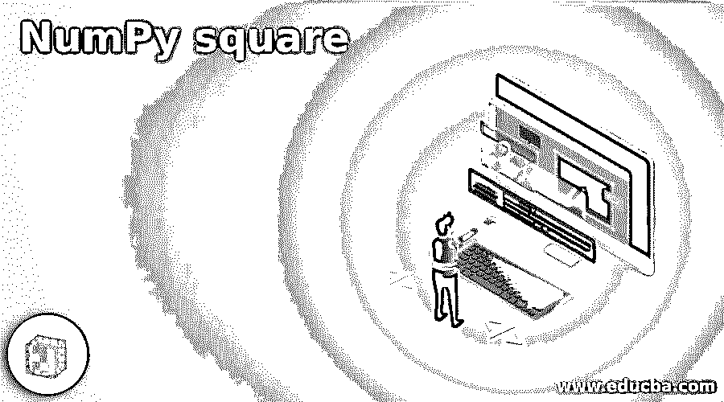
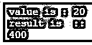
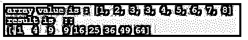
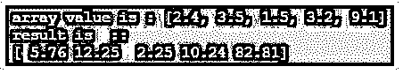
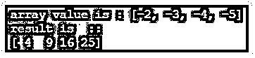
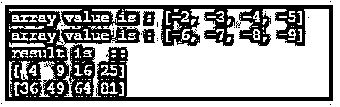

# NumPy 广场

> 原文：<https://www.educba.com/numpy-square/>




## NumPy 广场简介

下面的文章提供了 NumPy square 的概要。这个函数也来自 NumPy 库，用于数组和单个元素的计算。顾名思义，这个函数在我们想要计算数组元素的平方或者也可以计算单个元素值的时候使用。这个函数将返回包含数组元素平方值的新数组，它不修改原始数组，它只是一个未改变的数组。

**语法:**

<small>网页开发、编程语言、软件测试&其他</small>

通过使用 square 函数，我们可以在 python 中计算浮点数、整数和复数类型的平方。这个函数将 array 作为输入参数。为了使用它，我们需要将 NumPy 包作为我们程序的导入。

这是 python 文档中的语法:

```
numpy.square(x[, out])
```

上面的函数将 array 作为输入，返回一个新的数组，而不修改原来的数组。

### 平方函数在 NumPy 中是如何工作的？

现在我们知道，在 python 中，NumPy square 函数用于计算值的平方，NumPy 用于计算数组元素的数值，这是一个使计算变得简单明了的库。这个函数的工作方式和我们在学校学的一样。

这个函数有 4 个参数:

*   **arr (first param):** 这个参数是包含我们要计算的各种元素的数组。这是必需的参数。
*   **dType(第二个参数):**这个参数是可选的，这个参数指定了我们要返回的数组的类型。
*   **out(第三个参数):**这个参数也是可选的。当我们想把结果输出放到一个数组中时，就要用到这个参数。简而言之，它表示一个带有结果结果数组。
*   **其中(第四个参数作为元素的条件):**该参数指定在计算数组元素的平方时需要考虑哪个元素。

**返回类型(数组作为返回类型):**

*   这个函数返回一个新的数组。Square 函数不修改原始数组。

为了使用这个函数，我们必须将 NumPy 包导入到我们的程序中，否则我们将无法使用这个函数。

按照以下步骤开始使用该功能:

1.导入包并指定别名，以便更方便地访问和调用计算函数。

**举例:**

```
import NumPy as name
```

2.在这一步之后，我们可以直接调用 NumPy 库中可用的任何函数。现在我们来看看如何使用平方函数。

**举例:**

```
myNum.square(array)
```

在上面的代码行中，我们使用别名来调用 square 函数，并在里面传递需要计算的数组。

现在我们来看一个例子及其工作原理:

**举例:**

```
import numpy as myNum
arr = [2, 5, 6, 8, 9]
result  =  myNum.square(arr)
print (result)
```

在第一行中，您可以看到名为“myNum”的导入语句。之后，我们用不同的元素声明了一个数组。在下一行中，我们调用 square 函数，并尝试将数组传递给它。然后这个函数将返回给我们一个新的数组，这个数组将保存' result '变量，在下一行我们将打印我们的结果。我们还可以通过在 square 函数中传递单个变量来计算单个元素的平方。

```
np.sqaure(20)
```

像这样，它将计算单个元素的平方。

**在 NumPy 中使用平方函数时需要记住的几点:**

*   这个函数有 4 个参数，其中 3 个是可选的。
*   这将始终作为新数组返回，并且源数组将不会被更改。
*   Square 函数也可以接受单个参数和 NumPy 库的一部分。

### NumPy 正方形的例子

以下是 NumPy square 的示例:

#### 示例#1

在这个例子中，我们试图使用 square 函数得到单个元素的平方。

**代码:**

```
import numpy as myNum
val1 = 20
print("value is :", val1)
#calling numpy function here.
result  =  myNum.square(val1)
print("result is  ::")
print (result)
```

**输出:**




#### 实施例 2

在这个例子中，我们使用 square 函数计算整数数组元素的平方。

**代码:**

```
import numpy as myNum
#defining the array
arr = [1, 2, 3,3, 4, 5, 6, 7, 8]
print("array value is :", arr)
#calling numpy function here.
result  =  myNum.square(arr)
print("result is  ::")
print (result)
```

**输出:**




#### 实施例 3

在这个例子中，我们使用 square 函数计算浮点数组元素的平方。

**代码:**

```
import numpy as myNum
#defining the array
arr = [2.4, 3.5, 1.5, 3.2, 9.1]
print("array value is :", arr)
#calling numpy function here.
result  =  myNum.square(arr)
print("result is  ::")
print (result)
```

**输出:**




#### 实施例 4

在这个例子中，我们试图计算复数类型的平方。它是使用平方函数的数组 nu。

**代码:**

```
import numpy as myNum
#defining the array
arr = [-2, -3, -4, -5]
print("array value is :", arr)
#calling numpy function here.
result  =  myNum.square(arr)
print("result is  ::")
print (result)
```

**输出:**




#### 实施例 5

在这个例子中，我们使用 NumPy 库中的 square 函数来计算具有不同值的多个数组的平方。

**代码:**

```
import numpy as myNum
#defining the array
#first array
arr1 = [-2, -3, -4, -5]
#second array
arr2 = [-6, -7, -8 , -9]
print("array value is :", arr1)
print("array value is :", arr2)
#calling numpy function here.
result1  =  myNum.square(arr1)
result2  =  myNum.square(arr2)
print("result is  ::")
print (result1)
print (result2)
```

**输出:**




### 结论

通过使用 square 函数，我们可以在不迭代元素的情况下计算数组元素的平方，这也减少了代码行并对其进行了优化。这个函数在 NumPy 库中也是可用的。如果需要，我们还可以指定这个函数的可选参数。

### 推荐文章

这是去 NumPy 广场的指南。在这里我们讨论一下，平方函数在 NumPy 中是如何工作的？还有例子。您也可以看看以下文章，了解更多信息–

1.  [numPy.where()](https://www.educba.com/numpy-where/)
2.  num py . unique()
3.  [numpy.linspace()](https://www.educba.com/numpy-linspace/)
4.  [Numpy.argsort()](https://www.educba.com/numpy-argsort/)


