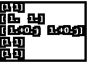
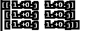
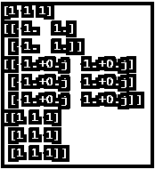
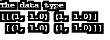
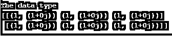
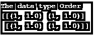
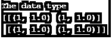
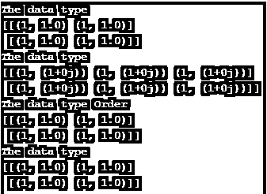
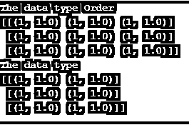

# 无数个

> 原文：<https://www.educba.com/numpy-ones/>


## Numpy 系列产品介绍

Numpy 是一个 python 库，用于处理数组。NumPy。Ones 是一种与 NumPy 一起使用的方法，它返回一个具有给定大小的形状的新数组，其中元素值设置为 1。它创建一个数组并向其中填充值 1。我们还可以将形状和数据类型定义为可选参数。我们可以用 NumPy 创建一个多维数组，并将元素插入其中。

**语法:**

<small>网页开发、编程语言、软件测试&其他</small>

```
ones(shape, dtype=None, order='C')
```

*   这是 NumPy 中 ones 方法的语法。
*   该形状定义了要使用的参数的大小。
*   dtype 用于定义数组的数据类型，缺省值为 Float。
*   顺序定义了我们需要插入数据的顺序。列级方法或行级方法。
*   因此，通过导入 NumPy 库并调用此方法，将创建所需大小的数组，数组上的值为 1。

### 举例说明数字工作原理

ones 函数基本上将值 1 插入到数组中。因此，它首先创建一个具有给定大小和数据类型的数组，然后向其中插入值 1。它将数组存储在内存中的一个连续位置，因此速度相对更快。

#### 示例#1

```
import numpy as np
aa = np.ones(5)
print(aa)
b = np.ones((5,), dtype=int)
print(b)
c = np.ones((2, 1))
print(c)
```

其输出将创建一个大小为 5 的数组。第一个输出的默认数据类型是 double。


第二个我们声明为 Integer，所以输出为 Integer。


第三个创建了一个大小确定数组。


**代码片段:**


```
d = np.ones((3,3))
print(d)
```

**输出:**


我们可以改变数组的数据类型，并在代码中相应地使用它。

#### 实施例 2

```
import numpy as np
```

默认的数据类型是 Double。所以显式地将值传递给 Int。

```
a = np.ones(2,dtype = int)
print(a)
```

**输出:**


**浮动:**

```
b = np.ones(2,dtype = float)
print(b)
```

**输出:**


**复杂数据类型:**

```
c = np.ones(2,dtype = complex)
print(c)
```

**输出:**


**字典类型:**

```
d = np.ones(2,dtype = dict)
print(d)
```

**输出:**


**类型列表:**

```
e = np.ones(2,dtype = list)
print(e)
```

**输出:**


**代码片段:**




甚至我们可以把数组的大小也改成 1D、2D 或多维数组。

所以同样的代码在改变数组大小时会是这样的:

**1D 阵:**

```
a = np.ones(3,dtype = int)
print(a)
```

**输出:**


**2D 阵:**

```
b = np.ones((2,2),dtype = float)
print(b)
```

**输出:**


**多维数组:**

```
c = np.ones((3,2),dtype = complex)
print(c)
```

**输出:**




**三维阵列:**

```
d = np.ones((3,3),dtype = dict)
print(d)
```

**输出:**


**代码片段:**




我们也可以在数组中混合数据类型。这意味着我们使用的数据类型将是相同的数据类型，没有任何限制。

#### 实施例 3

我们将为 numpy.ones 创建一个大小为的数组，并更改其数据类型。

```
b = np.ones((2,2),dtype = [('x','int'),('y','float')])
print("The data type ")
print(b)
```

**输出:**

这里我们可以看到一个是 Int 类型，另一个是 Float 类型。




```
c = np.ones((2,3),dtype = [('x','int'),('y','complex')])
print("The data type ")
print(c)
```

**输出:**




numpy.ones()使用的另一个参数是数据插入的顺序。它使用的参数是行专业或列专业。它取的值是 C 风格和 F 风格。

#### 实施例 4

```
d = np.ones((2,2),dtype = [('x','int'),('y','float')], order= 'C')
print("The data type Order ")
print(d)
```

**输出:**




C 用于行主插入，而 F 用于列主插入。

```
e = np.ones((2,2),dtype = [('x','int'),('y','float')], order= 'F')
print("The data type ")
print(e)
```




**代码片段:**




```
d = np.ones((3,3),dtype = [('x','int'),('y','float')], order= 'C')
print("The data type Order ")
print(d)
e = np.ones((3,2),dtype = [('x','int'),('y','float')], order= 'F')
print("The data type ")
print(e)
```

**输出:**




### 结论

从上面的文章中，我们看到了 ones 函数在 numpy 中的使用，我们还看到了语法和各种方法，我们可以使用 ones 函数创建数组。我们还了解了它的用法，以及它对 Python 编程的重要性。太蠢了。Ones 是 python 中用于数组操作的一个重要方法。

### 推荐 ed 文章

这是一本数字指南。在这里，我们还讨论了 numpy ones 的介绍和工作，以及不同的例子和代码实现。您也可以看看以下文章，了解更多信息–

1.  [NumPy 数组](https://www.educba.com/numpy-arrays/)
2.  [NumPy 数组函数](https://www.educba.com/numpy-array-functions/)
3.  [NumPy 简介](https://www.educba.com/introduction-to-numpy/)
4.  [熊猫分配()](https://www.educba.com/pandas-assign/)


