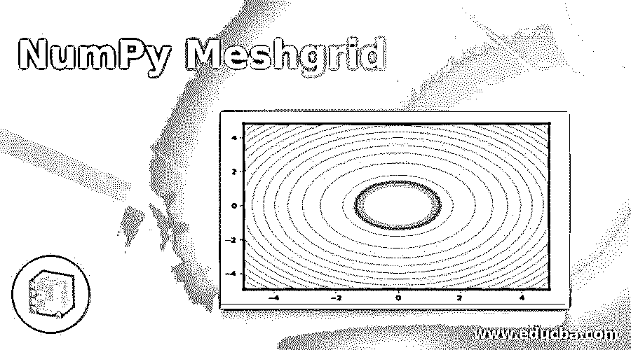
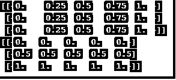
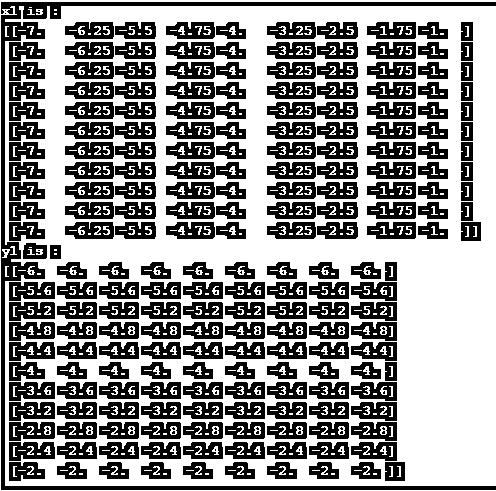
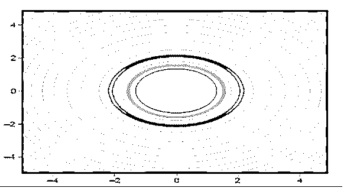

# 数字网格

> 原文：<https://www.educba.com/numpy-meshgrid/>




## 数字网格的定义

在 python 中，meshgrid 是一个函数，它从 2 个给定的一维数组中创建一个矩形网格，表示矩阵或笛卡尔索引。灵感来源于 MATLAB。这个 meshgrid 函数由模块 numpy 提供。坐标矩阵从坐标向量返回。在这里，我们将更详细地讨论 meshgrid 函数。

### 句法

下面是 numpy 中 meshgrid 函数的语法。

<small>网页开发、编程语言、软件测试&其他</small>

```
numpy.meshgrid(*xi, **kwargs)
```

该函数的四个参数是:

**1。x1，x2，…，xn**

*   必需参数
*   表示一维数组中网格坐标的参数。

**2。索引**

*   任选参数
*   表示结果的笛卡尔(' xy '，默认)或矩阵索引的参数。

**3。稀疏**

*   任选参数
*   接受布尔值
*   如果传递了“True ”,则返回稀疏网格以节省内存。
*   默认值:False

**4。复制**

*   任选参数
*   接受布尔值。
*   如果传递了“false ”,则返回原始数组的视图以节省内存。
*   默认值:False

如果参数 sparse 和 copy 设置为 False，将返回不连续的数组。此外，一个广播数组的一个或多个元素可以指向一个内存位置。如果必须向数组中写入数据，则必须首先复制数组。返回值是:坐标向量的坐标长度。

### NumPy 中的 Meshgrid 函数是如何工作的？

为了理解 numpy 中 meshgrid 函数的工作原理，让我们看一个例子。

创建 meshgrid 的步骤:

*   导入模块 numpy。

```
importnumpy as np
```

*   创建两个变量。

```
n1, n2 = (5, 3)
```

*   创建两个数组

```
a = np.linspace(0, 1, n1)
b = np.linspace(0, 1, n2)
```

*   用数组作为参数调用 meshgrid 函数。

```
aa, bb = np.meshgrid(a, b)
```

*   显示结果

```
print(aa)
print(bb)
```

### 数字网格示例

让我们看看 meshgrid 函数的一些样例程序。

#### 示例#1

Python 程序打印两个数组的 meshgrid 坐标。

**代码:**

```
import numpy as np
n1, n2 = (5, 3)
a = np.linspace(0, 1, n1)
b = np.linspace(0, 1, n2)
aa, bb = np.meshgrid(a, b)
print(aa)
print(bb)
```

**输出:**




在这个程序中，numpy 模块必须以别名 np 导入。然后，创建两个变量 n1 和 n2，其中赋值为 5 和 3。一旦完成，在 linspace()函数的帮助下也创建了两个数组 a 和 b。然后使用两个变量 aa 和 bb 来分配 meshgrid 的返回值。在函数中，数组 a 和 b 都被传递。最后，打印出 aa 和 bb 的值。在执行代码时，将显示两个数组，其中包含坐标长度和坐标向量。meshgrid 输出的坐标也可用于绘制坐标范围内给定的函数。

#### 实施例 2

Python 程序，打印指定值之间的两个数组的 meshgrid 坐标。

**代码:**

```
import numpy as np
l = np.linspace(-7, -1, 9)
k = np.linspace(-6, -2, 11)
x1, y1 = np.meshgrid(l, k)
print("x1 is : ")
print(x1)
print("y1 is : ")
print(y1)
```

**输出:**




同样在这个程序中，numpy 模块必须以任何别名导入。这个程序中的别名是 np。然后，在 linspace()函数的帮助下创建两个数组 l 和 k。然后使用两个变量 x1 和 y1 来分配 meshgrid 的返回值。在函数中，l 和 k 数组都被传递。最后，打印出 x1 和 y1 的值。在执行代码时，将显示两个数组，其中包含坐标长度和坐标向量。

#### 实施例 3

Python 程序打印两个数组的 meshgrid 坐标，其中稀疏为真。

**代码:**

```
import numpy as np
n1, n2 = (5, 3)
l = np.linspace(0, 1, n1)
k = np.linspace(0, 1, n2)
aa, bb = np.meshgrid(l, k, sparse=True)
print(aa)
print(bb)
```

**输出:**


与上面的程序类似，在这个程序中，numpy 模块也必须用别名导入。这个程序中的别名是 np。首先，创建两个变量 n1 和 n2，其中值分别为 5 和 3。然后，在 linspace()函数的帮助下创建两个数组 l 和 k。然后使用两个变量 x1 和 y1 来分配 meshgrid 的返回值。除了上面的节目，稀疏在这里是真的。如果 sparse 为 true，它会节省函数中的内存，同时传递数组 l、k 和稀疏值。最后，打印出 x1 和 y1 的值。在执行代码时，将显示两个数组，其中包含坐标长度和坐标向量。这里可以看出，显示的方式与上述程序不同。

#### 实施例 4

Python 程序打印两个数组的 meshgrid 坐标并显示等高线。

**代码:**

```
import numpy as np
import matplotlib.pyplot as plt
n = np.arange( -5, 5, 0.1 )
m = np.arange( -5, 5, 0.1 )
x, y = np.meshgrid( n, m, sparse=True )
c = np.sin( x**2+ y**2  ) / ( x**2 + y**2 )
z = plt.contourf( n, m, c )
plt.show()
```

**输出:**




与上面的程序类似，在这个程序中，numpy 模块也必须用别名 np 导入。首先，借助 arange()函数创建两个数组 n 和 m。然后使用两个变量 x 和 y 来分配 meshgrid 的返回值。此外，稀疏在这里也是成立的。在函数中，传递数组 n、m 和稀疏值。然后，声明一个变量 z，它分配函数 np.sin()的返回值。最后，使用函数 plt.contourf()绘制等高线和填充的等高线。在执行代码时，可以看到已经绘制了等高线。

### 推荐文章

这是 NumPy Meshgrid 的指南。在这里，我们还讨论了网格函数在 numpy 中的工作方式，并给出了示例及其代码实现。您也可以看看以下文章，了解更多信息–

1.  [NumPy.argmax()](https://www.educba.com/numpy-argmax/)
2.  num py . dot()
3.  [numpy.diff()](https://www.educba.com/numpy-dot-diff/)
4.  [NumPy 数组](https://www.educba.com/numpy-arrays/)


