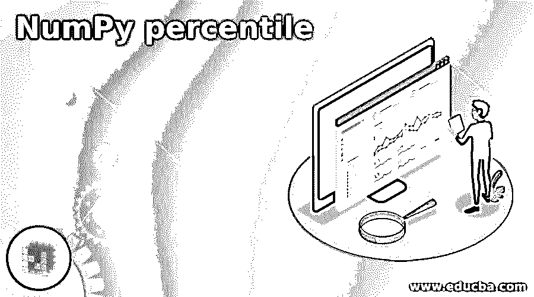
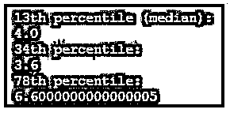
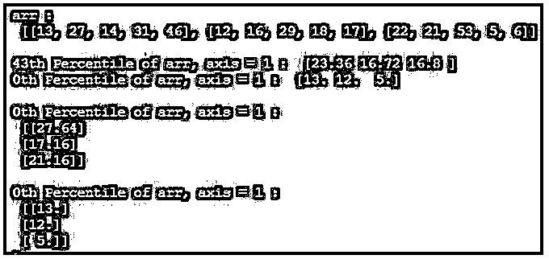

# 数字百分位

> 原文：<https://www.educba.com/numpy-percentile/>




## NumPy 百分位简介

numpy.percentile()是用于计算第 n 个数字的函数之一，该数字将是用户提到的给定数据的百分位形式，或者是可以作为轴格式提到的任何其他数组元素，如 x、y 和 z 等。NumPy 百分位数也称为百分位数，用于测量和统计目的，它以给定的百分比格式表示组中用户观察值的百分比，用于表示下面的百分比和挥手目的，即有 100 个相等的百分位数带，表示使用数组格式和轴指定的用户输入数据。

**语法:**

<small>网页开发、编程语言、软件测试&其他</small>

编程语言有自己的语法和规则，用于在独立应用程序和 web 应用程序(也包括移动应用程序)中应用逻辑。基于这一点，python numpy percentile 有一个默认的方法叫做 np.percentile()是 python 语言的内置方法，用于计算百分位值。

```
import numpy as np
a=[] // array elements initialisation
print("",np.percentile(a,integer value))
```

以上代码是使用默认方法计算百分比值的基本语法。它可以通过使用给定数组的用户定义值来计算百分比值。

### NumPy 中的百分位函数是如何工作的？

*   NumPy 有许多有用的统计函数，可以从上述数组中的给定元素集找到最小和最大百分位标准偏差和方差。对于每个 numpy 都有不同的函数集，如 amin()和 amax()，也就是说，它从给定数组中的元素计算最小和最大函数。NumPy percentile()方法还用于计算第 I 个百分位，以提供使用沿轴指定的数组格式提供的用户输入数据。百分位通常被定义为用于统计目的的数学术语。第 I 个百分位数据集是数据中的 I 百分比值。使用 np percentile()方法在 python 中计算百分位数据。
*   百分位数据可以计算和显示，如百分位等级用于报告来自常模参照测试的分数，每个百分位具有不同的一组值，如第 25 <sup>个</sup>百分位被称为第一四分位数，第 50 <sup>个</sup>个百分位被称为中间值或第二四分位数，第 75 <sup>个</sup>个百分位被称为第三四分位数(q3)。百分位数和四分位数是分位数的具体类型。我们有一个公式来计算排名格式中的百分位数，这可以是相对简单的任务，它将是直接的类型，它只知道分数的分布，可以很容易地计算出任何数量的分数在分布中的百分位数。百分比等级公式为 R=P/100(N+1 ),其中 R 代表分数的等级顺序。
*   百分位数等级计算从 0 到 100 的连续范围内的百分比，无论数字代表什么，可以是任何格式，如整数、小数、浮点、双精度和长格式。它显示可以在低于分数百分比的分数之间分布的数字分数的百分比计算。NumPy 是一种 python 包，它提供了快速、可靠、灵活和富有表现力的数据结构，主要设计用于关系 a 或标记数据，既简单又直观，它的目标是在 python 中进行实际和真实世界数据分析的基本高级构建块。

### NumPy 百分位示例

以下是 NumPy 百分位的示例:

#### 示例#1

**代码:**

```
import numpy as np
n = np.array([6,2,4,3,7])
print("13th percentile (median):")
p1 = np.percentile(n, 50)
print(p1)
print("34th percentile:")
p1 = np.percentile(n, 40)
print(p1)
print("78th percentile:")
p1 = np.percentile(n, 90)
print(p1)
```

**输出:**




#### 实施例 2

**代码:**

```
import numpy as np
a = [[13, 27, 14, 31, 46],
[12, 16, 29, 18, 17],
[22, 21, 53, 5, 6,]]
print("\narr : \n", a)
print("\n43th Percentile of arr, axis = 1 : ",
np.percentile(a, 43, axis =1))
print("0th Percentile of arr, axis = 1 : ",
np.percentile(a, 0, axis =1))
print("\n0th Percentile of arr, axis = 1 : \n",
np.percentile(a, 54, axis =1, keepdims=True))
print("\n0th Percentile of arr, axis = 1 : \n",
np.percentile(a, 0, axis =1, keepdims=True))
```

**输出:**




### 结论

统计测量通常是一组有限的方法，可以对市场中实际测量的人或物进行测量。对于每个数据不能用来概括其他人的数据，它可以更安全，特别是通过使用 python。

### 推荐文章

这是一个数字百分位指南。这里我们讨论一下简介，百分位函数在 NumPy 中是如何工作的？和示例。您也可以看看以下文章，了解更多信息–

1.  [numpy.linspace()](https://www.educba.com/numpy-linspace/)
2.  [numPy.where()](https://www.educba.com/numpy-where/)
3.  [Numpy.argsort()](https://www.educba.com/numpy-argsort/)
4.  [NumPy.argmax()](https://www.educba.com/numpy-argmax/)


