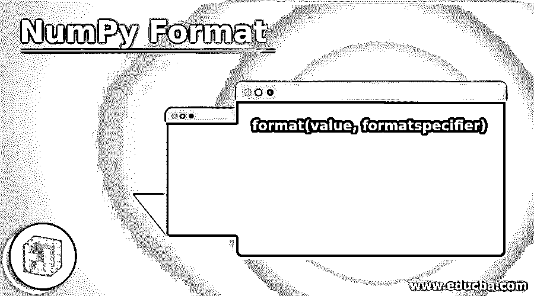
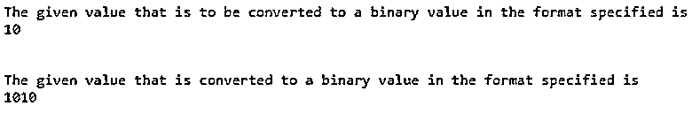
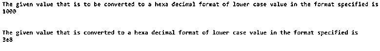
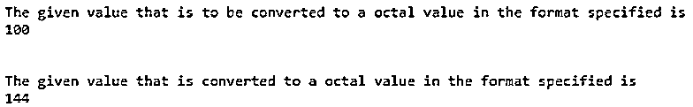

# NumPy 格式

> 原文：<https://www.educba.com/numpy-format/>




## NumPy 格式介绍

如果给定的值必须转换成格式说明符指定的格式，那么我们使用 python 中一个名为 format()函数的内置函数。它采用两个参数 value 和 formatspecifier，其中 value 是要转换为由第二个参数 formatspecifier 指定的格式的值，有几个格式说明符，如、^、=、+、-、_、逗号、空格、b、c、d、e、e、f、f、g、g、o、x、x、n 和%,指定为 value 的第一个参数可以是任何格式。

**语法:**

<small>网页开发、编程语言、软件测试&其他</small>

Pythonis 中 NumPyformat 函数的语法如下:

```
format(value, formatspecifier)
```

其中 value 是要转换为由第二个参数 formatspecifier 指定的格式的值。

### NumPy 中格式函数的使用

NumPy 中格式函数的工作方式如下:

*   如果给定的值必须转换成格式说明符指定的格式，那么我们使用 python 中一个名为 format()函数的内置函数。
*   python 中的 format()函数采用两个参数 value 和 formatspecifier，其中 value 是要转换为由第二个参数 formatspecifier 指定的格式的值。
*   有几个格式说明符，如、^、=、+、-、_、逗号、空格、b、c、d、e、e、f、f、g、g、o、x、x、n 和%,指定为值的第一个参数可以是任何格式。

### NumPy 格式的示例

下面是一些例子:

#### 示例#1

演示 NumPyformat 函数的 Python 程序将给定值转换为二进制格式:

**代码:**

```
#the value to be converted to a binary format as specified by the format specifier is displayed on the screen
value = 10
print('The given value that is to be converted to a binary value in the format specified is')
print value
print '\n'
#format function is used to convert the given value into a format as specified by the format specifier
convertedvalue = format(value, 'b')
print('The given value that is converted to a binary value in the format specified is')
#the given value after converted to a binary format as specified by the format specifier is displayed on the screen as the output
print convertedvalue
print '\n'
```

**输出:**




在上面的程序中，由格式说明符指定的要转换为二进制格式的值存储在一个名为 value 的变量中，并显示在屏幕上。然后，使用 format 函数将给定值转换为格式说明符指定的二进制格式。然后，给定值在转换为格式说明符指定的二进制格式后，作为输出显示在屏幕上。

#### 实施例 2

Python 程序演示了 NumPy 格式函数，它将给定的值转换成小写的十六进制格式:

**代码:**

```
#the value to be converted to ahexa decimal format of lower case as specified by the format specifier is displayed on the screen
value = 1000
print('The given value that is to be converted to a hexa decimal format of lower case value in the format specified is')
print value
print '\n'
#format function is used to convert the given value into ahexa decimal format of lower caseas specified by the format specifier
convertedvalue = format(value, 'x')
print('The given value that is converted to a hexa decimal format of lower case value in the format specified is')
#the given value after converted to ahexa decimal format of lower case as specified by the format specifier is displayed on the screen as the output
print convertedvalue
print '\n'
```

**输出:**




在上面的程序中，要转换为由格式说明符指定的小写六进制格式的值存储在一个名为 value 的变量中，并显示在屏幕上。然后，使用 format 函数将给定值转换为由格式说明符指定的小写六进制格式。然后，给定值在转换为格式说明符指定的十六进制小写格式后，作为输出显示在屏幕上。

#### 实施例 3

Python 程序演示了将给定值转换为八进制格式的 NumPy 格式函数:

**代码:**

```
#the value to be converted to a octal format as specified by the format specifier is displayed on the screen
value = 100
print('The given value that is to be converted to a octal value in the format specified is')
print value
print '\n'
#format function is used to convert the given value into a octal format as specified by the format specifier
convertedvalue = format(value, 'o')
print('The given value that is converted to a octal value in the format specified is')
#the given value after converted to aoctal format as specified by the format specifier is displayed on the screen as the output
print convertedvalue
print '\n'
```

**输出:**




在上面的程序中，由格式说明符指定的要转换为八进制格式的值存储在一个名为 value 的变量中，并显示在屏幕上。然后，使用 format 函数将给定值转换为格式说明符指定的八进制格式。然后，给定值在转换为格式说明符指定的八进制格式后，作为输出显示在屏幕上。

### 推荐文章

这是一个 NumPy 格式的指南。在这里，我们还讨论了 numpy 中格式函数的介绍和工作原理，以及不同的例子和代码实现。您也可以看看以下文章，了解更多信息–

1.  [NumPy ndarray tolist](https://www.educba.com/numpy-ndarray-tolist/)
2.  [NumPy 外部](https://www.educba.com/numpy-outer/)
3.  [NumPy zip](https://www.educba.com/numpy-zip/)
4.  [NumPy 连接](https://www.educba.com/numpy-concatenate/)


