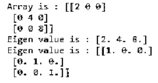
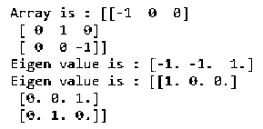
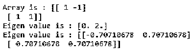
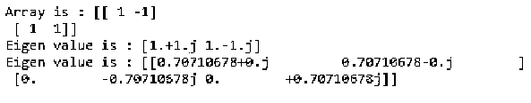
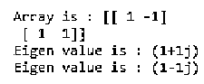
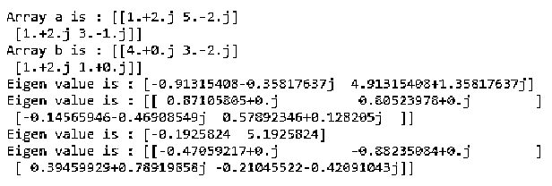

# Numpy 特征值

> 原文：<https://www.educba.com/numpy-eigenvalues/>


## Numpy 特征值的定义

Numpy 特征值是 numpy 库的 numpy 线性代数包中的一个函数，用于从给定的实对称或复对称数组或矩阵生成特征值或特征向量，作为函数的输入。根据输入数组或矩阵的种类，numpy 特征值函数返回两种类型的数组，一维数组表示输入位置的特征值，另一个二维数组给出对应于输入矩阵中列的特征向量。

**语法:**

<small>网页开发、编程语言、软件测试&其他</small>

numpy 特征值函数基本上使用以下语法调用，

```
numpy.linalg.eigvals(a)
```

*   Linalg.eigvals 表示 numpy 库中的线性代数包，用于执行各种代数运算
*   参数“a”是复数值或实数值的输入数组或矩阵。
*   该函数返回的特征值不是有序的，而是以其自身的变化形式表示的。如果特征值的计算不一致，就会给我们带来一个错误。

### Numpy 特征值的例子

下面是一些例子:

#### 示例#1

**代码:**

```
import numpy as np
# Generating an array using numpy array function
a = np.array([[3, -1j], [1j, 3]])
print("Array is :",a)
# using linear algebra package
# eigen value function is implemented
x, y = np.linalg.eigh(a)
print("Eigen value is :", x)
print("Eigen value is :", y)
```

**输出:**


在本例中，我们有一个复数值为“a”的输入数组，用于使用 numpy 特征值函数生成特征值。正如我们在输出中看到的，我们得到了一维和二维的两个数组。第一个数组是矩阵“a”的特征值，第二个数组是对应于列的特征向量的矩阵。

#### 实施例 2

在这个例子中，我们将确定简单对角矩阵的特征值，并生成相应的特征向量。

**代码:**

```
import numpy as np
# Generating a diagonal matrix using numpy array function
a = np.diag((2, 4, 8))
print("Array is :",a)
# using linear algebra package
# eigen value function is implemented
x, y = np.linalg.eigh(a)
print("Eigen value is :", x)
print("Eigen value is :", y)
```

**输出:**




在这个例子中，我们使用了一个对角的实值矩阵，并试图计算这个矩阵的特征值。输入矩阵是 3×3 对角矩阵，因此特征值是矩阵(2，4，8)中非零的实数。生成对角矩阵的相应特征向量。

#### 实施例 3

**代码:**

```
import numpy as np
# Generating an diagonal matrix using numpy array function
a = np.diag((-1,1,-1))
print("Array is :",a)
# using linear algebra package
# eigen value function is implemented
x, y = np.linalg.eigh(a)
print("Eigen value is :", x)
print("Eigen value is :", y)
```

**输出:**




与前面的示例类似，我们创建了一个具有实数值的对角矩阵(-1，1，-1)，我们计算了矩阵的特征值，矩阵中的所有实数值都对应于特征值，并创建了对角矩阵的相应特征向量。

#### 实施例 4

**代码:**

```
import numpy as np
# Generating a 2-D matrix using numpy array function
a = np.array([[1, -1], [1, 1]])
print("Array is :",a)
# using linear algebra package
# eigen value function is implemented
x, y = np.linalg.eigh(a)
print("Eigen value is :", x)
print("Eigen value is :", y)
```

**输出:**




**代码:**

```
import numpy as np
# Generating a 2-D matrix using numpy array function
a = np.array([[1, -1], [1, 1]])
print("Array is :",a)
# using linear algebra package
# eigen value function is implemented
x, y = np.linalg.eig(a)
print("Eigen value is :", x)
print("Eigen value is :", y)
```

**输出:**




在此示例中，我们比较了 numpy linalg.eigh()和 linalg.eig()函数，其中 linalg.eigh()用于生成复共轭矩阵或实对称矩阵的特征值和特征向量。函数用于计算输入方阵或数组的特征值和特征向量。
我们创建了一个二维数组“a ”,并使用 linalg.eigh()和 linalg.eig()函数生成输入矩阵“a”的特征值和向量。我们可以看到两个输出的差异。linalg.eig()函数返回输入数组“a”的复共轭，linalg.eigh()将复对称矩阵作为输入，为我们提供对应于输入数组的特征值和向量。

#### 实施例 5

**代码:**

```
import numpy as np
# Generating an 2_D matrix using numpy array function
a = np.array([[1,-1], [1, 1]])
print("Array is :",a)
# using linear algebra package
# eigen value function is implemented
x, y = np.linalg.eigvals(a)
print("Eigen value is :", x)
print("Eigen value is :", y)
```

**输出:**




在本例中，我们使用了与 linalg.eig()函数不同的 linalg . EIG()函数，前者仅返回特征值，而不返回我们在输出中看到的特征向量。

#### 实施例 6

**代码:**

```
import numpy as np
a = np.array([[1+2j, 5-2j], [1+2j, 3-1j]])
print("Array a is :",a)
b = np.array([[4.+0.j, 3.-2.j], [1.+2.j, 1.-0.j]])
print("Array b is :",b)
# using linear algebra package
# eigen value function is implemented
x1,y1 = np.linalg.eig(a)
x2,y2 = np.linalg.eigh(b)
print("Eigen value is :", x1)
print("Eigen value is :", y1)
print("Eigen value is :", x2)
print("Eigen value is :", y2)
```

**输出:**




在此示例中，为了更清楚地理解 numpy linalg.eig()和 linalg.eigh()函数，我们创建了两个数组“a”和“b”作为输入数组，并使用 linalg.eig()和 linalg.eigh()函数来生成这两个数组的特征值和特征向量。在这里我们可以看到复对称矩阵或实对称矩阵的特征值和向量总是实值。

### 结论

摘要:本文通过各种例子详细讨论了 numpy 特征值函数，以便对 Numpy 特征值函数及其用途有一个清晰的认识。我们还详细讨论了如何使用 numpy 线性代数软件包调用特征值函数，以及不同特征值函数的差异，如线性代数软件包中的 eig()、eigh()和 eighvals()。我们还讨论了使用实数组和复数组作为计算特征值和向量的输入所涉及的技术。

### 推荐文章

这是 Numpy 特征值的指南。这里我们还讨论了 numpy 特征值的定义和语法，以及不同的例子和代码实现。您也可以看看以下文章，了解更多信息–

1.  [Numpy 随机种子()](https://www.educba.com/numpy-random-seed/)
2.  num py . eye()
3.  [熊猫系列到 NumPy 数组](https://www.educba.com/pandas-series-to-numpy-array/)
4.  [NumPy 外部](https://www.educba.com/numpy-outer/)


