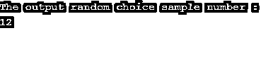
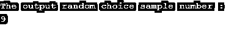
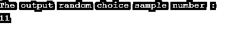
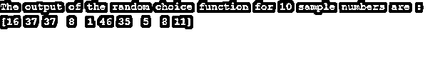

# 数字随机选择

> 原文：<https://www.educba.com/numpy-random-choice/>


## 数字随机选择的定义

NumPy random choice()函数用于获取一维数组的随机样本，该随机样本作为 NumPy 数组的随机样本返回。NumPy random choice()函数是 python 的 NumPy 包中的内置函数。NumPy random choice()函数生成随机样本，这些样本通常用于数据统计、数据分析、数据相关领域等，也可用于概率、机器学习、贝叶斯统计等。

**jQuery zindex()函数的语法:**

<small>网页开发、编程语言、软件测试&其他</small>

```
numpy.random.choice(list , size = None, replace = True, p = None)
```

**参数:**

*   **list**–这不是一个可选参数，它指定了一个具有随机样本的一维数组。
*   **size**–可选参数，指定 NumPy 数组输出随机样本的大小。
*   replace–这是一个可选参数，指定样本是否必须进行替换。
*   **p**–这是一个可选参数，指定数组“列表”中每个样本的概率。
*   **返回值**–这个函数的返回值是随机样本的 NumPy 数组。

### NumPy 随机选择()函数的工作原理

NumPy random choice()函数接受四个参数。强制参数是元素或数字的列表或数组。当我们将元素列表传递给 NumPy random choice()函数时，它随机选择单个元素并作为一维数组返回，但是如果我们为 size 参数指定了某个大小，那么它将返回指定大小的一维数组。请注意，如果只是将数字作为选项(30)传递，那么该函数会在[0，29]范围内随机选择一个数字。

### 例子

NumPy random choice()函数的示例，用于生成范围内的单个数字。

接下来，我们编写 python 代码，通过下面的示例更清楚地理解 NumPy random choice()函数，其中 choice()函数用于在[0，12]范围内随机选择一个数字，如下所示

#### 示例#1

**代码:**

```
# import numpy package as np
import numpy as np
# Using choice() method of random class
rdm_no = np.random.choice(13)
print( "The output random choice sample number : " )
# printing the generated output random samples of the choice() function
print( rdm_no )
```

**输出:**




同样，当我们运行上述程序时，它将生成另一个随机数，如下所示。




当我们再次运行上面的程序时，它将生成另一个随机数，如下所示。




由于在上面的程序中数字 13 被传递给 choice()函数，所以 choice()函数从范围[0，12]中随机选择单个数字，所以在上面的输出中我们看到它每次生成的随机数都在范围[0，12]内。

随机生成指定大小的数字的示例

接下来，我们编写 python 代码来理解 NumPy random choice()函数，其中 choice()函数用于随机生成范围为[0，49]的 10 个数字，如下所示

#### 实施例 2

**代码:**

```
# import numpy package as np
import numpy as np
# Using choice() method of random class
rdm_no = np.random.choice( 50, 10 )
print( "The output of the random choice function for 10 sample numbers are : " )
# printing the generated output random samples of the choice() function
print( rdm_no )
```

**输出:**




同样，当我们运行上述程序时，它将生成另一个随机数，如下所示


当我们再次运行上述程序时，它将生成另一个随机数，如下所示


在上面的程序中，数字 50 和 10 被传递给 choice()函数，其中 50 是随机数范围(现在范围是[0，49])，10 是随机数输出数组的大小，所以 choice()函数从范围[0，49]中随机选择 10 个数字，所以在上面的输出中，我们看到它每次都生成范围为[0，49]的 10 个随机数。

使用 replace–从给定列表中随机选择元素的示例

接下来，我们编写 python 代码来理解 NumPy random choice()函数，其中 choice()函数用于通过替换 true 从给定列表中随机选择一个元素，如下所示:

#### 实施例 3

**代码:**

```
# import numpy package as np
import numpy as np
# List of movies
list_movie = [ 'The Godfather', 'The Shawshank Redemption', 'The Wizard of Oz', 'Citizen Kane', 'Pulp Fiction' ]
# Using choice() method of random class
rdm_no = np.random.choice( list_movie, size = 3, replace = False )
print( "The output of the random choice function for the 2 movie sample numbers are : " )
# printing the generated output random samples of the choice() function
print( rdm_no )
```

**输出:**


同样，当我们运行上述程序时，它将生成另一个随机数，如下所示


当我们再次运行上述程序时，它将生成另一个随机数，如下所示


在上面的程序中，创建了电影列表，并将其与 size=3 和 replace=True 一起传递给 choice()函数，因此 choice()函数从列表中随机选择 3 个元素，replace 意味着所选元素可以重复，正如我们在上面的输出中看到的，在随机选择的数组中很少有元素重复。而如果 replace=False，则元素不会在随机选择的数组中重复。

### 结论

NumPy random choice()函数是 NumPy 包中的内置函数，用于获取一维数组的随机样本。

### 推荐文章

这是一个数字随机选择指南。这里我们用例子来讨论 NumPy random choice()函数的描述和工作。您也可以看看以下文章，了解更多信息–

1.  num py . eye()
2.  [NumPy 格式](https://www.educba.com/numpy-format/)
3.  [NumPy Newaxis](https://www.educba.com/numpy-newaxis/)
4.  [NumPy fft](https://www.educba.com/numpy-fft/)


