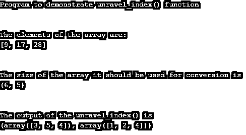

# NumPy 解开 _ 索引

> 原文：<https://www.educba.com/numpy-unravel_index/>


## NumPy unlauncle _ index 简介

在 Python 中，NumPy 提供了一个函数 unflare _ index()函数，用于将索引数组展平为多维数组中每一项的元素或坐标的元组，它通过该函数的输出为我们提供了行和列的坐标，这通常为我们提供了元素项在何处以及行和列的确切位置的概念。一般来说，我们可以定义 unflare _ index()NumPy 的一个函数，以产生给定数组的元素坐标，该数组转换任何 flatten 索引以获得由坐标数组组成的元组。

### NumPy unallow _ index()函数的工作原理

在本文中，我们将讨论 Python 编程语言中 NumPy 模块提供的 unallow _ index()方法，该方法用于将平面索引数组转换为包含数组中每个元素坐标的元组中的坐标。一般来说，unallow _ index()方法接受数组索引、数组的形状或大小以及数组中元素的行或列排列规范。还有一个与此函数相反的函数，称为 ravel_multi_index，它将多维数组转换为以输入和输出作为索引的多维数组。在下一节中，让我们看看 unlawn _ index()函数的语法和示例。

<small>网页开发、编程语言、软件测试&其他</small>

**语法:**

```
import numpy
numpy.unravel_index(ind_arr, shp_arr, order);
```

在上面的语法中，我们可以看到这个函数有 3 个参数

*   **Ind _ arr–**在这个参数中，我们指定数组元素的索引，它是一个整数值，已经是数组维数大小的展平值。
*   **Shp _ arr–**该参数指定数组的大小或形状，以存储应用该函数后获得的解开指数。
*   **Order-** 该参数是可选的，指定元素的行顺序，如果是列顺序，则指定为“C”样式，如果是列顺序，则指定为“F”(for tan-style)。默认情况下，如果我们不指定顺序，它将采用 C 风格。

### 例子

在下一节中，让我们考虑 Numpy 模块的 unallow _ index()函数的一个例子。

#### 示例#1

**代码:**

```
import numpy as ed
print("Program to demonstrate unravel_index() function")
print("\n")
print("The elements of the array are:")
a = [9, 17, 28]
print(a)
print("\n")
print("The size of the array it should be used for conversion is ")
b= (6,5)
print(b)
print("\n")
res = ed.unravel_index(a, b)
print("The output of the unravel_index() is")
print(res)
```

**输出:**


在上面的程序中，我们可以看到已经先导入的 NumPy 模块使用了 unallow _ index()函数。然后，我们声明存储在变量“a”中的数组的几个项目，以元组的形式将它们的行和列的坐标放在一起，然后，我们声明存储在变量“b”中的数组的大小要从扁平数组转换而来。在上面的程序中，我们调用函数并传递这两个变量“a = [9，17，28]”和“b = (6，5)”来获得输出，如上面的程序所示。我们得到元素“9”的坐标为(1，4)，元素“17”的坐标为(3，2)，元素“28”的坐标为(5，3)。因此，输出结果将是这些坐标与行和列的组合，例如 tuple = (array ([1，3，5])，array ([4，2，3])。在这个程序中，我们指定了顺序，所以默认情况下它将采用“C”样式，因此当我们看到一个(6，5)大小的数组时，这里的元素是按行放置的。因此，为了在“F”样式参数中指定顺序，当我们调用如下函数时，需要修改上面的程序

```
res = ed.unravel_index(a, b, order = 'F')
print(res)
```

因此，上面的代码行需要在上面的程序中修改，输出将如下面的截图所示。




在上面的输出中，我们可以得到一个数组元组的输出，例如(array([3，5，4])，array([1，2，4])，其中输出与上面的不同，因为这里我们将顺序更改为“F”。因此，它将按(6，5)列的方式排列数组的元素。

现在我们将在下面看到 unlaunch _ index()如何排列给定数组的索引。

#### 实施例 2

数组的元素是[9，17，28]，要转换的数组的大小是(6，5)，它指定了我们需要从中获取索引的目标数组的维数。

因此，如果数组是扁平的，这意味着如果没有提到维度，那么它将如下所示:

[ 0, 1, 2, 3, 4, 5, 6, 7, 8, **9,** 10, 11, 12, 13, 14, 15, 16,

17 ，18，19，20，21，22，23，24，25，26，27， **28** ，29】

现在我们想把上面的展平数组转换成(6，5)维数组，如下所示:

[[ 0, 1, 2, 3, 4], [5, 6, 7, 8, **9** ] , [10, 11, 12, 13, 14], [15, 16, **17**, 18, 19],[20, 21, 22, 23, 24], [25, 26, 27, **28**, 29]]

因此，粗体数字是未展平的数组的索引。因此，在上面的数组中，当“C”样式具有从(0，1，2，3，4，5)行开始的 6 行和作为(0，1，2，3，4)的 5 列时，数组的索引按行放置。因此，上述(6，5)维数组的给定索引元素的坐标对于 9 是(1，4)，对于 17 是(3，2)，对于 28 是(5，3)，因此元组的输出数组将是(array ([1，3，5])，array ([4，2，3))。

假设顺序为“F ”,则上述(6，5)数组将按列方式排列，如下所示:

[[0, 6, 12, 18, 24] [1, 7, 13, 19, 25] [2, 8, 14, 20, 26] [3, **9**, 15, 21, 27] [4, 10, 16, 22, **28**] [5, 11, **17**, 23, 29]]

因此，上面的数组是按“F”顺序排列的，粗体数字是数组的索引元素，坐标是(3，1)代表 9，(5，2)代表 17，(4，4)代表 28，输出结果为(array([3，5，4])，array([1，2，4]))。

### 结论

在本文中，我们得出结论，Python 的 NumPy 模块提供了一个函数，用于将作为元素的扁平索引数组转换为数组元组，该数组元组包含放置在数组的给定维度中的这些索引的坐标。在本文中，我们看到了如何使用 unflare _ index()函数，通过程序和演示，针对“C”行顺序和“F”列顺序的示例来取消展平的索引数组。

### 推荐文章

这是一个指南 NumPy 解开 _ 索引。这里我们也用例子来讨论 NumPy unravel _ index()函数的介绍和工作原理。您也可以看看以下文章，了解更多信息–

1.  [NumPy 格式](https://www.educba.com/numpy-format/)
2.  [NumPy ndarray tolist](https://www.educba.com/numpy-ndarray-tolist/)
3.  [NumPy 外部](https://www.educba.com/numpy-outer/)
4.  [NumPy Newaxis](https://www.educba.com/numpy-newaxis/)


