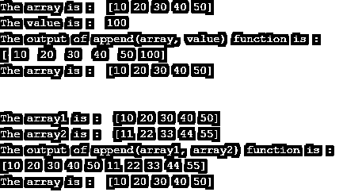
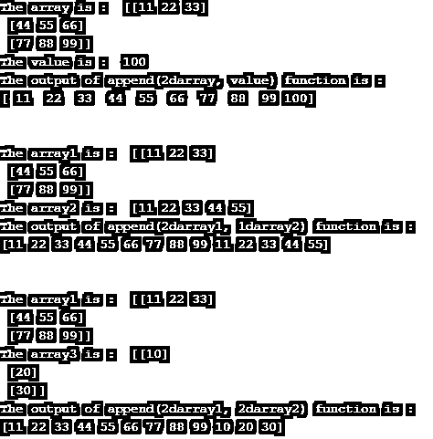
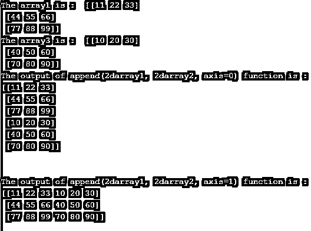

# NumPy append(数码宝贝附录)

> 原文：<https://www.educba.com/numpy-append/>


## NumPy 追加的定义

NumPy append()函数用于在数组末尾追加值。NumPy append()函数是 python 的 NumPy 包中的内置函数。这个函数可以用来追加两个数组或在一个数组的末尾追加一个或多个值，它向第一个数组添加或追加第二个数组并作为一个新数组返回。这个函数不改变第一个数组，它只是返回追加的数组，第一个数组将和调用 append()函数之前的一样。

**语法:**

<small>网页开发、编程语言、软件测试&其他</small>

```
NumPy.append( array, values, axis = None)
```

**参数:**

*   **array**–这不是一个可选参数，它指定了其副本要附加指定值的数组。该数组可以是 n 维数组。
*   **values**–这不是一个可选参数，它指定要附加到指定数组副本的值。值的形状必须与数组的形状匹配，追加时不包括轴。如果未定义轴，则允许任何形状的值，该轴将在使用前展平。
*   **轴**–这是一个可选参数，它指定值将被附加的轴。如果未提供轴，则数组和值将在使用前被展平。
*   **返回值**–该函数的返回值是 NumPy 数组，它是数组的副本，并附加了传递给轴的值。

### NumPy append()函数的工作原理

NumPy append()函数接受三个参数(数组、值、轴),前两个参数是强制参数。如果我们将数组“[11，22，33，44]”作为数组，将数组“[10，20，30，40]”作为值传递给 append()函数，那么 append()函数将返回结果数组“[11，22，33，44，10，20，30，40]”。如果我们检查数组，那么它将和调用 append()函数之前一样，为“[11，22，33，44]”。

### NumPy append()函数的示例

NumPy append()函数的示例，用于向一维数组追加值和数组–

接下来，我们编写 python 代码，通过下面的示例更清楚地理解 NumPy random append()函数，其中 append()函数用于向一维数组追加一些值和数组，如下所示

#### 示例#1

**代码:**

```
# import numpy package as np
import numpy as np
# creating numbers of array
array = np.array( [ 10, 20, 30, 40, 50 ] )
value = 100
app_array = np.append( array, value )
# printing array
print("The array is : ", array )
# printing value
print("The value is : ", value )
print( "The output of append(array, value) function is : " )
# printing the appended array
print( app_array)
# printing array to verify whether it is update or not
print("The array is : ", array )
print("\n")
array2 = np.array( [ 11, 22, 33, 44, 55 ] )
app_array = np.append( array, array2 )
print("The array1 is : ", array )
# printing array2
print("The array2 is : ", array2 )
print( "The output of append(array1, array2) function is : " )
# printing the appended array
print( app_array)
# printing array to verify whether it is update or not
print("The array is : ", array )
```

**输出:**




与上面的程序一样，append()函数用于将值追加到数组，将数组追加到数组。我们可以在输出中看到追加的数组，我们可以看到值和数组是如何追加的，我们还可以看到原始数组没有改变。

NumPy append()函数的示例，用于向二维数组追加值和数组–

接下来，我们编写 python 代码来理解 NumPy random append()函数，其中 append()函数用于向二维数组追加一些值和数组，如下所示

#### 实施例 2

**代码:**

```
# import numpy package as np
import numpy as np
# creating 2d array
array = np.array([ [11, 22, 33], [44, 55, 66], [77, 88, 99] ])
value = 100
app_array = np.append( array, value )
print("The array is : ", array )
print("The value is : ", value )
print( "The output of append(2darray, value) function is : " )
# printing the appended array
print(app_array)
print("\n")
array2 = np.array( [ 11, 22, 33, 44, 55 ] )
app_array = np.append( array, array2 )
print("The array1 is : ", array )
# printing array2
print("The array2 is : ", array2 )
print( "The output of append(2darray1, 1darray2) function is : " )
# printing the appended array
print(app_array)
print("\n")
array3 = np.array([ [10], [20], [30] ])
app_array = np.append( array, array3 )
print("The array1 is : ", array )
print("The array3 is : ", array3 )
print( "The output of append(2darray1, 2darray2) function is : " )
print( app_array)
```

**输出:**




与上面的程序一样，append()函数用于向二维数组添加值，向一维数组添加一维水平数组，向一维数组添加一维垂直数组，但不添加轴。我们可以在输出中看到追加的数组，我们可以看到值和一维数组是如何追加的，但是如果我们传递轴值 0 或 1，那么 append()函数会给出一个错误“值错误:所有输入数组必须具有相同的维数。”.

NumPy append()函数示例，用于通过值和带轴的数组追加二维数组

接下来，我们编写 python 代码来理解 NumPy random append()函数，其中 append()函数用于向二维数组追加一些值以及数组和轴值，如下所示

#### 实施例 3

**代码:**

```
# import numpy package as np
import numpy as np
# creating 2d array
array1 = np.array([ [11, 22, 33], [44, 55, 66], [77, 88, 99] ])
array2 = np.array([ [10, 20, 30], [40, 50, 60], [70, 80, 90] ])
app_array1 = np.append( array1, array2, axis = 0 )
print("The array1 is : ", array1 )
print("The array3 is : ", array2 )
print( "The output of append(2darray1, 2darray2, axis=0) function is : " )
print( app_array1)
print( "\n" )
app_array2 = np.append( array1, array2, axis = 1 )
print( "The output of append(2darray1, 2darray2, axis=1) function is : " )
print( app_array2)
```

**输出:**




与上面的程序一样，append()函数用于将二维数组附加到二维数组中(垂直和水平)。我们可以在输出中看到追加的数组，第一次追加是在轴值为 0 时垂直完成的，第二次追加是在轴值为 1 时水平完成的。

### 结论

NumPy append()函数是 NumPy 包中的内置函数，用于在数组末尾追加值。

### 推荐文章

这是 NumPy append 的指南。这里我们还讨论了简介、语法、参数和不同的例子及其代码实现。您也可以看看以下文章，了解更多信息–

1.  [Numpy 随机种子()](https://www.educba.com/numpy-random-seed/)
2.  num py . eye()
3.  [NumPy 解开 _ 索引](https://www.educba.com/numpy-unravel_index/)
4.  [NumPy 格式](https://www.educba.com/numpy-format/)


