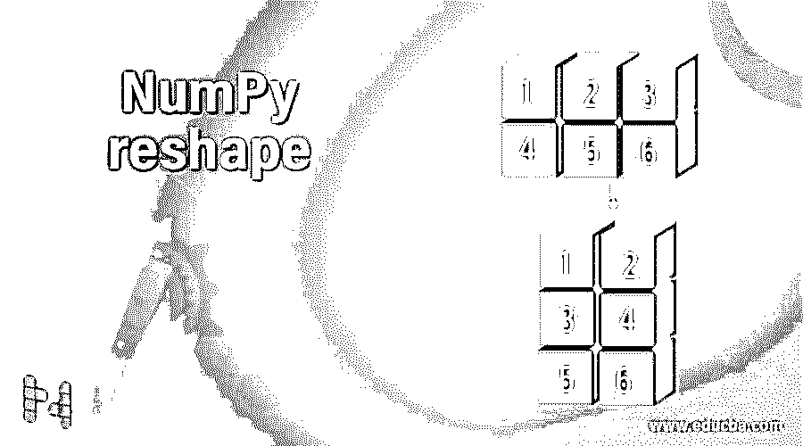
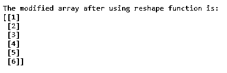
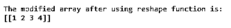
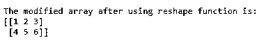

# NumPy reshape(数码相机)

> 原文：<https://www.educba.com/numpy-reshape/>




## NumPy 整形简介

python 中的单词 reshape 意味着改变数组的形状，其中每个维度中的几个元素都是数组形状的含义，我们利用 python 中的 NumPy 来改变数组的形状，这意味着改变每个维度中的元素数量。我们使用 python 中的 NumPy reshape，它用于在现有数组中删除或添加维度，或者修改现有数组中每个维度的元素计数，当我们使用 python 中的 NumPy reshape 时，数据不会因为对数组进行整形而受到影响，并且 NumPy reshape 会返回数据中没有任何修改的整形后的数组。

**语法:**

<small>网页开发、编程语言、软件测试&其他</small>

```
numpy.reshape(arrayname, newshape, order='C')
```

其中 arrayname 是要整形的数组的名称，

newshape 是通过使用 NumPy reshape 和

order 是索引顺序，使用该顺序可以读取数组元素并将其放入由 new shape 表示的整形后的数组中。order 的允许值为 C、F 和 A，其中 C 表示 C，类似于读写元素时使用的索引顺序，F 表示 Fortran，类似于读写元素时使用的索引顺序，A 表示 Fortran，类似于索引顺序，如果 arrayname 表示的给定数组的内存是 Fortran 连续的，或者它表示 C，类似于索引顺序，如果 arrayname 表示的给定数组的内存是 C 连续的。

### 数字整形工作

*   每当需要改变一个数组的形状时，其中每个维度中的几个元素都是数组形状的含义，我们就使用 Python 中的 NumPy reshape。
*   它用于在现有数组中删除或添加维度，或者修改现有数组中每个维度的元素计数。
*   当我们在 python 中使用 NumPy reshape 时，数据不会因为整形数组而受到影响，并且 NumPy reshape 会返回数据中没有任何修改的整形数组。
*   可以在整形函数中指定读取数组元素并将其放入整形后的数组的索引顺序。
*   可以读取数组元素并将其放入整形后的数组中的索引顺序的允许值是 C、F 和 a。
*   其中 C 表示类似于索引顺序的 C，使用该顺序将元素读取和写入到整形后的数组中。
*   f 代表 Fortran，类似于索引的顺序，使用该顺序将元素读取和写入到整形后的数组中。
*   如果给定数组的内存是 Fortran 连续的，则 a 表示类似于 Fortran 的索引顺序；如果给定数组的内存是 C 连续的，则 a 表示类似于 C 的索引顺序。

### 例子

以下是 NumPy 整形的不同示例:

#### 示例#1

**代码:**

```
#importing the package numpy
import numpy as num
#defining a 3*2 array to store the elements in the array
orgarrayname = num.array([[1,2,3], [4,5,6]])
#using Numpy reshape function to modify the dimensions of the given array without changing the data in the given array
modarrayname = num.reshape(orgarrayname, (6, 1))
print("The modified array after using reshape function is:")
#printing the elements of the modified array
print(modarrayname)
```

**输出:**




在上面的程序中，导入了一个名为 NumPy 的包，使我们能够使用 reshape 函数。然后定义一个 3*2 的数组来存储数组中的元素。然后，我们利用整形函数将给定的 3*2 数组的维数修改为 6*1 数组，而不改变给定数组的元素，整形或修改后的数组作为输出打印在屏幕上。

#### 实施例 2

**代码:**

```
#importing the package numpy
import numpy as num
#defining a 2*2 array to store the elements in the array
orgarrayname = num.array([[1,2], [3,4]])
#using Numpy reshape function to modify the dimensions of the given array without changing the data in the given array
modarrayname = num.reshape(orgarrayname, (1, 4))
print("The modified array after using reshape function is:")
#printing the elements of the modified array
print(modarrayname)
```

**输出:**




在上面的程序中，导入了一个名为 NumPy 的包，使我们能够使用 reshape 函数。然后定义一个 2*2 的数组来存储数组中的元素。然后，我们利用整形函数将给定的 2*2 数组的维数修改为 1*4 数组，而不改变给定数组的元素，整形或修改后的数组作为输出打印在屏幕上。

#### 实施例 3

**代码:**

```
#importing the package numpy
import numpy as num
#defining a 3*2 array to store the elements in the array
orgarrayname = num.array([[1,2,3], [4,5,6]])
#using Numpy reshape function to modify the dimensions of the given array without changing the data in the given array
modarrayname = num.reshape(orgarrayname, (2, 3))
print("The modified array after using reshape function is:")
#printing the elements of the modified array
print(modarrayname)
```

**输出:**




在上面的程序中，导入了一个名为 NumPy 的包，使我们能够使用 reshape 函数。然后定义一个 3*2 的数组来存储数组中的元素。然后，我们利用整形函数将给定的 3*2 数组的维数修改为 2*3 数组，而不改变给定数组的元素，整形或修改后的数组作为输出打印在屏幕上。输出显示在上面的快照中。

### 结论

在本教程中，我们通过定义、语法和编程示例及其输出来理解 Python 中 NumPy reshape 的概念。

### 推荐文章

这是一个 NumPy 重塑指南。在这里，我们讨论 Python 中 NumPy reshape 的定义、语法和工作方式，并给出例子。您也可以看看以下文章，了解更多信息–

1.  [NumPy.argmax()](https://www.educba.com/numpy-argmax/)
2.  [numpy.ravel()](https://www.educba.com/numpy-dot-ravel/)
3.  [Numpy.argsort()](https://www.educba.com/numpy-argsort/)
4.  num py . unique()


