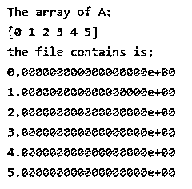
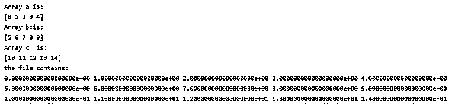
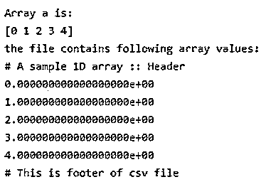
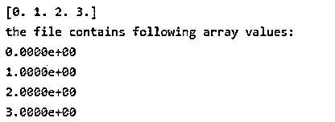

# NumPy savetxt 文件

> 原文：<https://www.educba.com/numpy-savetxt/>


## NumPy savetxt 简介

Python 为用户提供了不同的功能。为了处理数组，python 库提供了一个 NumPy 函数。主要是 NumPy savetxt 函数用来保存 txt 格式的数组，使用不同的分隔符。NumPy savetxt 函数适用于 1D 和 2D 阵列，numpy savetxt 还以 csv 文件格式保存阵列元素。在速度至关重要的数据科学中，数组扮演着重要的角色。NumPy 是数字 python 的首字母缩写。基本上，NumPy 是一个开源项目。NumPy 执行数组的逻辑和数学运算。因此，可以有效地进行处理和操作。

### NumPy savetxt 的语法

下面给出了语法:

<small>网页开发、编程语言、软件测试&其他</small>

```
numpy.savetxt(file_name, Array, format='%.4e', delimiter='  ', newline='n', header='  ', footer='  ', comments='# ')
```

**说明:**

*   **文件名:**文件名用于实际文件名。这意味着如果一个文件以。txt，则文件会自动保存为文本格式。以同样的方式，它适用于不同的文件扩展名。
*   **Arr:** Arr 表示 1D 或 2D 数组，用于将数组数据存储在文本文件中。
*   **格式:**格式参数用于定义图案的顺序。当我们想将数据保存到文本文件中时，就会用到它。如果格式被指定为 single，如“%d”，这意味着它适用于所有元素。为每列指定的 2D 数组是不同的，它是一个可选部分。
*   **分隔符:**作为字符串或字符来分隔列，是 savetxt 函数的可选参数。
*   **newline:**newline 参数用于分隔字符串或字符，是 savetxt 函数的可选参数。
*   **header:** 在 header 参数的帮助下，字符串或字符将被写入文件的开头，它是一个可选参数。
*   **footer:** 在 header 参数的帮助下，将字符串或字符写到文件的末尾，可选参数。
*   **注释:**注释参数使用符号 ***'#'*** 对某一段进行注释。在某些版本中，默认情况下，页眉和页脚被指定为注释。

### NumPy 中的 savetxt 函数是如何工作的？

*   我们必须在我们的系统上安装 Python。
*   我们必须使用 pip 命令安装 numpy。
*   我们需要关于 Python 的基础知识。
*   我们需要关于带有不同参数的 savetxt 函数的基本知识。
*   我们需要关于数组的基本知识。
*   我们可以使用 numpy savetxt 函数执行不同的操作。

### NumPy savetxt 的示例

以下是 NumPy savetxt 的示例:

#### 示例#1

对于 1D 阵来说。

**代码:**

```
import numpy as np
A = np.arange(0, 6, 1)
print("The array of A:")
print(A)
c = np.savetxt('1D.txt', A, delimiter=', ')  #  save array into txt file
X = open("1D.txt", 'r')  #  open file in read mode
print("the file contains is:")
print(X.read())   # open file
```

**说明:**

*   我们导入 numpy 函数，作为 np 使用。
*   我们为数组声明了变量 A 并赋值。
*   我们试图打印变量的值。
*   然后，我们使用 savetxt 函数将数组值存储到 txt 文件中。
*   之后，我们以读取模式打开该文件。
*   最后我们试着打印 txt 文件。
*   在上面的例子中，我们使用 numpy savetxt 函数实现了一个 1D 数组。
*   通过使用下面的快照来说明上述声明的最终结果。

**输出:**




#### 实施例 2

对于 2D 阵来说。

**代码:**

```
import numpy as np
a = np.arange(0, 5, 1)
b = np.arange(5, 10, 1)
c = np.arange(10, 15, 1)
print("Array a is:")
print(a)
print("Array b:is:")
print(b)
print("Array c: is:")
print(c)
x = np.savetxt('demoa.txt', (a, b, c))  #  Array with same dimension
y = open("demoa.txt", 'r')    #  open file in read mode
print("the file contains:")
print(y.read())
```

**说明:**

*   我们导入 numpy 函数，作为 np 使用。
*   我们为数组声明了变量 a、b 和 c 并赋值。
*   我们试着打印变量 a，b 和 c 的值。
*   然后，我们使用 savetxt 函数将数组值存储到具有相同数组维数的 2d.txt 文件中。
*   之后，我们以读取模式打开该文件。
*   最后我们尝试打印 2d.txt 文件。
*   在上面的例子中，我们使用 numpy savetxt 函数实现了一个 2D 数组。
*   通过使用下面的快照来说明上述声明的最终结果。

**输出:**




#### 实施例 3

1D 数组存储到带页眉和页脚的 csv 文件中。

**代码:**

```
import numpy as np
a = np.arange(0, 5, 1)
print("Array a is:")
print(a)
x = np.savetxt('hf.csv', a, delimiter=',' , header='A sample 1D array :: Header', footer='This is footer of csv file')  # savetxt function with header and footer.
y = open("hf.csv", 'r')    #  open file in read mode
print("the file contains following array values:")
print(y.read())
```

**说明:**

*   我们导入 numpy 函数，作为 np 使用。
*   我们为数组声明了变量 a 并赋值。
*   我们试着打印变量 a 的值。
*   然后我们使用 savetxt 函数将数组值存储到带有页眉和页脚的 hf.csv 文件中。
*   之后，我们以读取模式打开该文件。
*   最后，我们尝试打印 hf.csv 文件。
*   在上面的例子中，我们使用带有页眉和页脚参数的 numpy savetxt 函数实现了一个 1D 数组。
*   通过使用下面的快照来说明上述声明的最终结果。

**输出:**




#### 实施例 4

带指数符号的 1D 数组。

**代码:**

```
import numpy as np
a = b = c = np.arange(0.0,4.0,1.0)
print(a)
np.savetxt('demo.txt', a, delimiter=',')
np.savetxt('demo.txt', (a,b,c))
np.savetxt('demo.txt', a, fmt='%1.4e')   # exponential notation
x = open("demo.out", 'r')
print("the file contains following array values:")
print(x.read())
```

**说明:**

*   在上面的例子中，我们遵循了相同的过程，但唯一的区别是，在这个程序中，我们添加了指数符号。
*   通过使用下面的快照来说明上述声明的最终结果。

**输出:**




### 结论

从上面的文章中，我们看到了 numpy savetxt 函数的基本语法。我们还通过不同的例子看到了如何用 python 实现它们。从本文中，我们看到了如何在 python 中处理 numpy savetxt 函数。

### 推荐文章

这是 NumPy savetxt 的指南。这里我们讨论一下入门，savetxt 函数在 NumPy 中是如何工作的？并分别举例说明。你也可以看看下面的文章来了解更多-

1.  [numPy.where()](https://www.educba.com/numpy-where/)
2.  [NumPy.argmax()](https://www.educba.com/numpy-argmax/)
3.  num py . dot()
4.  [安装 NumPy](https://www.educba.com/install-numpy/)


