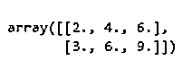
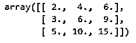
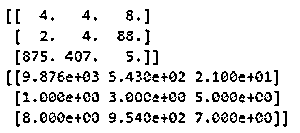
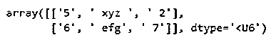
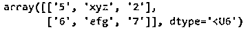
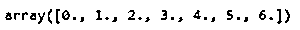
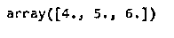

# NumPy genfromtxt

> 原文：<https://www.educba.com/numpy-genfromtxt/>


## NumPy genfromtxt 简介

NumPy genfromtxt 是 python numpy 库支持的各种函数之一，它读取表数据并将其生成一个数据数组并显示为输出。numpy genfromtxt 函数在两个循环中执行操作，其中一个循环读取文件中的行并将其转换为字符串序列，另一个循环将该字符串序列转换为合适的数据类型，以便读取时不会产生错误。genfromtxt 函数通常在数据的数据类型与 float、string、object 等不同时使用。

### NumPy genfromtxt 的语法

NumPy genfromtxt 函数的基本语法:

<small>网页开发、编程语言、软件测试&其他</small>

```
numpy.genfromtxt(fname, dtype= , comments: , delimiter = , skiprows = , skip_header = , autostrip =)
```

*   numpy.genfromtxt 表示将包含各种数据类型的输入数据或文件读入数组格式的函数。
*   fname 是我们通过 genfromtxt 函数传递的输入数据或文件的文件名。它可以在文件名、列表或读取路径中给出。
*   当我们希望 genfromtxt 函数的输出数组是特定的数据类型时，dtype 就是数据类型声明。如果我们将 dtype 声明为“None ”,它将根据该列的值自动生成数据类型。
*   注释它用于指示一行给定输入数据的起始字符。我们可以丢弃声明的注释后面的值或字符。
*   delimiter 它是我们声明用来分割输入值的字符串值。对于 csv 文件，我们使用'，'(逗号)作为分隔符来分隔文件中的值。
*   skiprows 用于跳过给定输入文件中的特定行或一组行。
*   当我们想要跳过给定输入文件的起始行或行时，使用 skip_header。
*   autostrip 它可以声明为自动删除数据文件中值之间的空格。

### NumPy genfromtxt 示例

以下是 NumPy genfromtxt 的示例:

#### 示例#1

让我们看一个基本的例子来理解 numpy round 函数是如何工作的。

**代码:**

```
import numpy as np
from io import StringIO
data = u"2, 4, 6\n3, 6, 9"
inp_data = np.genfromtxt(StringIO(data), delimiter=",")
inp_data
```

**输出:**




**代码:**

```
import numpy as np
from io import StringIO
data = u"2, 4, 6\n3, 6, 9\n5,10,15"
inp_data = np.genfromtxt(StringIO(data), delimiter=",")
inp_data
```

**输出:**




在上面的例子中，我们调用了 numpy 和 io 库来从 genfromtxt 函数生成输出数组。数据以字符串格式手动给出，并使用 stringio 函数通过 genfromtxt 函数传递，因为我们在数据中使用了字符串的 unicode。使用的分隔符是逗号，它通过识别逗号来分隔值。生成的输出数组是 genfromtxt 函数的结果数组。

输入格式可以是字符串列表、字符串、生成器或具有读取功能的打开对象文件。根据输入类型，genfromtxt 函数假定并打印输出数组。

例如，当我们提供单个字符串时，genfromtxt 函数会将其视为本地或远程位置的文件名。当提供字符串列表时，它将每个字符串视为文件中的一个单独的行。我们还可以将 url 位置传递给 genfromtxt 函数，该函数将从该 url 位置下载并打开文件。

#### 实施例 2

在这个例子中，我们将看到如何根据输入文件中值的宽度使用分隔符选项来分隔输出数组的数据。

**代码:**

```
data2 = u" 4  4  8\n  2  4 88\n875407  5"
inp_data2 = np.genfromtxt(StringIO(data2), delimiter=3)
print(inp_data2)
data3 = u"987654321\n   1  3 5\n   8954 7"
inp_data3 = np.genfromtxt(StringIO(data3), delimiter=(4, 3, 2))
print(inp_data3)
```

**输出:**




我们已经声明了两个输入数据，data1 和 data2，它们具有不同宽度的整数，并且我们没有用逗号或字符分隔，因此在这种情况下，我们使用 delimiter 中的整数值来分隔文件中的值，以得到我们想要的输出数组。

两个输入数据在一行中具有不同的值宽度，因此通过使用整数分隔符 3，我们将列分成三组值。当我们的输入文件在整个文件中具有相同的宽度值时，可以使用这个方法。如果文件中的值没有始终遵循相同的宽度，我们可以在分隔符中使用整数值序列来分别分隔值，就像我们在 data3 输入中所做的那样，我们使用序列 4，3，2 的分隔符来清楚地分隔值。

#### 实施例 3

让我们来看另一个例子，我们使用 autostrip 参数来删除值之间的空白。

**代码:**

```
data = u"5, xyz , 2\n 6, efg, 7"
# Executing Without autostrip
np.genfromtxt(StringIO(data), delimiter=",", dtype="|U6")
```

**输出:**




**代码:**

```
# ExecutingWith autostrip
np.genfromtxt(StringIO(data), delimiter=",", dtype="|U6", autostrip=True)
```

**输出:**




在本例中，我们使用了两个数据作为输入，并打印了两个输出，一个传递了 autostrip 参数，另一个没有传递 autostrip 参数。我们可以看到两个输出的差异，一个输出的值之间有空白，另一个输出的值之间没有空格。在文件中工作时，空格会导致不必要的复杂化，所以在我们的 genfromtxt 函数中包含 auto strip 参数是有用的。

#### 实施例 4

在本例中，我们在输入数据中使用了 skip header 参数来跳过输入数据中特定数量的值。

**代码:**

```
data = u"\n".join(str(i) for i in range(7))
np.genfromtxt(StringIO(data), delimiter=",")
```

**输出:**




**代码:**

```
# Executing With skip header
np.genfromtxt(StringIO(data), delimiter=",", skip_header=4)
```

**输出:**




### 结论

在本文中，我们通过各种示例详细了解了 NumPy genfromtx 函数，从而对 NumPy genfromtx 函数及其用法有了清晰的理解。我们还看到了如何使用 genfromtxt 函数读取各种数据类型的输入数据文件，我们还看到了使用示例中的分隔符所涉及的不同参数和技术的用法。

### 推荐文章

这是 NumPy genfromtxt 的指南。这里我们分别用例子来讨论 NumPy genfromtxt 的介绍。您也可以看看以下文章，了解更多信息–

1.  [numPy.where()](https://www.educba.com/numpy-where/)
2.  [numpy.ravel()](https://www.educba.com/numpy-dot-ravel/)
3.  [numpy.diff()](https://www.educba.com/numpy-dot-diff/)
4.  [NumPy Ndarray](https://www.educba.com/numpy-ndarray/)


