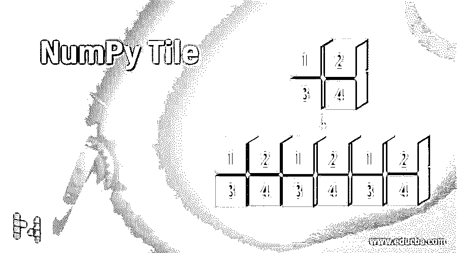
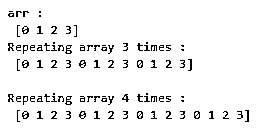
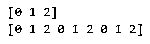
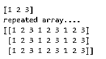
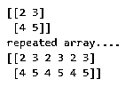
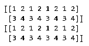
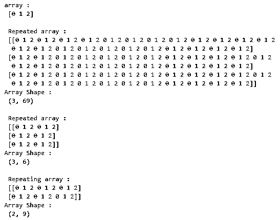

# 数字瓷砖

> 原文：<https://www.educba.com/numpy-tile/>




## NumPy 瓷砖简介

Python 为用户提供了不同的功能。为了使用数组，python 库提供了一个 numpy tile。numpy tile 提供了一种工具，可以通过重复多次来创建新的数组。在执行 tile 函数之后，我们得到一个新的数组，它的维数是 max(A，ND，R ),其中 R 是重复的长度。如果 A.ND > R 被提升为 A.ND，则在它前面加上 1。如果 A.ND

**语法**

<small>网页开发、编程语言、软件测试&其他</small>

```
numpy.tile(A,R)
```

**解释**

在上面的语法中，其中 numpy.tile 是函数，其中 A 是数组的输入，并且此元素是必需的。r 表示数组(A)沿每个轴重复的次数，该元素是必需的。

### NumPy 中的 tile 函数是如何工作的？

1.  我们必须在您的系统上安装 Python。
2.  我们必须使用 pip 命令安装 numpy。
3.  我们需要 Python 的基础知识。
4.  我们需要关于瓷砖的基本知识。
5.  我们可以使用 numpy.tile 函数执行不同的操作。

### NumPy 瓷砖示例

让我们来看一个不同的数字瓷砖的例子。

#### 示例# 1–三维阵列

**代码:**

```
import numpy as np
array = np.arange(4)
print("arr : \n", array)
repetitions = 3
print("Repeating array 3 times : \n", np.tile(array, repetitions))
repetitions = 4
print("\nRepeating array 4 times : \n", np.tile(array, repetitions))
```

**说明:**

在上面的例子中，我们用 1D 数组实现了 numpy.tile 函数。在这个例子中，我们首先导入 numpy 函数，并将其指定为 np。然后我们声明一个变量数组，用一个 arange 函数给数组赋值 4。之后，我们只是尝试打印数组值。然后，在 np.tile 函数的帮助下，我们声明两个重复值 3 和 4，最后，我们尝试打印具有重复的给定数组。通过使用下面的快照来说明上述声明的最终结果。




#### 示例# 2–numpy 瓷砖的普通示例

**代码:**

```
import numpy as np
A = np.array([0, 1, 2])
print(A)
x=np.tile(A, reps=3)
print(x)
```

**说明:**

在上面的例子中，我们导入了 numpy 函数，然后将其赋值为 np。然后我们有一个轴值为 0 的数组，重复三次。通过使用下面的快照来说明上述声明的最终结果。




#### 示例 3–A . ND 小于 R

**代码:**

```
import numpy as np
A = np.array([1, 2, 3])
print(A)
print("repeated array....")
x=np.tile(A, reps=(3, 3))
print(x)
```

**说明:**

在上面的例子中，我们尝试实现数组维数小于重复的第一种情况。首先，我们导入 numpy 函数，并将其指定为 np。然后，我们用值声明一个数组，并分配重复值。最后，结果已经打印出来。通过使用下面的快照来说明上述声明的最终结果。




#### 示例 4–A . ND 大于 R

**代码:**

```
import numpy as np
A = np.array([[2, 3], [4, 5]])
print(A)
print("repeated array....")
x=np.tile(A, reps=3)
print(x)
```

**说明:**

在上面的例子中，我们实现了另一个特例，即 A.ND 大于 r .其中，我们首先导入 numpy 函数，并将它们用作 np。然后，我们用值声明一个数组，并分配重复值。最后，我们尝试打印结果。通过使用下面的快照来说明上述声明的最终结果。




#### 例 5–for(A . ND = = R)= = 0

**代码:**

```
import numpy as np
A = np.arange(4).reshape(2, 2)
print("Array : \n", A)
x = 2
y = 1
repetitions = (x, y)
print("\n Repeated array : \n", np.tile(A, repetitions))
print("Array Shape : \n", np.tile(A, repetitions).shape)
x = 3
y = 2
repetitions = (x, y)
print("\n Repeated array : \n", np.tile(A, repetitions))
print("Array Shape : \n", np.tile(A, repetitions).shape)
x = 2
y = 3
repetitions = (x, y)
print("\n Repeated array : \n", np.tile(A, repetitions))
print("Array Shape : \n", np.tile(A, repetitions).shape)
```

**说明:**

在上面的例子中，我们实现了一个特例(A.ND==R)== 0 条件，其中我们首先导入 numpy 函数，并将它们用作 np。然后我们用值声明了一个数组，并在程序中分配了不同的重复值。最后，我们尝试打印出带有形状的数组。通过使用下面的快照来说明上述声明的最终结果。

**T2】**


 **#### 示例# 6–使用不同的方法编写图块函数

**代码:**

```
import numpy as np
matrix= np.array([[1,2],[3,4]])
x = np.tile(matrix,4)
y = np.tile(matrix,(1,4))
print(x)
print(y)
```

**说明:**

在上面的例子中，我们通过使用两种不同的方法实现了一个 tile 函数。执行两种方法后，得到的数组是相同的。通过使用下面的快照来说明上述声明的最终结果。




#### 示例# 7–平铺功能的水平+垂直实施

**代码:**

```
import numpy as np
matrix= np.array([[2,3],[4,5]])
x = np.tile(matrix,(3,4))
print(x)
```

**说明:**

在上面的例子中，我们用水平和垂直矩阵实现了一个平铺函数。通过使用下面的快照来说明上述声明的最终结果。

**T2】**


 **#### 实施例 8

**代码:**

```
import numpy as np
a = np.arange(3)
print("array : \n", a)
x = 3
y = 23
rep = (x, y)
print("\n Repeated array : \n", np.tile(a, rep))
print("Array Shape : \n", np.tile(a, rep).shape)
x = 3
y = 2
rep = (x, y)
print("\n Repeated array : \n", np.tile(a, rep))
print("Array Shape : \n", np.tile(a, rep).shape)
x = 2
y = 3
rep = (x, y)
print("\n Repeating array : \n", np.tile(a, rep))
print("Array Shape : \n", np.tile(a, rep).shape)
```

**说明:**

在上面的例子中，我们导入了一个 numpy 函数，然后将其赋值为 np。然后我们用一个数组函数创建了一个数组。之后，我们通过使用 numpy.tile 函数给数组分配重复值，然后我们尝试用数组的形状打印数组。对于不同的重复值，我们重复相同的过程。通过使用下面的快照来说明上述声明的最终结果。




### 结论

我们希望通过这篇文章，您已经了解了 numpy tile 函数。从上面的文章中，我们已经学习了 numpy tile 函数的基本语法。我们还学习了如何用 python 实现它们，每种类型都有不同的例子。从本文中，我们了解了如何在 python 中处理 numpy tile。

### **推荐文章**

这是 NumPy 瓷砖指南。在这里，我们将讨论 NumPy 中的 tile 函数是如何工作的，以及代码和输出的例子。您也可以阅读以下文章，了解更多信息——

1.  [Numpy.argsort()](https://www.educba.com/numpy-argsort/)
2.  [NumPy 数组](https://www.educba.com/numpy-arrays/)
3.  [NumPy Ndarray](https://www.educba.com/numpy-ndarray/)
4.  [NumPy 中的矩阵](https://www.educba.com/matrix-in-numpy/)


****