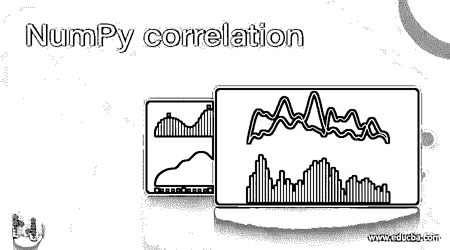
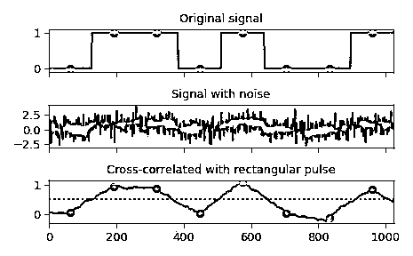
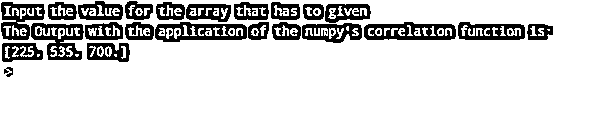
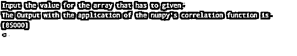

# 数字相关

> 原文：<https://www.educba.com/numpy-correlation/>




## 数字关联简介

Python 中的 Numpy.correlation 是由 correlate ***** ()函数的应用激发的。它在 Python 编码语言中使用，支持包含数据集序列的一维数组的两个唯一一维之间的互相关。该函数能够对相关性执行计算，因为它通常是在信号增强和评估过程中定义的。

### numpy.correlate*()的语法和参数

以下是使用 Python 编程语言编写代码时使用 numpy.correlate ***** ()的语法:

<small>网页开发、编程语言、软件测试&其他</small>

```
numpy*.* correlate* (* a1, v1, mode='valid', * old* _* behavior* =* False)
```

以下是用 Python 编程语言编写的 numpy.correlate()函数所使用的参数:

| **参数** | **参数说明** |
| a1 single dimensioned array or sequence of array_like它们代表输入变量；所有的一维数组都是用户已经输入到系统中的。它们包含一系列数据，这些数据可以是随机的，也可以是有模式的模式*** * * * * * * ***{*** ***‘有效’，*** ***‘相同’，*** ***‘满’*** ***}， *** *** 可选 *** ** ** ***这是指 docstring 中预期的对话。它是一个可选变量，在使用函数时用在参数中。必须注意，该参数的默认值设置为有效。与卷积的类似功能不同，卷积的默认设置是“满”old_behavior : bool* ** ** *如果该参数被证明为真，则它利用来自数值的先前存在的行为， *** *** (相关性 *** *** (a1，v1) = *** *** = *** *** 相关性 *** *** (v1，a1)，然后不考虑在复杂阵列上利用进一步的共轭。增加参数的值设置为假；然后，它利用预定义的常规信号处理。 |
| **返回** | Out: ndarray, optional* ** *该参数使程序能够显示必须放置相关执行结果数组的确切目的地。此参数不是不必要的附加项，可以在编写命令时跳过。 |

### NumPy 关联是如何工作的？




图 1:原始信号和任何噪声之间的横截面相关性的示意图，所述噪声是由信号捕获的，以最终提供定义的矩形脉冲

在音频信号处理中，互相关定义了一种标准化的度量，以指示在两个数据集系列之间观察到的相似性，这两个数据集系列充当根据彼此对比相关性的位移的函数。这种现象也就是俗称的滑动点积的滑动内积。它通常用于在较短的持续时间内搜索特别长的信号，这被称为一个特征。它在识别由声波检测的模式、单个粒子的分析、神经生理学中的平均过程、解密和电子断层摄影过程中具有重要的应用。

为了分析函数相关性是如何工作的，首先要做的是了解函数的可用性以及如何利用全部或部分函数。有各种各样的计算已经按照相关性进行了分类。几个时间序列的相关性，包括序列本身的一个比较左的拷贝，被称为自相关。而相反，互相关船舶是一种相关序列的元素序列组成的支付，这可能包括或可能不包括滞后。

### 数字相关的例子

显示在 Python 中使用 NumPy.correlate()执行关联的示例:

#### 示例#1

**代码:**

```
# Python program explaining the use of NumPy.correlate () function import numpy as geek1
# Python program explaining
# numpy.correlate() function
# importing numpy as geek
import numpy as geek1
print("Input the value for the array that has to given")
a1 = [20, 50, 70]
v1 = [0, 10, 0.50]
print("The Output with the application of the numpy's correlation function is: ")
gfg1 = geek1.correlate(a1, v1, "same")
print(gfg1)
```

**输出:**




#### 实施例 2

**代码:**

```
# Python program explaining the use of NumPy.correlate () function import numpy as geek2
# Python program explaining
# numpy.correlate() function
# importing numpy as geek2
import numpy as geek2
print("Input the value for the array that has to given: ")
a2 = [200, 500, 700]
v2 = [0, 100, 50]
output = geek2.correlate(a2, v2)
print("The Output with the application of the numpy's correlation function is: ")
print(output)
```

**输出:**




### 结论

NumPy。concatenate()函数在使用中是必不可少的，因为互相关定义了一种标准化的度量，以指示在两个数据集系列之间观察到的相似性，这两个数据集系列在位移方面起着函数的作用，而位移在彼此的对比相关性方面起作用。这种现象也就是俗称的滑动点积的滑动内积。它通常用于在较短的持续时间内搜索特别长的信号，这被称为一个特征。它在识别由声波检测的模式、单个粒子的分析、神经生理学中的平均过程、解密和电子断层摄影过程中具有重要的应用。

### 推荐文章

这是 NumPy 关联的指南。这里我们讨论 NumPy 关联是如何工作的，以及代码和输出的例子。您也可以看看以下文章，了解更多信息–

1.  [NumPy Newaxis](https://www.educba.com/numpy-newaxis/)
2.  NumPy Meshgrid
3.  [NumPy.argmax()](https://www.educba.com/numpy-argmax/)
4.  [NumPy 回合](https://www.educba.com/numpy-round/)


