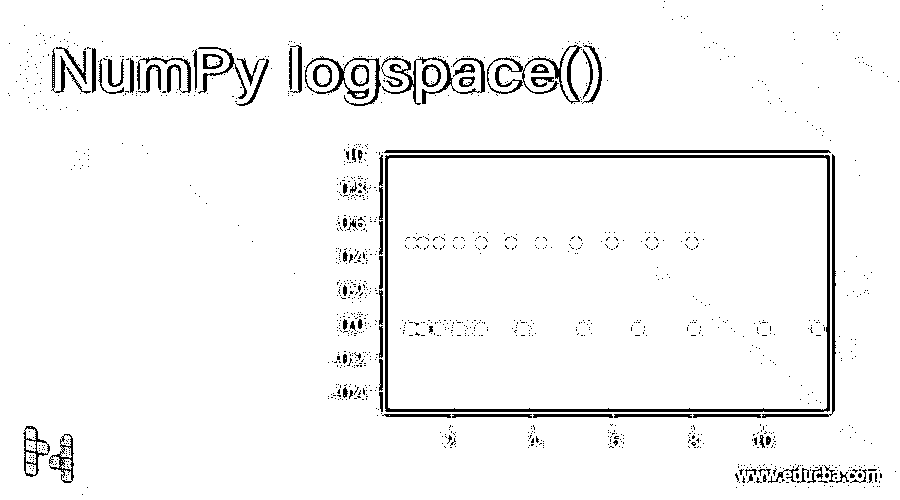
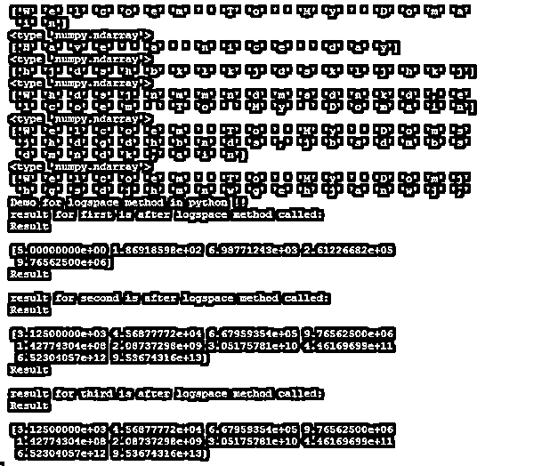

# NumPy 日志空间()

> 原文：<https://www.educba.com/numpy-logspace/>




## NumPy 日志空间()简介

logspace 方法用于在起点和终点之间平均分配对数值。logspace 方法采用多个参数；基于这些参数，它将对数值放置在空间上。Logspace 方法的开始和结束参数将决定空间上对数值的起点和对数值的终点。简而言之，通过使用 python 中的 Logspace 方法，我们可以在空间上计算对数值。python 的 numpy 包中可用的 Logspace 方法。我们将在本教程的方法引入部分研究更多的细节。

### 句法

正如我们所知，这是 NumPy 库中可用的方法，用于 python 中的计算。但是这个方法在调用时需要几个参数。此外，该方法的每个参数都代表日志空间的一些值。在继续之前，让我们看看这个方法的语法，见下文；

<small>网页开发、编程语言、软件测试&其他</small>

**举例:**

```
NumPy.logspace(start, stop, num, endpoint, base, dtype)
```

现在我们将研究 logspace 方法的一个实践语法，以便更好地理解该方法如何在编程时使用它；

**举例:**

```
NumPy.logspace(1, 5, 2, 11)
```

### NumPy logspace()方法是如何工作的？

到目前为止，我们知道这种方法用于绘制空间上的对数值。通过使用这种方法，我们可以决定它的起点和终点。如果我们不想为日志值指定端点，还有一个选项。此方法将多个参数作为值 param 在此基础上，我们决定如何在空间上映射对数值。我们还可以指定生成下一个值的步骤，即空间的两个值之间的差异。所以基本上，我们用这个方法在空间上画出我们的对数值，它总是返回给我们数组。我们将详细讨论该方法的每个参数。所以首先，重新看看它的签名，见下文；

**方法签名:**

```
NumPy.logspace(start, stop, num , endpoint, base , dtype )
```

所以在上面几行代码中，我们可以看到方法签名。这个方法接受 6 个参数作为输入，每个参数指定了不同的用途。让我们详细讨论每个参数，如下所示:

**1。num:**para 用于指定我们想要生成的值的数量。我们可以在这里指定任何数字，但是这个参数的默认值是 50。假设您已经给定它的值为 10，那么它将生成日志的 10 个样本值。

**2。dtype:** 该参数用于指定数组的类型。结果这个数组将是输出数组。如果我们不指定它的值，它将根据方法的其他值生成类型。

**3。端点:**该参数用于指定样本的端点。这是一个布尔值，可以取真或假。如果为真，则停止值将是端点值。如果不是，那么就不包括。但是它的默认值在这里被指定为 True。

**4。基数:**该参数用于指定记录值的基数。这意味着日志值之间的步长。这个参数的默认值在这里被指定为 10。

**5。stop:** 该参数用于指定日志空间的最后一个值，但仅当 endpoint 参数设置为 True 时。否则，+1 将被加到这些值上，并形成一个新值。

**6。start:** 这个参数用来指定第一个，或者我们可以说是空间中对数序列的初始值。假设我们给了 10，那么第一个值将只从 10 开始。

现在我们将看到一个例子，让初学者理解这种方法实际上是如何工作的；

```
import numpy as mynumpy
print("\n", mynumpy.logspace(1, 10, 5, endpoint = True, base = 5, dtype = None))
```

要在程序中使用这个方法，首先，我们需要准备好 NumPy 库；确保您必须像上面的代码行一样将它导入到您的程序中。在这之后，我们只是打印我们的日志空间的值。为此，我们在这里使用了 logspace 方法。在这个方法中，我们根据我们的需求指定值。这里的起始值是 1，结束值是 10，num 是 5。我们这里所说的端点是真实的；基数是 5，以此类推。它将返回我们的数组作为输出。

### NumPy 日志空间()的示例

在这个例子中，我们在空间上创建多个日志值，返回类型只是一个数组。在本例中，我们指定了 logspace()方法的所有参数，并试图将使用该方法生成的值作为数组打印出来。

**代码:**

```
import numpy as mynumpy
print("Demo for logspace method in python !!")
p1 = mynumpy.logspace(1, 10, 5, endpoint = True, base = 5, dtype = None)
p2 = mynumpy.logspace(5, 20, 10, endpoint = True, base = 5, dtype = None)
p3 = mynumpy.logspace(3, 9, 2, endpoint = True, base = 5, dtype = None)
print( "result for first is after logspace method called:")
print("Result\n")
print(p1)
print("Result\n")
print("result for second is after logspace method called:")
print("Result\n")
print(p2)
print("Result\n")
print("result for third is after logspace method called: ")
print("Result\n")
print(p2)
```

**输出:**




### 结论

通过使用对数空间方法，我们可以在空间中绘制我们的值；此方法专门用于记录值。我们唯一要做的就是在调用它的时候只需要在方法中提到参数。但是请记住，它是 NumPy 库的一部分，用于 python 中的计算。

### 推荐文章

这是 NumPy 日志空间()的指南。在这里，我们讨论 NumPy logspace()方法的工作原理和示例，以及代码和输出。您也可以看看以下文章，了解更多信息–

1.  [NumPy ndarray tolist](https://www.educba.com/numpy-ndarray-tolist/)
2.  [NumPy 空数组](https://www.educba.com/numpy-empty-array/)
3.  [NumPy vstack](https://www.educba.com/numpy-vstack/)
4.  [NumPy.argmax()](https://www.educba.com/numpy-argmax/)


