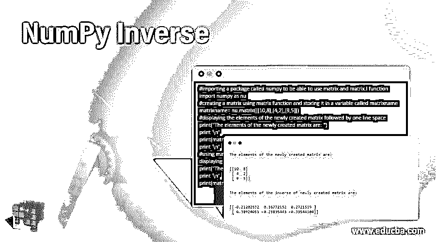
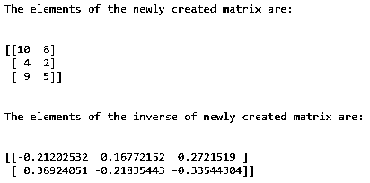
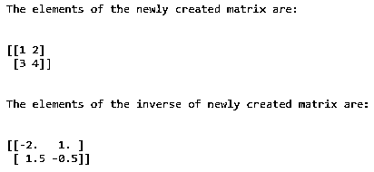
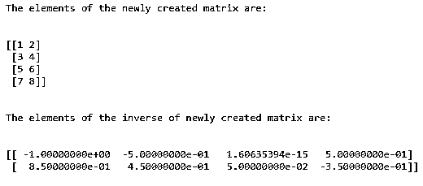

# 反向 NumPy

> 原文：<https://www.educba.com/numpy-inverse/>

> 
> 
> 

## NumPy 逆运算简介

当我们与原始矩阵相乘时，该矩阵会产生一个单位矩阵，称为给定矩阵的逆矩阵，其中单位矩阵是一个对角元素为 1 而矩阵中其余元素为 0 的方阵，在 python 中可以使用 numpy 中称为 inverse 的模块来计算矩阵的逆矩阵，该模块由简单属性表示。所以我和通过使用 numpy 中的反函数，我们不用数学上计算一个矩阵的逆矩阵，只用反函数计算逆矩阵。

**语法:**

Python 中 NumPy 反函数的语法如下:

<small>网页开发、编程语言、软件测试&其他</small>

```
Matrixname.I
```

其中，matrixname 是要计算其逆矩阵的矩阵名称

我表示计算给定矩阵的逆矩阵的属性。

### 数字反函数的运算

*   单位矩阵是对角元素为 1，矩阵中其余元素为零的方阵。
*   当我们与原矩阵相乘时，得到一个单位矩阵的矩阵称为给定矩阵的逆矩阵。
*   在 python 中，可以使用 numpy 中称为反函数的模块来计算矩阵的逆矩阵。
*   numpy 中的反函数由简单属性 I 表示。
*   通过使用 numpy 中的反函数，我们不用数学上计算一个矩阵的逆矩阵，只需使用反函数计算逆矩阵即可。

### NumPy 逆的例子

下面提到了不同的例子:

#### 示例#1

演示反函数的 Python 程序，用于创建矩阵并使用反函数找到新创建矩阵的逆:

**代码:**

```
#importing a package called numpy to be able to use matrix and matrix.I function
import numpy as nu
#creating a matrix using matrix function and storing it in a variable called matrixname
matrixname= nu.matrix([[10,8],[4,2],[9,5]])
#displaying the elements of the newly created matrix followed by one line space
print("The elements of the newly created matrix are: ")
print '\n'
print(matrixname)
print '\n'
#using matrix.I function to find the inverse of the newly created matrix and then displaying the elements of the inverse matrix followed by one line space
print("The elements of the inverse of newly created matrix are: ")
print '\n'
print(matrixname.I)
```

**输出:**




在上面的程序中，导入了 python 中一个名为 numpy 的包，以便能够利用矩阵函数和矩阵。我用 python 写函数。然后使用 matrix 函数创建一个矩阵，并存储在一个名为 matrixname 的变量中。然后显示新创建的矩阵的元素。然后矩阵。I 函数用于寻找新创建矩阵的逆矩阵。然后，新创建的矩阵的逆矩阵的元素显示在屏幕上。

#### 实施例 2

Python 程序演示了 NumPy 反函数来创建矩阵，并使用反函数找到新创建的矩阵的逆:

**代码:**

```
#importing a package called numpy to be able to use matrix and matrix.I function
import numpy as nu
#creating a matrix using matrix function and storing it in a variable called matrixname
matrixname= nu.matrix ([[1,2],[3,4]])
#displaying the elements of the newly created matrix followed by one line space
print("The elements of the newly created matrix are: ")
print '\n'
print(matrixname)
print '\n'
#using matrix.I function to find the inverse of the newly created matrix and then displaying the elements of the inverse matrix followed by one line space
print("The elements of the inverse of newly created matrix are: ")
print '\n'
print(matrixname.I)
```

**输出:**




在上面的程序中，导入了 python 中一个名为 numpy 的包，以便能够利用矩阵函数和矩阵。我用 python 写函数。然后使用 matrix 函数创建一个矩阵，并存储在一个名为 matrixname 的变量中。然后显示新创建的矩阵的元素。然后矩阵。I 函数用于寻找新创建矩阵的逆矩阵。然后，新创建的矩阵的逆矩阵的元素显示在屏幕上。

#### 实施例 3

Python 程序演示了 NumPy 反函数来创建矩阵，并使用 NumPy 反函数找到新创建的矩阵的逆:

**代码:**

```
#importing a package called numpy to be able to use matrix and matrix.I function
import numpy as nu
#creating a matrix using matrix function and storing it in a variable called matrixname
matrixname= nu.matrix ([[1,2],[3,4],[5,6],[7,8]])
#displaying the elements of the newly created matrix followed by one line space
print("The elements of the newly created matrix are: ")
print '\n'
print(matrixname)
print '\n'
#using matrix.I function to find the inverse of the newly created matrix and then displaying the elements of the inverse matrix followed by one line space
print("The elements of the inverse of newly created matrix are: ")
print '\n'
print(matrixname.I)
```

**输出:**




在上面的程序中，导入了 python 中一个名为 numpy 的包，以便能够利用矩阵函数和矩阵。我用 python 写函数。然后使用 matrix 函数创建一个矩阵，并存储在一个名为 matrixname 的变量中。然后显示新创建的矩阵的元素。然后矩阵。I 函数用于寻找新创建矩阵的逆矩阵。然后，新创建的矩阵的逆矩阵的元素显示在屏幕上。

### 推荐文章

这是一个 NumPy 逆的指南。在这里，我们通过定义、语法和编程示例及其输出来讨论 Python 中 NumPy 反函数的概念。您也可以看看以下文章，了解更多信息–

1.  [NumPy 函数](https://www.educba.com/numpy-functions/)
2.  [NumPy 数组](https://www.educba.com/numpy-arrays/)
3.  [NumPy Ndarray](https://www.educba.com/numpy-ndarray/)
4.  [安装 NumPy](https://www.educba.com/install-numpy/)


