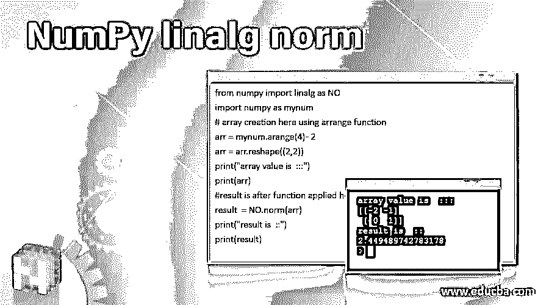
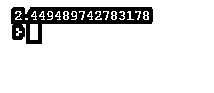
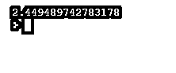
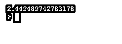
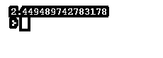
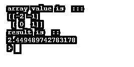

# NumPy 线性范数

> 原文：<https://www.educba.com/numpy-linalg-norm/>




## NumPy 线性范数函数简介

该函数用于计算矩阵范数或向量范数。这个函数也存在于 NumPy 库中，但是它是用来计算范数的。所以它可以用来计算一个向量范数，或者我们可以说是八个矩阵范数。矩阵范数什么都不是，但我们可以说它是向量范数的扩展。它还可以计算无穷向量范数。在这个主题中，我们将学习 NumPy linalg 范数。

**语法**

<small>网页开发、编程语言、软件测试&其他</small>

下面是根据 python 文档的 linalg 范数函数的语法。该函数将四个参数作为输入，如下所述；

```
myNumPy.linalg.norm(x, ord=None, axis=None, keepdims=False)
```

我们将在下一节详细讨论输入参数。直到我们看到一个练习语法来更好地理解函数，如何在编程时使用它；

```
myNumPy.linalg.norm(param1, param2, param3, param4)
```

### 线性范数函数在 NumPy 中是如何工作的？

到目前为止，我们知道它用于计算 python 中不同矩阵范数的无穷向量范数之一或右。同样，矩阵范数是向量范数的扩展。现在我们将看到如何定义一个矩阵范数函数，一般来说，见下文；

例如 f:Rm×n→R(用来定义矩阵范数的一般函数)

由于矩阵范数是向量的推广，因此它具有与向量范数相似的性质。现在我们将详细讨论 norm 函数的所有参数，以理解在用 python 编写程序时如何使用它们(见下文);

该函数采用以下 4 个参数:

**1。第一个参数-( x ):** 该参数以输入为数组类型。我们可以传递一个包含不同元素的数组变量。我们也可以通过使用 Numpy 库中可用的函数来创建一个随机数组。

**2。第二个参数——(轴):**众所周知，我们有一个 x 轴和 y 轴，在这里的意思是一样的。该参数是范数函数中的可选参数。如果我们没有为这个参数传递任何值，这个函数将返回矩阵范数或向量范数。但是如果我们为这个参数传递一个整数值，那么它将计算 x 轴的向量范数。如果我们传递两个元组作为轴值，则计算矩阵范数。

**3。第三个参数-(订单):**我们有不同的订单可用于此参数。这个订单的完整形式是'订单'而已，它支持不同的订单以及名称建议。我们将详细了解不同的顺序，如下所示；

| Zero | One | -1 | Two | -2 |
| 没有人 | 向后 | Nuc | 中程核力量 | -inf |

**4。第四个参数-(keep dims):**该参数属于布尔类型，其默认值为 false。如果该值为 True，则轴在结果的左侧被赋范；否则为 false，则坐标轴保留在结果中。它表示参数的假值或真值。

现在我们将看到一个如何在我们的代码中使用这个库的例子；

这个函数在 linalg 库内部可用，它是 Numpy 的一部分，但是这里我们必须导入两个库一个是 NumPy，另一个是 linalg。要使用 norm 函数，请将 linalg 导入到程序中。

*   计算矩阵:为了计算矩阵的范数，我们需要在轴中传递 2 元组作为值。下面让我们来了解一下工作；

```
from numpy import linalg as NO
import numpy as mynum
arr = mynum.arange(4) - 2
print(NO.norm(arr))
```




在这个例子中，我们计算一个矩阵的范数。在第一行中，我们导入了 linalg 库和 NumPy 库，以便使用它们的功能。在下一行中，我们使用 NumPy 库的 arrange 函数创建一个数组。之后，调用 norm 函数并传递一个数组作为输入参数。此外，我们已经定义了我们的别名来使用这个包名作为替代的简称。

**计算向量:**为了计算向量的范数，我们需要为轴参数提供整数值。

```
from numpy import linalg as NO
import numpy as mynum
arr = mynum.arange(4) - 2
print(NO.norm(arr, axis=0))
```




在上面的例子中，我们正在计算向量的范数。这里我们再传一个参数，即轴，是' 0 '。除此之外，对于矩阵和向量范数计算，所有事情都是相似的。

在 python 中使用 Norm 函数时要记住的几点:

*   为了使用这个函数，我们需要将 linalg 库导入到程序中。
*   根据我们写的逻辑，我们可以计算向量和矩阵的范数。

### NumPy 线性范数的例子

下面给出了 NumPy linalg 范数的例子:

#### 示例#1

在这个例子中，我们使用 norm 函数来计算向量的范数。

**代码:**

```
from numpy import linalg as NO
import numpy as mynum
# ccreating one array, using nUmpy arrange function
arr = mynum.arange(4) - 2
# calculating nirmas for vector here..
print(NO.norm(arr, axis=0))
```

**输出:**




#### 实施例 2

在本例中，我们使用 norm 函数计算矩阵的范数。此外，请注意，我们在这里没有提到轴参数，因为我们在这里使用 2 元组。

**代码:**

```
from numpy import linalg as NO
import numpy as mynum
# ccreating one array, using nUmpy arrange function
arr = mynum.arange(4) - 2
# calculating norms for matrix here ..
print(NO.norm(arr))
```

**输出:**




#### 实施例 3

在这个例子中，我们使用范数计算矩阵的范数。此外，使用排列和整形功能来创建我们的数组。

**代码:**

```
from numpy import linalg as NO
import numpy as mynum
# array creation here using arrange function
arr = mynum.arange(4) - 2
arr = arr.reshape((2,2))
print("array value is  :::")
print(arr)
#result is after function applied here
result  = NO.norm(arr)
print("result is  ::")
print(result)
```

**输出:**




### 结论

向量和矩阵的范数可以通过使用 norm 函数来计算，该函数在 linalg 库中可用。利用该函数可以计算无穷向量范数和八种不同的矩阵范数。同样，我们可以将铰孔参数作为一个要求传递。

### 推荐文章

这是一个指南 NumPy linalg 规范。在这里，我们将讨论 linalg 范数函数在 NumPy 中是如何工作的，并举例说明代码和输出。您也可以看看以下文章，了解更多信息–

1.  num py . dot()
2.  [NumPy Ndarray](https://www.educba.com/numpy-ndarray/)
3.  [NumPy 函数](https://www.educba.com/numpy-functions/)
4.  [numpy.ravel()](https://www.educba.com/numpy-dot-ravel/)


