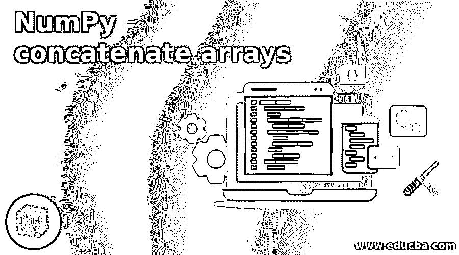
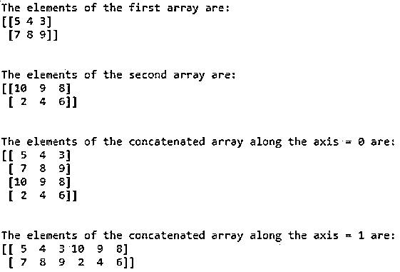
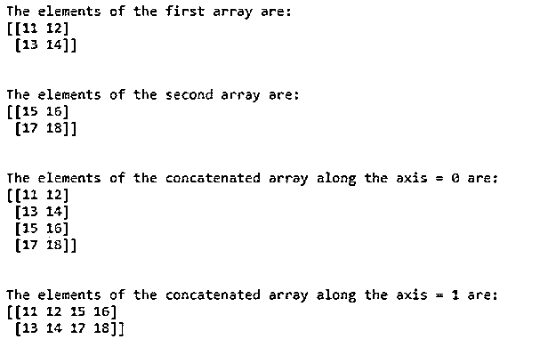

# NumPy 连接数组

> 原文：<https://www.educba.com/numpy-concatenate-arrays/>




## NumPy 连接数组简介

每当需要连接两个或两个以上形状相同的数组时，我们就利用 NumPy 中的一个名为 concatenate function 的函数，其中 concatenation 表示连接，NumPy 中的 concatenate 函数采用两个参数 arrayname1 arrayname2， 它表示要连接的两个数组，axis 表示给定的两个数组必须沿其连接的轴，axis 的默认值为零，axis 参数是可选的，concatenate 函数返回一个连接的数组，该数组是通过将给定的数组连接为 NumPy 中的 concatenate 函数的参数而得到的。

**语法:**

<small>网页开发、编程语言、软件测试&其他</small>

```
numpy.concatenate(arrayname1,arrayname2, axis)
```

其中 arrayname1 和 arrayname2 是要连接的数组的名称，它们必须具有相同的形状，并且 axis 表示给定数组必须沿其连接的轴。轴的默认值为零。

### NumPy 连接数组函数的工作原理

*   每当需要连接两个或多个相同形状的数组时，我们在 NumPy 中使用一个称为 concatenate 函数的函数，其中 concatenate 意味着连接。
*   NumPy 中的 concatenate 函数接受两个参数 arrayname1 arrayname2，表示要连接的两个数组和轴。
*   arrayname1 和 arrayname2 是连接在一起的数组的名称，它们必须具有相同的形状。
*   Axis 表示给定数组必须沿其连接的轴。轴的默认值为零。
*   concatenate 函数返回一个串联数组，该数组是将指定为参数的给定数组连接到 NumPy 中的 concatenate 函数而得到的数组。

### NumPy 连接数组的示例

下面提到了不同的例子:

#### 示例#1

Python 程序演示了创建两个相同形状的数组的函数，然后使用 concatenate 函数将创建的两个数组连接起来。

**代码:**

```
#importing the package numpy
import numpy as num
#creating an array using the array function and storing it in the variable arrayname1
arrayname1 = num.array([[5,4,3],[7,8,9]])
#displaying the elements of the newly created array
print 'The elements of the first array are:'
print arrayname1
print '\n'
#creating an array using the array function and storing it in the variable arrayname2
arrayname2 = num.array([[10,9,8],[2,4,6]])
#displaying the elements of the newly created array
print 'The elements of the second array are:'
print arrayname2
print '\n'
#using concatenate function to concatenate the two newly created array along the axis = 0
concatenatedarray = num.concatenate((arrayname1,arrayname2))
#displaying the elements of the concatenated array along the axis = 0
print 'The elements of the concatenated array along the axis = 0 are:'
print concatenatedarray
print '\n'
#using concatenate function to concatenate the two newly created array along the axis = 1
concatenatedarray1 = num.concatenate((arrayname1,arrayname2),axis=1)
#displaying the elemnets of the concatenated array along the axis = 1
print 'The elements of the concatenated array along the axis = 1 are:'
print concatenatedarray1
print '\n'
```

**输出:**




在上面的程序中，numpy 是 python 中导入的包，它允许我们利用数组函数和 concatenate 函数。然后使用 array 函数创建一个数组，并存储在一个名为 arrayname1 的变量中。然后显示 arrayname1 的元素。然后使用 array 函数创建另一个数组，并存储在名为 arrayname2 的变量中。然后显示 arrayname2 的元素。然后使用 concatenate 函数连接两次创建的两个数组，一次沿轴= 0，下一次沿轴= 1。

#### 实施例 2

Python 程序演示了创建两个相同形状的数组的函数，然后使用 concatenate 函数将创建的两个数组连接起来。

**代码:**

```
#importing the package numpy
import numpy as num
#creating an array using the array function and storing it in the variable arrayname1
arrayname1 = num.array([[11,12],[13,14]])
#displaying the elements of the newly created array
print 'The elements of the first array are:'
print arrayname1
print '\n'
#creating an array using the array function and storing it in the variable arrayname2
arrayname2 = num.array([[15,16],[17,18]])
#displaying the elements of the newly created array
print 'The elements of the second array are:'
print arrayname2
print '\n'
#using concatenate function to concatenate the two newly created array along the axis = 0
concatenatedarray = num.concatenate((arrayname1,arrayname2))
#displaying the elements of the concatenated array along the axis = 0
print 'The elements of the concatenated array along the axis = 0 are:'
print concatenatedarray
print '\n'
#using concatenate function to concatenate the two newly created array along the axis = 1
concatenatedarray1 = num.concatenate((arrayname1,arrayname2),axis=1)
#displaying the elemnets of the concatenated array along the axis = 1
print 'The elements of the concatenated array along the axis = 1 are:'
print concatenatedarray1
print '\n'
```

**输出:**




在上面的程序中，numpy 是 python 中导入的允许我们使用数组函数和 concatenate 函数的包。然后使用 array 函数创建一个数组，并存储在一个名为 arrayname1 的变量中。然后显示 arrayname1 的元素。然后使用 array 函数创建另一个数组，并存储在名为 arrayname2 的变量中。然后显示 arrayname2 的元素。然后使用 concatenate 函数连接两次创建的两个数组，一次沿轴= 0，下一次沿轴= 1。

### 推荐文章

这是一个 NumPy 连接数组的指南。为了更好地理解，我们在这里讨论介绍、工作和例子。您也可以看看以下文章，了解更多信息–

1.  [NumPy 空数组](https://www.educba.com/numpy-empty-array/)
2.  [NumPy hstack](https://www.educba.com/numpy-hstack/)
3.  [最大数量](https://www.educba.com/numpy-max/)
4.  NumPy Meshgrid


