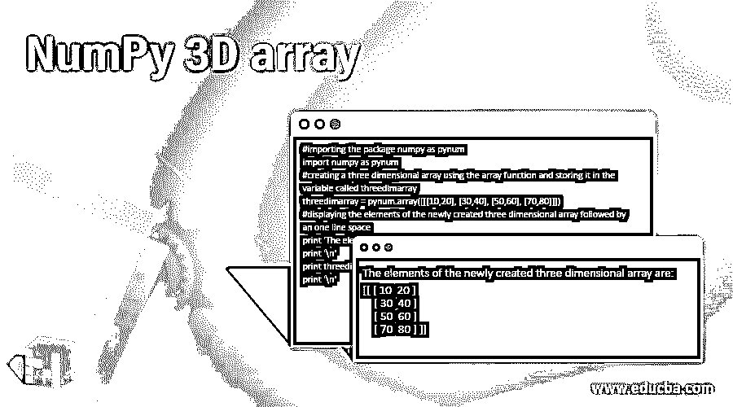
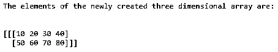
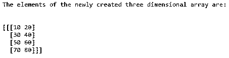

# NumPy 3D 阵列

> 原文：<https://www.educba.com/numpy-3d-array/>




## NumPy 3D 阵列简介

NumPy 中的数组是适合数学运算的高性能数据结构。嵌套在一起的三层数组代表 python 中的三维数组，其中每一层代表一个维度。我们利用 NumPy 中的 array 函数创建一个三维数组，将一个对象作为参数传递给它。对象表示 NumPy 中 x 乘 y 乘 z 的三维数组，其中 x 是对象中的嵌套列表，y 是 x 个嵌套列表中的嵌套列表，z 是每个 y 个嵌套列表中的值。所以在这个主题中，我们将学习 NumPy 3D 数组。

**语法:**

<small>网页开发、编程语言、软件测试&其他</small>

Python 中 NumPy 3D 数组的语法如下:

```
numpy.array(object)
```

其中对象表示 NumPy 中 x 乘 y 乘 z 的三维数组，其中 x 是对象中的嵌套列表，y 是 x 个嵌套列表中的嵌套列表，z 是每个 y 个嵌套列表中的值。

### 声明 NumPy 3D 数组

*   NumPy 中的数组是适合数学运算的高性能数据结构。例如，嵌套在一起的三层数组代表 python 中的三维数组。
*   三维数组中的每一层代表一个维度。我们使用 NumPy 中的 array 函数创建一个三维数组，将一个对象作为参数传递给它。
*   对象表示 NumPy 中 x 乘 y 乘 z 的三维数组，其中 x 是对象中的嵌套列表，y 是 x 个嵌套列表中的嵌套列表，z 是每个 y 个嵌套列表中的值。
*   考虑下面 python 中三维数组的表示:

([[[1, 2], [3, 4]], [[5, 6], [7, 8]]])

这里 x =[[1，2]，[3，4]]，[[5，6]，[7，8]]，

y = [[1，2]，[3，4]]和[[5，6]，[7，8]]，

z = [1，2]，[3，4]和[5，6]，[7，8]

### NumPy 3D 阵列示例

以下是 NumPy 3D 阵列的示例:

#### 示例#1

Python 程序使用 NumPy 中的 array 函数演示 NumPy 三维数组，并将对象作为参数传递给它，然后在屏幕上显示数组的元素:

**代码:**

```
#importing the package numpy as pynum
import numpy as pynum
#creating a three dimensional array using the array function and storing it in the variable called threedimarray
threedimarray = pynum.array([[[10,20,30,40], [50,60,70,80]]])
#displaying the elements of the newly created three dimensional array followed by an one line space
print 'The elements of the newly created three-dimensional array are:'
print '\n'
print threedimarray
print '\n'
```

**输出:**




在上面的程序中，我们用 python 导入了一个名为 NumPy 的包作为 pynum。导入 NumPy 包使我们能够在 python 中使用数组函数。为了创建一个三维数组，我们在 python 中传递表示 x 乘 y 乘 z 的对象，其中 x 是对象中的嵌套列表，y 是 x 嵌套列表中的嵌套列表，z 是每个 y 嵌套列表中的值。新创建的三维数组存储在名为 threedimarray 的变量中。然后，新创建的三维数组 threedimarray 的元素显示在屏幕上。

#### 实施例 2

Python 程序使用 NumPy 中的 array 函数演示 NumPy 三维数组，并将对象作为参数传递给它，然后在屏幕上显示数组的元素:

**代码:**

```
#importing the package numpy as pynum
import numpy as pynum
#creating a three dimensional array using the array function and storing it in the variable called threedimarray
threedimarray = pynum.array([[[10,20], [30,40], [50,60], [70,80]]])
#displaying the elements of the newly created three dimensional array followed by an one line space
print 'The elements of the newly created three dimensional array are:'
print '\n'
print threedimarray
print '\n'
```

**输出:**




在上面的程序中，我们用 python 导入了一个名为 NumPy 的包作为 pynum。导入 NumPy 包使我们能够在 python 中使用数组函数。为了创建一个三维数组，我们在 python 中传递表示 x 乘 y 乘 z 的对象，其中 x 是对象中的嵌套列表，y 是 x 嵌套列表中的嵌套列表，z 是每个 y 嵌套列表中的值。新创建的三维数组存储在名为 threedimarray 的变量中。然后，新创建的三维数组 threedimarray 的元素显示在屏幕上。

#### 实施例 3

Python 程序使用 NumPy 中的 array 函数演示 NumPy 三维数组，并将对象作为参数传递给它，然后在屏幕上显示数组的元素:

**代码:**

```
#importing the package numpy as pynum
import numpy as pynum
#creating a three dimensional array using the array function and storing it in the variable called threedimarray
threedimarray = pynum.array([[[10], [40], [60], [70]]])
#displaying the elements of the newly created three dimensional array followed by an one line space
print 'The elements of the newly created three dimensional array are:'
print '\n'
print threedimarray
print '\n'
```

**输出:**


在上面的程序中，我们用 python 导入了一个名为 NumPy 的包作为 pynum。导入 NumPy 包使我们能够在 python 中使用数组函数。为了创建一个三维数组，我们在 python 中传递表示 x 乘 y 乘 z 的对象，其中 x 是对象中的嵌套列表，y 是 x 嵌套列表中的嵌套列表，z 是每个 y 嵌套列表中的值。新创建的三维数组存储在名为 threedimarray 的变量中。然后，新创建的三维数组 threedimarray 的元素显示在屏幕上。

### 推荐文章

这是 NumPy 3D 阵列的指南。在这里，我们通过编程示例及其输出，通过 python 中 3D 数组的定义、语法和声明来讨论 Python 中 NumPy 3D 数组的概念。您也可以看看以下文章，了解更多信息–

1.  [NumPy 挤压](https://www.educba.com/numpy-squeeze/)
2.  [NumPy 连接](https://www.educba.com/numpy-concatenate/)
3.  [NumPy 指数](https://www.educba.com/numpy-exponential/)
4.  num py . dot()


