# NumPy datetime64

> 原文：<https://www.educba.com/numpy-datetime64/>

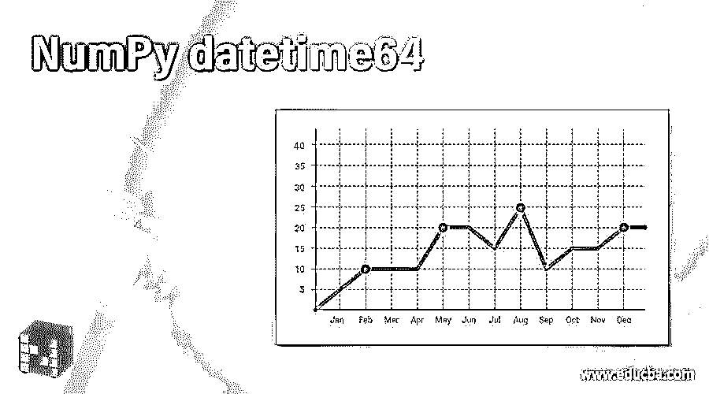


## NumPy 日期时间简介 64

众所周知，Python 是最常用的 web 编程语言之一。据说对于新手和专家来说，它都是最容易学的语言之一，因为它提供了许多内置函数，程序员可以很容易地使用它们。不同的 Python 包中提供了大量的日期、时间和时间跨度的表示形式，程序员可以将它们导入到程序中，并根据特定的需求使用它们。datetime64 函数允许以紧凑的形式存储和打印日期数组。它基本上将日期编码成 64 位整数。在本主题中，我们将学习 NumPy datetime64。

**语法**

<small>网页开发、编程语言、软件测试&其他</small>

python 中的 datetime64 函数允许用户使用数组表示日期。它接受特定格式的输入。下面给出了在 Python 程序中使用 datetime64 函数的基本语法:

```
numpy.datetime64('dates')
```

datetime64 函数生成的输出是“yyyy-mm-dd”格式。

### datetime64 在 NumPy 中是如何工作的？

让我们使用以下示例来理解 NumPy 中 datetime64 的工作方式:

#### 示例#1

Python 程序中 datetime64 函数的基本输出。

**代码:**

```
import numpy as npy
var = npy.datetime64('2020-12-09')
print var
```

**输出:**


在上面的代码中，显示了 datetime64 函数的基本工作方式，输入格式为“YYYY-MM-DD”，日期以与输出相同的格式显示。

#### 实施例 2

强制显示输入日期的日单位。

**代码:**

```
import numpy as npy
var = npy.datetime64('2020-12', 'D')
print var
```

**输出:**

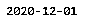


在上面的代码中，当我们没有在 datetime64 函数的输入日期中指定日期单位(D)并要求它显示在控制台上时，它会自动将该月的第一天视为日期。

类似地，我们也可以使用其他日期单位，如“Y”、“M”来相应地在控制台上显示输出。

#### 实施例 3

使用日期单位的年份“Y”参数。

**代码:**

```
import numpy as npy
var = npy.datetime64('2020-12', 'Y')
print var
```

**输出:**


#### 实施例 4

使用日期单位的月“M”参数。

**代码:**

```
import numpy as npy
var = npy.datetime64('2020-12', 'M')
print var
```

**输出:**

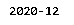


#### 实施例 5

使用日期和时间作为 Python 程序中 datetime64 函数的输入。

**代码:**

```
import numpy as npy
var = npy.datetime64('2020-12-04 12:00:30')
print var
```

**输出:**

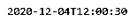


在上面的代码中，我们将日期和时间都指定为 datetime64 函数的输入参数，在日期和时间之间保留空格，但是请观察显示的输出。在输出中，“T”显示在两者之间。

我们可以使用以下两种格式的日期和时间:

1.  日期和时间一起由空格隔开。
2.  日期和时间，中间有“T”

在这两种情况下，输出将是相同的，即 python 将在它们之间插入“T”。

让我们用一个例子来说明:

```
import numpy as npy
var = npy.datetime64('2020-12-04T12:00:30')
print var
```

**输出:**

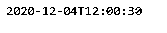


在这两种情况下，python 显示的输出是相同的。

#### 实施例 6

仅在 datetime64 函数中从输入日期单位提取小时。

**代码:**

```
import numpy as npy
date = npy.datetime64('2020-12-04')
hours = npy.datetime64(date, 'h')
print hours
```

在上面的代码中，没有提到时间单位；如果用户试图从中提取小时数，它将显示为“00 ”,日期和时间之间有一个“T”。

同样，我们可以使用' m '，' s '从日期时间单位中提取分和秒。

**输出:**

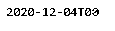


#### 实施例 7

使用 datetime64 函数从日期和时间单位中提取分和秒。

**代码:**

```
import numpy as npy
date = npy.datetime64('2020-12-04T12:03:05')
minutes = npy.datetime64(date, 'm')
print minutes
seconds = npy.datetime64(date, 's')
print seconds
```

**输出:**

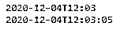


#### 实施例 8

在数组中排列日期时间单位。

**代码:**

```
import numpy as npy
dates= npy.array(['2020-12-04T12:03:05','2020-01-08T12:05:05', '2020-02-12T05:03:05', '2020-06-04T11:03:05'], dtype='datetime64')
print dates
```

**输出:**

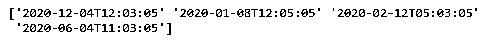


在上面的代码中，我们创建了一个日期时间单位的数组。它基本上有两个参数，即 datetime 和“dtype”。

#### 实施例 9

在 datetime64 函数中使用 arange 函数

我们还可以使用类似“arange”的函数来显示 python 的 datetime64 函数中输入的两个日期之间的日期范围。我们借助一个例子来理解一下。

**代码:**

```
import numpy as npy
dates= npy.arange('2020-12-01','2020-12-15', dtype='datetime64')
print dates
```

**输出:**

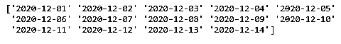


在上面的代码中，所有日期都显示在位于两个给定日期之间的控制台上，即“2020-12-01”到“2020-12-15”。

**对日期时间单位执行算术运算。**

我们可以使用像(+、-)这样的算术运算符对日期时间单位执行基本的算术运算。例如，我们可以用两个日期相减来得到两个日期之间的天数，将给定日期中的天数相加，然后从特定日期中减去月份。让我们借助一个例子来理解它们:

#### 实施例#10

减去 datetime64 函数的输入日期中的天数:

**代码:**

```
import numpy as npy
dates= npy.datetime64('2020-12')
print dates+5
```

**输出:**

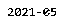


在上面的代码中，由于没有提到日期单位“D ”,默认情况下，它会将其视为 01。因此，在其中添加“5”将会显示日期为“2020-12-06”

#### 实施例 11

减去这两个日期来计算中间的天数

**代码:**

```
import numpy as npy
dates_between= npy.datetime64('2020-12-08')- npy.datetime64('2020-11-08')
print dates_between
```

**输出:**

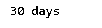


在上面的代码中，使用函数 datetime64 减去 2 个日期，并计算它们之间的天数，即 30。

#### 实施例#12

在 datetime64 函数的输入日期单位中添加月份。

**代码:**

```
import numpy as npy
month = npy.datetime64('2020-12-08', 'M')
months_final = month+4
print months_final
```

**输出:**

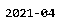


在上面的代码中，首先从日期中提取月份，然后加上 4，4 存储在变量' months_final '中，并在控制台上显示给用户。

### 结论

上面的描述清楚地解释了 datetime64 函数以及程序员使用它的原因。尽管 Python 中有许多独立的日期和时间函数，但理解它们之间的关系非常重要。由于不同的日期和时间函数以特定的格式给出输出，所以作为一名程序员，在程序中使用它们之前，必须正确理解每个函数。

### 推荐文章

这是 NumPy datetime64 的指南。这里我们讨论 datetime64 在 NumPy 中是如何工作的，并给出了代码和输出。您也可以看看以下文章，了解更多信息–

1.  [NumPy hstack](https://www.educba.com/numpy-hstack/)
2.  [NumPy 指数](https://www.educba.com/numpy-exponential/)
3.  [numPy.where()](https://www.educba.com/numpy-where/)
4.  num py . dot()


