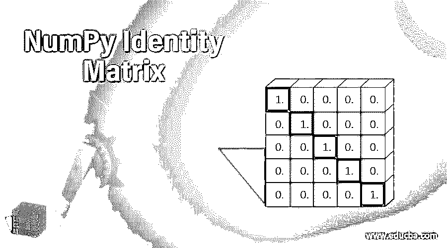
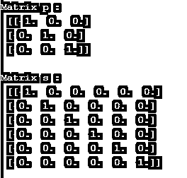
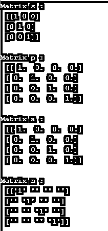

# NumPy 单位矩阵

> 原文：<https://www.educba.com/numpy-identity-matrix/>




## 数字单位矩阵简介

NumPy 单位矩阵是一个内置的 NumPy 工作，用于恢复一个框架，即，一个 2D 集群，在其基本歪斜处有 1，而在其他地方有 0。identity()工作在 NumPy 下表征，可以作为 import NumPy 作为 np 导入，我们可以在 NumPy 的辅助下进行多维的展示和推断其他数值度量。身份集群是一个正方形的展品，主要是倾斜的。Python identity()工作返回个性展示。n×n 产量中的行数(和节数)。产量的信息排序。

**语法和参数**

<small>网页开发、编程语言、软件测试&其他</small>

```
NumPy.identity(dtype=None,n)
```

在哪里，

“n”表示 NumPy 单位矩阵中的行数和列数。

Dtype 表示对象的数据类型，默认情况下被认为是浮动的。

它返回一个 ndarray n x n 群集，其基本倾斜设置为 1，并且所有不同的分量都为 0。

### NumPy 单位矩阵是如何工作的？

现在我们看到了 NumPy 单位矩阵在 Python 中如何工作的各种例子。

#### 示例#1

用 NumPy 单位矩阵求矩阵值

**代码:**

```
import numpy as geek
p = geek.identity(3, dtype = float)
print("Matrix p : \n", p)
s = geek.identity(6)
print("\nMatrix s : \n", s)
```

**输出:**




在上面的程序中，我们首先作为一个极客导入 NumPy 库，并定义矩阵 s 和 p。在定义矩阵之后，我们希望打印矩阵值，这就是为什么我们使用 identity()矩阵函数将矩阵值替换程序中提到的次数。因此，程序被实现，输出如上面的快照所示。

#### 实施例 2

用 NumPy 单位矩阵求多个 n*n 数组的矩阵值

**代码:**

```
import numpy as np
s = np.identity(3, dtype=int)
print("Matrix s : \n", s)
p = np.identity(4)
print("\nMatrix p : \n", p)
a = np.identity(4, dtype=float)
print("\nMatrix a : \n", a)
n = np.identity(4, dtype=str)
print("\nMatrix n : \n", n)
```

**输出:**




在上面的程序中，我们有 2*2，3*3，4*4 个矩阵，我们将 NumPy 作为 np 导入并实现所有这些矩阵值的值。然后，我们使用 NumPy 单位矩阵为数据类型提供值，最后根据给定的次数实现这些值。因此，程序被实现，输出如上面的快照所示。

在第一容量中，线和段的数量是 2。通过这种方式，显示了一个 2 X 2 的格，它的原则是倾斜的，尊重 1 的返回类型是 int。在这里，漂移被推崇为人物作品还理所当然地有滑行返回式。在第二容量中，线的数量是 3，部分是 3。沿着这些线，一个 3 X 3 的网络被显示，它的主要歪斜为 1，返回类型为漂浮。

在第三个容量中，行数是 3，部分是 3，因此显示了 3×3 的框架，其基本角到角为 1，返回类型为字符串。此外，不同的品质被引入到疲惫的角色中，这些角色表现出的自尊等于零。

在第四种容量中，行数为 3，段数为 3。因此，显示了一个 3 X 3 的网格，其主倾斜为 1，返回类型为字符串。

NumPy 是一个用于逻辑注册的包，它支持一个惊人的 N 维展示对象。NumPy 给出了一组多维的数字，这是一篇真正的文章。为了增加这两个框架，我们使用 speck()技术。熟悉 numpy.dot 的功能。*用于集群增加(增加两个展品的相关组件)，而不是网格复制。比较类似记录，我们可以利用列表来获得网络组件。NumPy 代表数字 Python，是一个由多维展示对象和处理这些集群的各种调度组成的库。利用 NumPy，数字和智能程序的展品可以执行。

### 结论

因此，我认为 NumPy 是对展品进行复杂控制的最佳库。利用 NumPy 库计算展品非常简单。集群控制在某种程度上是简单的，但我看到许多新的学徒或温和的设计师发现了格子控制的挑战。转置是另一个框架，当线段中的所有成分都存在时，就会产生坏习惯，反之亦然。您可以利用矩阵变量 t 来发现网络的转换。比如，在这种情况下，我需要呈现矩阵 2。该框架通常被信息研究者用于信息控制。在仔细阅读这个指导性练习后，我相信你能控制这个框架。

### 推荐文章

这是一个指南 NumPy 单位矩阵。这里我们讨论 NumPy 单位矩阵如何与语法和参数一起工作。您也可以看看以下文章，了解更多信息–

1.  [NumPy fft](https://www.educba.com/numpy-fft/)
2.  [NumPy.argmax()](https://www.educba.com/numpy-argmax/)
3.  [NumPy 回合](https://www.educba.com/numpy-round/)
4.  num py . dot()


