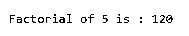
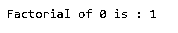
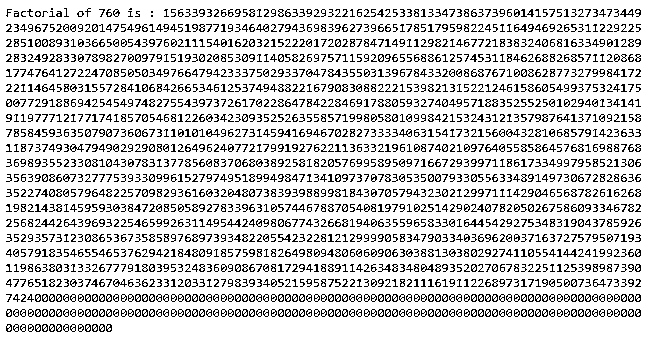
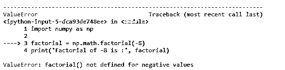
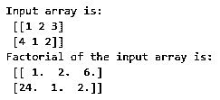
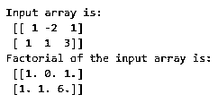

# NumPy 阶乘

> 原文：<https://www.educba.com/numpy-factorial/>


## 数字阶乘的定义

Numpy.math.factorial()是 python 中的一个数学函数，用于计算给定正数的阶乘。但是在我们开始之前，阶乘到底是什么？一个数的阶乘是所有小于或等于给定数的非零正数的乘积。计算数字“n”的阶乘的一般公式如下:

n！= n *(n-1)*(n-2)*(n-3)*(n-4)…. 3 * 2 * 1

<small>网页开发、编程语言、软件测试&其他</small>

举个例子，

6 的阶乘是 6*5*4*3*2*1，即 720

0 和 1 的阶乘是 1

9 的阶乘是 9*8*7*6*5*4*3*2*1，即 362880

到目前为止，我们对阶乘有了一个相当好的概念。让我们继续理解 NumPy 中的阶乘函数。该函数存在于 NumPy 模块的数学库中。它与 scipy.math.factorial 和 math.factorial 等 python 库中的其他函数非常相似，我们甚至可以说它们是 math.factorial 主函数的不同名称。

**语法和参数**

使用 Numpy factorial()函数的基本语法如下:

```
numpy.math.factorial(n)
```

上述语法中使用的参数如下:

**n:** 这是需要计算阶乘的输入整数/数字。

**返回:**函数返回一个整数。

讨论了 python 中使用阶乘函数的语法和参数。基于它我们来试几个例子。

### NumPy 阶乘的例子

下面提到了不同的例子:

#### 示例#1

求 5 的阶乘。

**代码:**

```
#import module
import numpy as np
#function
factorial = np.math.factorial(5)
print('Factorial of 5 is :', factorial)
```

**输出:**




这里，我们已经计算了数字 5 的阶乘。5 的阶乘给定为(5X4X3X2X1)，相当于 120。我们可以从给定代码的输出中观察到，numpy.math.factorial()函数也返回相同的输出。

#### 实施例 2

求 0 的阶乘。

**代码:**

```
import numpy as np
factorial = np.math.factorial(0)
print('Factorial of 0 is :', factorial)
```

**输出:**




在这个例子中，我们已经计算了 0 的阶乘。类似数学，numpy.math 中 0 的阶乘也是 1。

#### 实施例 3

求 760 的阶乘。

**代码:**

```
import numpy as np
factorial = np.math.factorial(760)
print('Factorial of 760 is :', factorial)
```

**输出:**




在这个例子中，我们计算了 760 的阶乘。这个数字的阶乘是一个大的整数值，从输出中可以看出。

#### 实施例 4

求-8 的阶乘。

**代码:**

```
import numpy as np
factorial = np.math.factorial(-8)
print('Factorial of -8 is :', factorial)
```

**输出:**




在这个例子中，我们试图说明 numpy.math 库中的阶乘函数不计算负数的阶乘。相反，对于负输入，它抛出一个错误。但是当你往下读的时候，把这个例子和例子 6 比较一下。

上面讨论的 math.factorial()函数将只寻找正自然数的阶乘。它不能用于查找输入数组的元素阶乘。在这些情况下，我们可能需要使用不同的函数。常用于计算 NumPy 数组阶乘的函数如下所示:

```
scipy.special.factorial(input array)
```

这个阶乘函数取自 scipy.special，用于在 numpy ndarray 上执行基于元素的阶乘计算。该函数的输入参数是不言自明的。该函数返回一个带有计算值的 numpy 数组。

这里有几个例子来进一步说明这一点。

#### 实施例 5

计算给定矩阵的元素阶乘。

**代码:**

```
import numpy as np
#import scipy module
from scipy.special import factorial
#input
a = np.array([[1,2,3],[4,1,2]])
print('Input array is:\n', a)
#function
fact_arr = factorial(a)
print('Factorial of the input array is:\n',fact_arr)
```

**输出:**




这里我们展示了如何使用 scipy.special 模块中的 factorial()函数来计算输入 numpy ndarray 的元素阶乘。

#### 实施例 6

计算给定多维数组的元素阶乘。

**代码:**

```
import numpy as np
#import scipy module
from scipy.special import factorial
#input
a = np.array([[1,-2,1],[1,1,3]])
print('Input array is:\n', a)
#function
fact_arr = factorial(a)
print('Factorial of the input array is:\n',fact_arr)
```

**输出:**




在这个例子中，我们试图说明 special.factorial()函数在一些输入数组元素为负时不会抛出错误。它只返回对应于该特定元素的“0”和其余元素的阶乘。与示例 4 相比，在示例 4 中，numpy.math.factorial()函数用于负数。

### 结论

NumPy 库中的 factorial()函数实际上是 python 数学库中的一个函数。它类似于 scipy.math.factorial()。该函数计算正数的阶乘。它不适用于输入数组。为了计算输入数组的阶乘，可以考虑使用 scipy.special.factorial()函数。

### 推荐文章

这是 NumPy 阶乘的指南。这里我们讨论 Python 中 NumPy 阶乘函数的定义、语法，以及编程示例和它们的输出。您也可以看看以下文章，了解更多信息–

1.  [NumPy 函数](https://www.educba.com/numpy-functions/)
2.  [NumPy 数组](https://www.educba.com/numpy-arrays/)
3.  [NumPy Ndarray](https://www.educba.com/numpy-ndarray/)
4.  [安装 NumPy](https://www.educba.com/install-numpy/)


