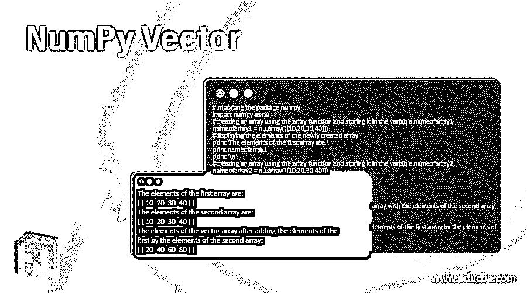
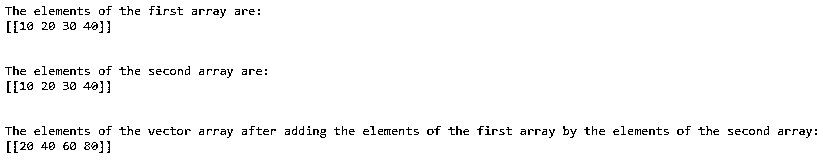
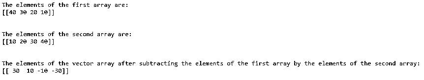
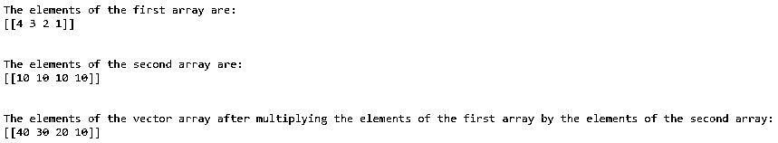

# NumPy 向量

> 原文：<https://www.educba.com/numpy-vector/>




## NumPy 矢量简介

一个或多个标量的元组称为向量，普通数字是用于构建向量的组件；这个向量可以被认为是一个数字列表，就像我们如何对列表中的数字执行操作一样，向量代数也被执行，小写字母 v 用于将向量表示为 v = (v1，v2，v3)其中 v1，v2， 和 v3 表示标量值，向量也可以表示在垂直列中，NumPy 数组表示 python 中的向量，数字列表可用于创建 NumPy 数组，并且可以对向量执行算术运算，如加、减、乘、除、点积和向量标量乘法。

**语法:**

<small>网页开发、编程语言、软件测试&其他</small>

```
vectorname = numpy.array([arrayelement1, arrayelement2..])
```

其中 vectorname 是使用 Numpy 中的 array 函数创建的向量的名称，数组的元素为 arrayname1、arrayname2 等。

### NumPy 向量的工作

*   一个或多个标量的元组称为向量，普通数字是用于构建向量的组件。
*   向量可以被认为是一个数字列表，就像我们如何对列表中的数字执行操作一样，向量代数也是如此，小写字母 v 用于将向量表示为 v = (v1，v2，v3)，其中 v1，v2 和 v3 表示标量值，向量也可以用垂直列表示。
*   在 python 中，NumPy 数组表示一个向量，一列数字可以用来创建一个 NumPy 数组。
*   可以对向量执行算术运算，如加、减、乘、除、点积和向量标量乘法。

### 例子

下面提到了不同的例子:

#### 示例#1

Python 程序演示了 NumPy vector 使用 NumPy 中的 array 函数创建两个数组，并对创建的两个数组执行向量加法:

**代码:**

```
#importing the package numpy
import numpy as nu
#creating an array using the array function and storing it in the variable nameofarray1
nameofarray1 = nu.array([[10,20,30,40]])
#displaying the elements of the newly created array
print 'The elements of the first array are:'
print nameofarray1
print '\n'
#creating an array using the array function and storing it in the variable nameofarray2
nameofarray2 = nu.array([[10,20,30,40]])
#displaying the elements of the newly created array
print 'The elements of the second array are:'
print nameofarray2
print '\n'
#using vector arithmetic to add the elements of the first array with the elements of the second array
vectorarray = nameofarray1 + nameofarray2
#displaying the elements of the vector array
print 'The elements of the vector array after adding the elements of the first array by the elements of the second array:'
print vectorarray
print '\n'
```

**输出:**




在上面的程序中，导入了 python 中一个名为 numpy 的包，以利用 array 函数创建新的数组。首先，Nameofarray1 是使用 NumPy 中的 array 函数创建的新数组，然后显示其元素。那么 Nameofarray2 就是使用 NumPy 中的 array 函数创建的新数组，然后显示它的元素。然后对两个数组 nameofarray1 和 nameofarray2 进行向量加法，将两个数组的元素相加。

#### 实施例 2

Python 程序演示了 NumPy vector 使用 NumPy 中的 array 函数创建两个数组，并对创建的两个数组执行向量减法:

**代码:**

```
#importing the package numpy
import numpy as nu
#creating an array using the array function and storing it in the variable nameofarray1
nameofarray1 = nu.array([[40,30,20,10]])
#displaying the elements of the newly created array
print 'The elements of the first array are:'
print nameofarray1
print '\n'
#creating an array using the array function and storing it in the variable nameofarray2
nameofarray2 = nu.array([[10,20,30,40]])
#displaying the elements of the newly created array
print 'The elements of the second array are:'
print nameofarray2
print '\n'
#using vector arithmetic to add the elements of the first array with the elements of the second array
vectorarray = nameofarray1 - nameofarray2
#displaying the elements of the vector array
print 'The elements of the vector array after subtracting the elements of the first array by the elements of the second array:'
print vectorarray
print '\n'
```

**输出:**




在上面的程序中，导入了 python 中一个名为 numpy 的包，以利用 array 函数创建新的数组。首先，Nameofarray1 是使用 NumPy 中的 array 函数创建的新数组，然后显示其元素。那么 Nameofarray2 就是使用 NumPy 中的 array 函数创建的新数组，然后显示它的元素。然后对两个数组 nameofarray1 和 nameofarray2 执行向量减法，从第二个数组中减去第一个数组元素。

#### 实施例 3

Python 程序演示了 NumPy vector 使用 NumPy 中的 array 函数创建两个数组，并对创建的两个数组执行向量乘法:

**代码:**

```
#importing the package numpy
import numpy as nu
#creating an array using the array function and storing it in the variable nameofarray1
nameofarray1 = nu.array([[4,3,2,1]])
#displaying the elements of the newly created array
print 'The elements of the first array are:'
print nameofarray1
print '\n'
#creating an array using the array function and storing it in the variable nameofarray2
nameofarray2 = nu.array([[10,10,10,10]])
#displaying the elements of the newly created array
print 'The elements of the second array are:'
print nameofarray2
print '\n'
#using vector arithmetic to add the elements of the first array with the elements of the second array
vectorarray = nameofarray1 * nameofarray2
#displaying the elements of the vector array
print 'The elements of the vector array after multiplying the elements of the first array by the elements of the second array:'
print vectorarray
print '\n'
```

**输出:**




在上面的程序中，导入了 python 中一个名为 numpy 的包，以利用 array 函数创建新的数组。首先，Nameofarray1 是使用 NumPy 中的 array 函数创建的新数组，然后显示其元素。那么 Nameofarray2 就是使用 NumPy 中的 array 函数创建的新数组，然后显示它的元素。然后对两个数组 nameofarray1 和 nameofarray2 进行向量相减，将第一个数组和第二个数组的元素相乘。

### 结论

在本教程中，我们将通过编程示例及其输出，了解 python 中 NumPy 向量的定义、语法和 Python 中向量的工作原理。

### 推荐文章

这是一个 NumPy 矢量的指南。这里我们讨论 NumPy 向量的工作原理和例子，以及代码和输出。您也可以看看以下文章，了解更多信息–

1.  [NumPy 空数组](https://www.educba.com/numpy-empty-array/)
2.  NumPy Meshgrid
3.  [numpy.pad()](https://www.educba.com/numpy-pad/)
4.  [numpy.mean()](https://www.educba.com/numpy-mean/)


